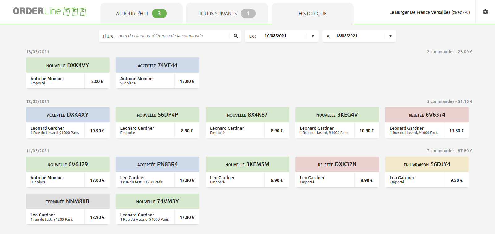

## Afficher les commandes du jour

Lorsque OrderLine reçoit une commande à exécuter le jour même, une notification du nombre de commandes s'affiche dans le coin supérieur droit de l'onglet correspondant, et une notification sonore est émise pour vous alerter.

Les commandes peuvent être masquées, selon l'état du paramètre **Masquer le statut de la commande**. Vous pouvez retrouver ces commandes masquées en ouvrant l'onglet **Aujourd'hui** et en cliquant sur **VOIR** dans la dernière carte. Pour plus d'informations, reportez-vous à [Statut des commandes](/apps/orderline/parametres/#encha-nement-des-statuts-de-commande).

## Afficher les commandes des jours suivants

Lorsque OrderLine reçoit une commande à exécuter à une date ultérieure, un compteur de commandes s'affiche près de l'onglet **JOURS SUIVANTS** d'OrderLine. Une notification sonore est également émise pour vous avertir de l'arrivée d'une nouvelle commande.

## Consultation de l'historique des commandes

OrderLine regroupe les commandes du jour, les commandes futures et les commandes passées au cours des 30 derniers jours dans trois ongles séparés. Pour consulter ce dernier onglet, cliquez sur **HISTORIQUE**.

Les commandes sont classées par ordre décroissant de date, la commande la plus récente apparaissant en premier.

Vous pouvez filtrer les commandes en combinant :

- Le nom du client ou la référence de la commande.
- La plage de dates de livraison.

