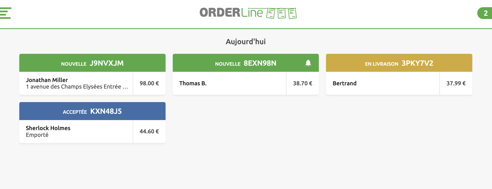

Vous pouvez personnaliser l'enchaînement des statuts afin d'adapter la gestion des commandes à votre activité. Cette section décrit l'enchaînement des statuts par défaut, ainsi que les actions permettant d'accepter ou d'imprimer les commandes. Pour personnaliser cet enchaînement, consultez la page [Statuts de commande](/apps/orderline/configuration/#encha-nement-des-statuts-de-commande/).

## Recevoir des commandes

A l'arrivée d'une commande, OrderLine l'affiche dans l'onglet **Aujourd'hui** ou **Jours suivants** selon la date de livraison.

OrderLine peut également émettre une notification sonore pour vous informer des nouvelles commandes. Pour configurer les notifications sonores, consultez la rubrique [Notifications](/apps/orderline/configuration/#notifications) de la page **Configuration**.

---

**NOTE IMPORTANTE :** Les navigateurs peuvent bloquer les notifications sonores. Pour les maintenir activées en permanence, suivez les instructions dans la FAQ [Comment puis-je garder les notifications sonores activées ?](/apps/orderline/faqs/garder-notifications-sonores-activees/).

---

Lors de la première connexion, OrderLine récupère les commandes des 30 derniers jours.

## Voir une commande

Pour consulter les détails de la commande, cliquez sur la carte de la commande. Pour fermer la carte, cliquez sur l'icône de fermeture <InlineImage width="23" height="23"></InlineImage> ou n'importe où en dehors de la carte.

La carte d'une commande affiche toutes les informations nécessaires à son traitement :

- L'adresse du client. Un lien **Voir dans Google Maps** s'affiche si des coordonnées GPS sont associées à la commande.
- La date et l'heure de création de la commande.
- La date et l'heure souhaitées de livraison ou de récupération par le client.
- La date et l'heure confirmées, qui correspondent initialement à l'heure prévue, jusqu'à ce qu'un utilisateur de OrderLine la modifie pour l'heure de livraison réelle.
- Le type de commande, qui indique le mode de traitement : **LIVRAISON**, **EMPORTÉ** ou **SUR PLACE**.
- La liste des produits à préparer, avec les demandes spécifiques éventuelles du client.
- Le statut de la commande. Vous pouvez modifier le statut d'une commande ou imprimer le reçu en sélectionnant le bouton correspondant.

## Modifier le statut d'une commande

Pour modifier le statut d'une commande, cliquez la fiche de commande et choisissez le bouton de statut approprié.

Selon votre configuration OrderLine, vous aurez l'option d'ajouter des informations supplémentaires lors de mises à jour de statut spécifiques. Pour ajuster cette configuration, consultez [Saisies complémentaires](/apps/orderline/configuration/#saisies-compl-mentaires). Ces saisies de données supplémentaires peuvent être utiles dans certaines situations, telles que :

- Renseigner un **message pour le client** lors du passage d'une commande au statut **Annulée**, pour justifier l'annulation.
- Indiquer une **heure confirmée** de livraison, lorsque la commande est marquée comme **Acceptée** mais ne peut pas être livrée à l'heure prévue. Si aucune **Heure confirmée** n'est spécifiée, l'heure initialement souhaitée pour la livraison de la commande sera utilisée.

Pour modifier l'heure de livraison ou ajouter un message pour votre client, cliquez sur l'icône stylo à côté du bouton de statut. Pour enregistrer vos modifications, cliquez sur le bouton de statut.

---

**NOTE IMPORTANTE :** Pour que ces saisies supplémentaires soient prises en compte, votre système de commande en ligne doit les prendre en charge.

---

Certaines mises à jour de statut, telles que marquer une commande comme **Terminée**, peuvent faire disparaître la commande de l'onglet **Aujourd'hui**, en fonction de votre configuration OrderLine. Pour retrouver la commande, cliquez sur **AFFICHER** sur la carte **des commandes masquées**, ou sélectionnez l'onglet **Historique des commandes**. Pour configurer les statuts dans lesquels les commandes sont masquées, voir [Masquer les commandes](/apps/orderline/parametres/#masquer-les-commandes).

## Imprimer une commande

OrderLine prend en charge l'impression sur n'importe quelle imprimante reconnue par votre système via la boîte de dialogue d'impression de votre navigateur.

Pour imprimer un reçu de commande, suivez ces étapes :

1. Ouvrez la carte de la commande.
1. Cliquez sur **IMPRIMER**.
1. Suivez les instructions indiquées dans la boîte de dialogue d'impression.

## Reçus

Pour une meilleure lisibilité, les reçus sont présentés sous forme de sections délimitées par un trait plein, reflétant les informations de la carte de commande. Pour plus d'informations sur les cartes de commande, consultez la rubrique [Voir une commande](#voir-une-commande).

Les reçus contiennent les informations suivantes :

- Le type de commande, qui indique le mode de traitement : **LIVRAISON**, **EMPORTÉ** ou **SUR PLACE**.
- Le mode de paiement.
- L'adresse de livraison, les commentaires et les coordonnés GPS (si fournies par la solution de commande en ligne).
- La date et l'heure confirmées.
- La date et l'heure confirmées, qui ne seront affichées que si elles diffèrent de l'heure de livraison souhaitée.
- Les offres promotionnelles suivies des produits associés.
- Les produits commandés, avec les options ajoutées ou enlevées. Les options enlevées sont barrées.
- Le numéro de référence de la commande.

