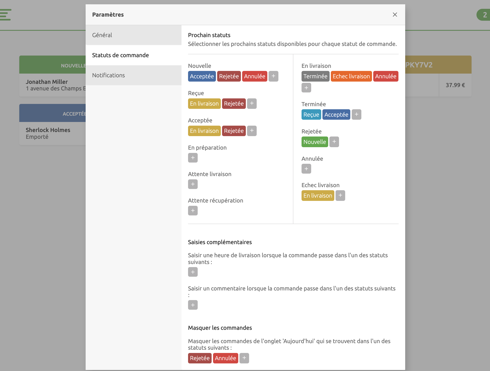

La page **Paramètres** permet de personnaliser l'affichage et d'ajuster plusieurs fonctionnalités dans OrderLine.

Pour accéder à la page **Paramètres**, sélectionnez l'icône d'engrenage <InlineImage width="20" height="20"></InlineImage> dans le coin supérieur droit de l'écran. Sur les appareils mobiles, sélectionnez-le dans le menu burger.

Les options suivantes sont disponibles via le menu **Paramètres** :

- **Général**
- **Statuts de commande**
- **Notifications**

## Général

Dans **Paramètres** > **Général**, vous pouvez sélectionner la langue d'affichage. OrderLine peut être utilisé en **anglais** ou en **français**.

## Enchaînement des statuts de commande

Dans les **Paramètres** > **Statut de commande**, vous pouvez configurer l'enchaînement des statuts de commande, qui détermine les statuts dans lesquels une commande peut passer en fonction de son statut actuel. Personnalisez l'enchaînement des statuts pour qu'il corresponde au mieux à vos besoins opérationnels.

Les commandes arrivent toujours dans le statut **Nouvelle**, mais elles peuvent évoluer de différentes manières selon l'enchaînement configuré. Dans l'exemple suivant, la commande peut successivement être **Acceptée**, puis **En livraison**, puis **Terminée**. A chaque étape, sauf pour le statut **Terminée**, la commande peut être **Rejetée**.

Vous pouvez utiliser l'enchaînement de statuts standard de OrderLine, le simplifier ou bien le personnaliser entièrement afin de l'adapter à votre façon de travailler.

Les statuts disponibles sont les suivants :

- Nouvelle
- Reçue
- Acceptée
- En préparation
- Attente livraison
- Attente récupération
- En livraison
- Terminée
- Rejetée
- Annulée
- Échec livraison

Pour modifier l'enchaînement des statuts, procédez comme suit :

1. Pour chaque statut, sélectionnez le symbole plus <InlineImage width="40" height="42"></InlineImage> pour sélectionner les statuts qu'une commande peut adopter à partir de son statut en cours. La coche <InlineImage width="40" height="40"></InlineImage> indique que le statut a déjà été sélectionné. Pour désélectionner tous les statuts, cliquez **Tout décocher**.
1. Répétez l'opération pour chaque statut que vous souhaitez modifier.

Par exemple, pour ajouter **Échec livraison** comme statut possible après **En livraison**, sélectionnez **Échec livraison** dans la liste **En livraison**.

## Saisies complémentaires

Lorsqu'une commande est dans certains statuts spécifiques, OrderLine peut permettre à l'utilisateur de modifier l'**heure de livraison**, ou d'ajouter un **commentaire**.

---

**REMARQUE IMPORTANTE :** OrderLine n'envoie pas directement d'e-mails aux clients. Les e-mails et autres notifications sont envoyées par votre solution de commande en ligne, sous deux conditions : votre solution de commande en ligne doit supporter l'envoi de notifications aux clients ; l'envoi de notifications doit être intégré à HubRise. Avant de mettre en place cette fonctionnalité, vérifiez que ces deux conditions sont remplies. Nous recommandons de tester sur une commande fictive pour vous assurer que le client reçoit bien la nouvelle heure de livraison et le commentaire.

---

Pour qu'OrderLine propose de modifier l'**heure de livraison** lorsqu'une commande passe dans certains statuts spécifiques, procédez comme suit :

1. Sélectionnez la liste de statut sous **Saisir une heure de livraison...**
1. Sélectionnez le symbole plus <InlineImage width="40" height="42"></InlineImage> pour ajouter un statut. Pour désélectionner tous les statuts, cliquez **Tout décocher**. La coche <InlineImage width="40" height="40"></InlineImage> indique que le statut a déjà été sélectionné.

Les utilisateurs peuvent être invités à ajouter un commentaire lorsque la commande se trouve dans un statut spécifique. Pour permettre la saisie d'un commentaire pour certains statuts spécifiques, procédez comme suit :

1. Trouvez la section **Saisir un commentaire lorsque la commande passe dans l'un des statuts suivants**.
1. Sélectionnez le symbole <InlineImage width="40" height="42"></InlineImage> pour sélectionner les statuts dans lesquels l'utilisateur pourra saisir un commentaire. Pour désélectionner tous les statuts, cliquez **Tout décocher**. La coche <InlineImage width="40" height="40"></InlineImage> indique que le statut a déjà été sélectionné.

## Masquer les commandes

Vous pouvez masquer les commandes de l'onglet **Aujourd'hui** qui sont dans certains statuts spécifiques. Les commandes masquées peuvent être affichées dans l'onglet **Aujourd'hui**, en cliquant sur la carte des **commandes masquées**.

Pour masquer des commandes dans la liste **Aujourd'hui**, procédez comme suit :

1. Trouvez la section **Masquer les commandes de l'onglet 'Aujourd'hui' qui se trouvent dans l'un des statuts suivants**.
1. Sélectionnez le symbole <InlineImage width="40" height="42"></InlineImage> pour masquer les commandes ayant ce statut. Pour désélectionner tous les statuts, cliquez **Tout décocher**. La coche <InlineImage width="40" height="40"></InlineImage> indique que le statut a déjà été sélectionné.

## Notifications

Vous pouvez être averti par un son lors de l'arrivée de nouvelles commandes dans OrderLine, en fonction des paramètres de notification. Cela s'applique aux commandes de l'onglet **Aujourd'hui** comme à celles de l'onglet **Jours suivants**.

Les paramètres disponibles sont les suivants :

| Paramètres | Description                                                    |
| ---------- | -------------------------------------------------------------- |
| Répétition | Nombre de répétitions de la notification sonore.               |
| Intervalle | Délai entre deux notifications sonores successives.            |
| Mélodie    | Choix de la mélodie jouée à l'arrivée d'une nouvelle commande. |

Certaines mélodies ont des sonorités plus aiguës ou plus fortes que d'autres. Choisissez la tonalité qui convient le mieux à vos goûts et à votre environnement sonore. N'oubliez pas que le volume se règle dans les paramètres de votre appareil, et non dans OrderLine. Si le son de votre appareil n'est pas suffisamment fort pour un espace de travail bruyant, envisagez de connecter une enceinte Bluetooth amplifiée.

