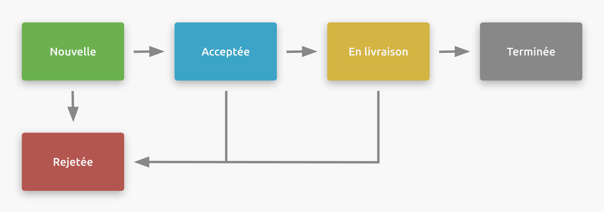
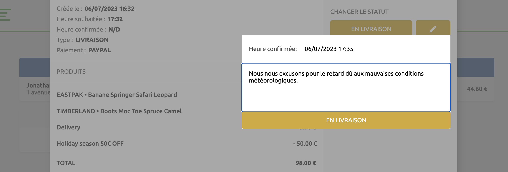
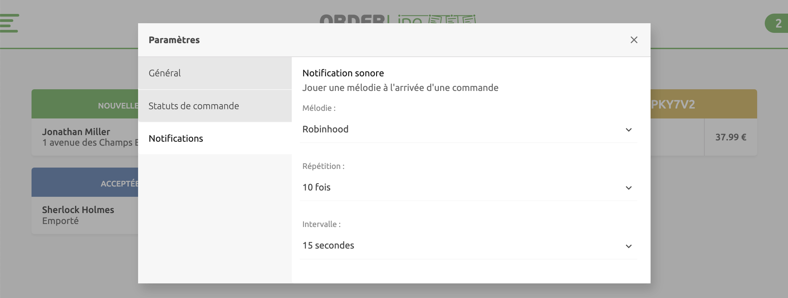

La page **Paramètres** permet de personnaliser l'affichage et d'ajuster plusieurs fonctionnalités dans OrderLine.

Pour accéder à la page **Paramètres**, sélectionnez l'icône d'engrenage <InlineImage width="20" height="20"></InlineImage> dans le coin supérieur droit de l'écran. Sur les appareils mobiles, sélectionnez-le dans le menu burger.

Les options suivantes sont disponibles via le menu **Paramètres** :

- **Général**
- **Statut de commande**
- **Notifications**

## Général

Dans **Paramètres** > **Général**, vous pouvez sélectionner la langue d'affichage. OrderLine peut être utilisé en **anglais** ou en **français**.

## Enchaînement des statuts de commande

Dans les **Paramètres** > **Statut de commande**, vous pouvez configurer l'enchaînement des statuts de commande, qui détermine les statuts dans lesquels une commande peut passer en fonction de son statut actuel. Personnalisez l'enchaînement des statuts pour qu'il corresponde au mieux à vos besoins opérationnels.

Les commandes arrivent toujours dans le statut **Nouvelle**, mais elles peuvent évoluer de différentes manières selon l'enchaînement configuré. Dans l'exemple suivant, la commande peut successivement être **Acceptée**, puis **En livraison**, puis **Terminée**. A chaque étape, sauf pour le statut **Terminée**, la commande peut être **Rejetée**.

Vous pouvez utiliser l'enchaînement de statuts standard de OrderLine, le simplifier ou bien le personnaliser entièrement afin de l'adapter à votre façon de travailler.

Les statuts disponibles sont les suivants :

- Nouvelle
- Reçue
- Acceptée
- En préparation
- Attente livraison
- Attente récupération
- En livraison
- Terminée
- Rejetée
- Annulée
- Échec livraison

Pour modifier l'enchaînement des statuts, procédez comme suit :

1. Pour chaque statut, sélectionnez le <InlineImage width="40" height="42"></InlineImage> symbole plus pour définir les prochains statuts disponibles à partir du statut de départ. La coche <InlineImage width="40" height="40">!\[Icône de validation d'ajout de statut dans OrderLine\](../images/037-orderline-status-added.jpg)</InlineImage> indique que le statut a déjà été sélectionné. Pour supprimer toutes les options, sélectionnez **Tout décocher**.
1. Répétez pour chaque statut que vous souhaitez modifier.

Par exemple, si vous souhaitez ajouter **Échec livraison** comme un statut possible après **En livraison**, vous devez sélectionner **Échec livraison** dans la liste des statuts possibles pour **En livraison**.

## Saisies complémentaires

Lorsqu'une commande est configurée selon un statut spécifique, OrderLine peut proposer à l'utilisateur de mettre à jour l'**heure de livraison**, ou d'ajouter un **commentaire**.

---

**REMARQUE IMPORTANTE :** OrderLine n'envoie pas d'e-mails ni de mises à jour directement aux clients. Ces informations sont envoyées par votre solution de commande en ligne, sous deux conditions : Que votre solution de commande en ligne supporte l'envoi de messages aux clients. Que l'envoi de messages soit intégré à HubRise. Avant de mettre en place cette fonctionnalité, vérifiez que ces deux conditions sont remplies. Nous recommandons de tester sur une commande fictive pour vous assurer que le client reçoit bien la nouvelle heure de livraison et le commentaire.

---

Pour qu'OrderLine propose de mettre à jour l'**heure de livraison** lorsqu'une commande passe dans un certain statut, procédez comme suit :

1. Sélectionnez la liste de statut sous **Saisir une heure de livraison...**
1. Sélectionnez <InlineImage width="40" height="42"></InlineImage> symbole plus pour définir un statut que l'utilisateur peut sélectionner. Pour supprimer toutes les options, sélectionnez **Tout décocher**. La coche <InlineImage width="40" height="40">!\[Icône de validation d'ajout de statut dans OrderLine\](../images/037-orderline-status-added.jpg)</InlineImage> case à cocher indique que le statut a déjà été sélectionné.

Les utilisateurs peuvent être invités à ajouter un commentaire lorsque la commande se trouve sur un statut spécifique. Pour afficher une invite de saisie d'un commentaire, procédez comme suit :

1. Dans la section **Saisir un commentaire lorsque la commande passe dans l'un des statuts suivants**, sélectionnez la liste des statuts.
1. Sélectionnez <InlineImage width="40" height="42"></InlineImage> symbole pour indiquer que le statut déclenchera une invite de saisie d'un commentaire. Pour supprimer toutes les options, sélectionnez **Tout décocher**. La coche <InlineImage width="40" height="40">!\[Icône de validation d'ajout de statut dans OrderLine\](../images/037-orderline-status-added.jpg)</InlineImage> indique que le statut a déjà été sélectionné.

## Masquer les commandes

Vous pouvez masquer les commandes de l'onglet **Aujourd'hui** qui sont dans un statut spécifique. Les commandes masquées peuvent être affichées depuis l'onglet **Aujourd'hui** en sélectionnant la carte des commandes masquées.

Pour masquer des commandes dans la liste **Aujourd'hui**, procédez comme suit :

1. Dans la section **Masquer les commandes de l'onglet 'Aujourd'hui' qui se trouvent dans l'un des statuts suivants**, sélectionnez la liste des statuts.
1. Sélectionnez <InlineImage width="40" height="42"></InlineImage> symbole pour masquer les commandes ayant ce statut. Pour supprimer toutes les options, sélectionnez **Tout décocher**. La coche <InlineImage width="40" height="40">!\[Icône de validation d'ajout de statut dans OrderLine\](../images/037-orderline-status-added.jpg)</InlineImage> indique que le statut a déjà été sélectionné.

## Notifications

Vous pouvez être averti par un son lors de l'arrivée de nouvelles commandes dans OrderLine, en fonction des paramètres de notification. Cela s'applique aussi bien aux commandes d'**Aujourd'hui** qu'aux commandes des **Jours suivants**.

Les paramètres disponibles sont les suivants :

| Paramètres | Description                                         |
| ---------- | --------------------------------------------------- |
| Répétition | Nombre de répétitions de la notification sonore.    |
| Intervalle | Délai entre deux notifications sonores successives. |
| Mélodie    | Musique entendue lors de la notification sonore.    |

Certaines mélodies ont une sonorité plus aiguë et fort que d'autres. Choisissez la tonalité qui convient le mieux à vos goûts et à votre environnement. Il est important de noter que le volume se règle dans les paramètres de votre appareil et non dans OrderLine. Si le son de votre appareil n'est pas suffisamment fort pour un espace de travail bruyant, envisagez de vous connecter à une enceinte Bluetooth externe.

