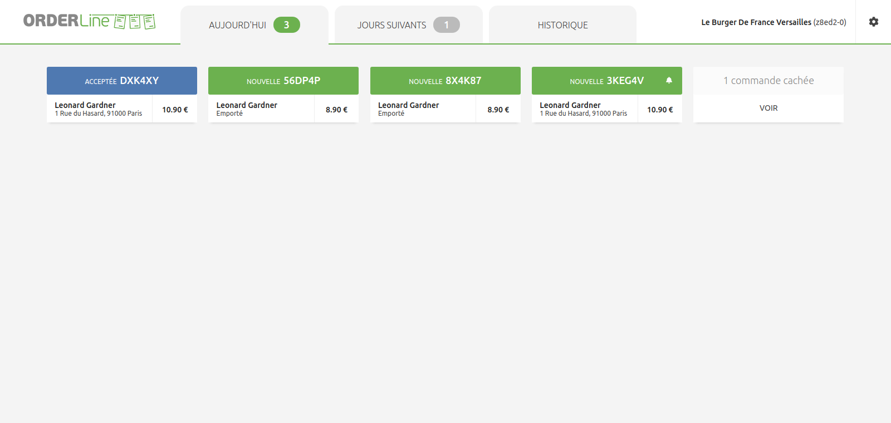
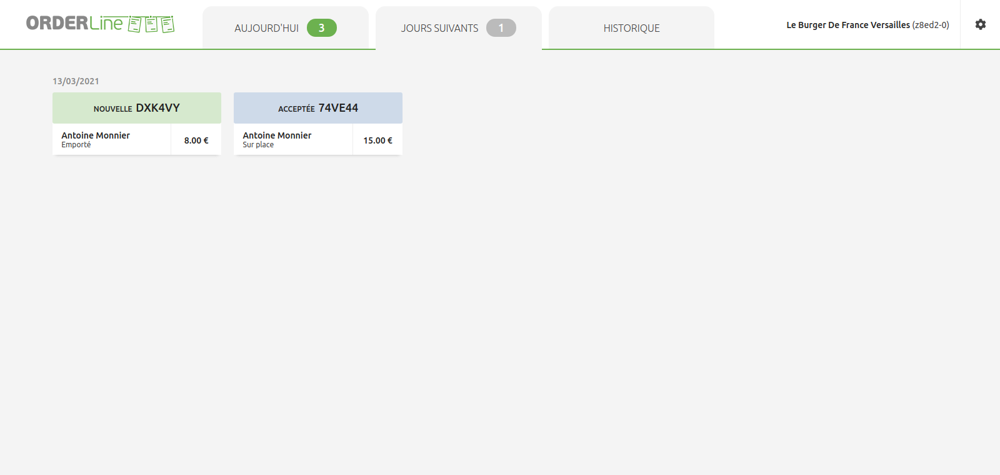

## Commandes du jour

L'onglet **Aujourd'hui** affiche toutes les commandes dont la date de livraison correspond à la date du jour. Un compteur de commandes facile à repérer indique le nombre de commandes actuellement dans le statut **Nouveau**.

Les commandes sont triées en fonction de leur heure de livraison ou de collecte souhaitée, avec les commandes à traiter le plus vite en haut de la liste.

Les commandes peuvent être masquées, selon la personnalisation choisie pour le paramètre **Masquer les commandes**. Vous pouvez retrouver ces commandes masquées dans l'onglet **Aujourd'hui** en cliquant sur **VOIR** dans la carte commande cachée. Pour plus d'informations, voir la rubrique [Enchaînement des statuts de commande](/apps/orderline/parametres/#encha-nement-des-statuts-de-commande).

## Commandes futures

L'onglet **Jours suivants** affiche toutes les commandes avec une date de livraison postérieure à la date d'aujourd'hui. Le compteur de commandes indique le nombre de commandes futures dans le statut **Nouveau**.

## Historique des commandes

OrderLine offre une vue d'ensemble avec toutes les commandes : passées, présentes et futures. Pour consulter celle-ci, cliquez sur **HISTORIQUE**.

Les commandes sont affichées en commençant par les plus récentes.

Pour une recherche ciblée dans votre historique de commandes, vous pouvez utiliser les filtres disponibles, qui incluent :

- Le nom du client ou la référence de la commande.
- La plage de dates de livraison.

