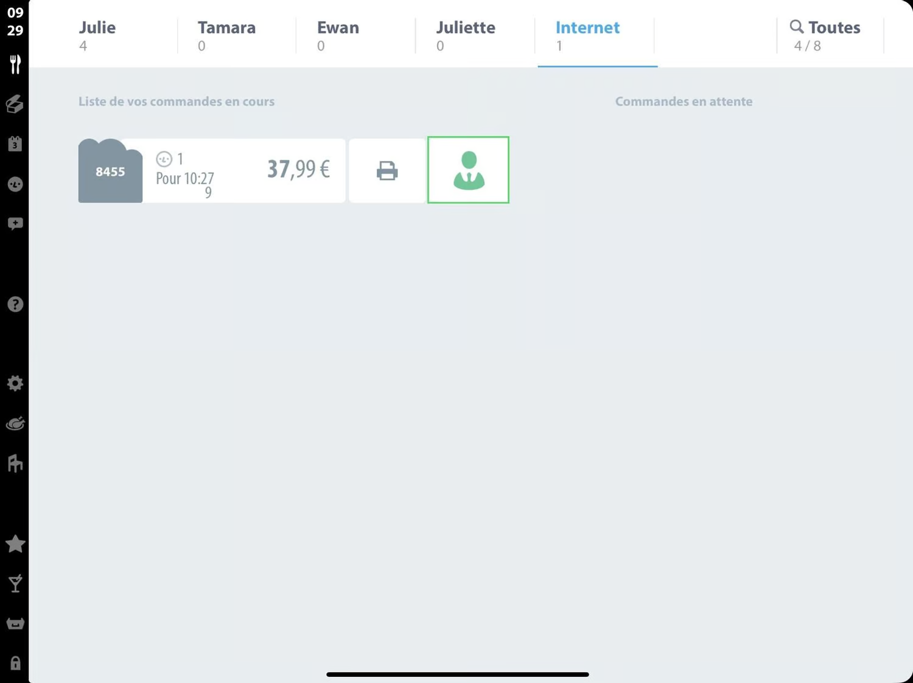

Lorsque Popina est connecté à HubRise, les commandes envoyées à HubRise arrivent automatiquement dans votre logiciel de caisse.

## Interface utilisateur

Une fois HubRise connecté, vous pouvez retrouver les commandes HubRise dans l'onglet **Internet** de Popina :

Pour plus d'informations sur le traitement des commandes HubRise dans Popina, consultez le [wiki HubRise sur Popina](https://wiki.popina.com/hubrise).

## Articles et options

Les articles et les options des commandes HubRise sont envoyés à Popina avec les informations suivantes : nom, prix, quantité, et code ref. Le code ref permet à Popina d'associer chaque article ou option à l'élément correspondant dans le catalogue Popina.

Si un article ou une option a un code ref non reconnu, Popina utilise le nom et le prix définis sur HubRise, et applique un taux de TVA par défaut. L'article ou l'option n'est pas décompté du stock, et il n'apparaît pas dans les rapports de vente.

En cas de différence de prix entre les articles d'une commande HubRise et les produits dans Popina, ce sont les prix envoyés par HubRise qui sont pris en compte.

## Types de service {#service-types}

Le code ref du type de service permet d'identifier le Fournisseur et la Marque virtuelle associés à la commande. Les fournisseurs suivants sont pris en charge : `UBEREATS`, `DELIVEROO`, `JUSTEAT`.

Le format du code ref est soit le nom du fournisseur, soit le nom du fournisseur suivi d'un tiret et du nom de la marque virtuelle. Par exemple, `UBEREATS` et `UBEREATS-Pizza30` sont tous deux valides.

## Statuts de commande

Popina passe automatiquement le statut des nouvelle commandes à **Reçue**.

Sur Popina, vous pouvez accepter ou annuler manuellement une commande, ou activer le mode d'acceptation automatique. Lorsque le statut de la commande est modifié sur Popina, le statut passe à **Acceptée** ou **Annulée** sur HubRise.

## Remises

Les remises dans HubRise sont envoyées à Popina avec le nom de la remise et le montant de la réduction. Aucun code ref n'est nécessaire pour les remises.

## Frais

Les frais dans HubRise (frais de livraison, frais de service, etc.) sont envoyés à Popina avec le libellé et le montant. Aucun code ref n'est nécessaire pour les frais.

## Paiements

Lorsqu'une commande HubRise est payée, Popina utilise le code ref de la méthode de paiement sur HubRise pour déterminer le mode de paiement. Pour trouver les codes ref à utiliser, consultez la page [Associer les codes ref](/apps/popina/map-ref-codes#payment-methods). Si le code ref est invalide ou non renseigné, Popina utilise le mode de paiement par défaut.

Lorsqu'une commande HubRise n'est pas payée, Popina la traite comme une commande ouverte.

## Informations client

Les informations complètes sur le client, y compris le nom, l'e-mail et l'adresse de livraison, sont envoyées à Popina avec chaque commande HubRise.

Popina ne crée pas de compte client pour les commandes HubRise, mais il enregistre les informations du client dans la commande.
