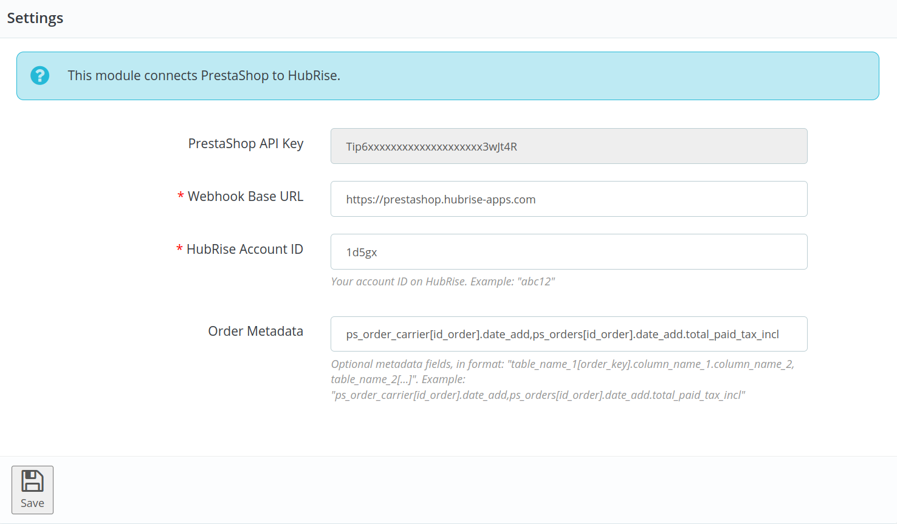

The configuration page allows you to customise the behaviour of PrestaShop Bridge based on your preferences.

---

**IMPORTANT NOTE:** Due to its very customisable nature, PrestaShop Bridge requires a certain level of technical knowledge to configure. If you are not comfortable with the configuration, place a few different test orders, with various payment methods, and contact us at support@hubrise.com, mentioning the EPOS you are using. We will be happy to help you!

---

## Language


Choose the language to use for generic items such as `Delivery charge`. These names may appear in your EPOS and in customer receipts.

## Orders

### Order Statuses {#order-statuses}


In this section, you can customise how status changes in HubRise are reflected in PrestaShop.

For each HubRise order status, specify the corresponding PrestaShop order status. To ignore a status change, select **Do nothing**.

### Service Types {#service-types}


This section displays the list of carriers you have defined in your PrestaShop back-office. You can specify the ref code for each carrier, which will be sent as `service_type_ref` in order JSONs. This ref code is used to identify the carrier in your EPOS.

Refer to your EPOS documentation on the HubRise website to verify the correct codes to use.

### Special Items


This section lets you specify the ref code used for PrestaShop gift items. It usually corresponds to a specific product in your EPOS.

### Discounts


This section lets you specify the discount ref code applied to your products, in case you have active discount rules in your PrestaShop back-office.
Refer to your EPOS documentation on the HubRise website to see how to obtain the corresponding ref code.

### Charges


If charges apply, a ref code might be required. Refer to your EPOS documentation on the HubRise website to verify.

In this section, you can specify the ref code for delivery charges, and for wrapping fees.

### Expected Time


PrestaShop offers native support for delivery dates. If you use this native feature, or if you don't use delivery dates at all, leave **Values to use** set to **None**, and PrestaShop Bridge will send delivery dates to HubRise as `expected_time`.

However, if you use a third-party PrestaShop module to manage delivery dates and times, you need to configure which table and fields contain this information in your database. This is explained in more detail in the [Order Metadata](#order-metadata) section.

The **Values to use** drop-down menu lets you choose how expected times are encoded: **One value containing both date and time**, or **Two values: one for date, one for time**. Based on the selected option, one or two fields will appear, where you can specify the metadata field name(s) that contain the expected date and time.

If your module uses one metadata key, the supported formats are the following:

- An ISO 8601 string, for example: `2021-07-22T12:00:30+02:00`
- A SQL date or time type.
- A Unix timestamp. For example: `1642422302`.

If your module uses two metadata keys, the supported formats are the following:

- The date must be in the `dd/mm/yyyy` format.
- The time must be in the `hh:mm` format.

### Payments


PrestaShop customers can pay for their order either online or by cash on delivery, depending on the modules you install in your PrestaShop back-office. Online payments include payments by check, bank wire, or other online payment platforms like PayPal.

This section of the configuration page allows you to specify the ref codes for online and cash payments. Refer to your EPOS documentation on the HubRise website to verify the correct codes to use.

### Multi-Site


Configure this section if you support multiple stores from the same PrestaShop website.

Each location must be connected to PrestaShop Bridge and identified by a unique metadata value included in the order payload sent to HubRise. Orders are only forwarded to the location that matches the configured value. To include metadata in the order payload, you need to configure the HubRise module in your PrestaShop back-office. For more information, see [Order Metadata](#order-metadata).

In the **Metadata key for multi-site** field, specify the metadata key used to identify the location.

In the **Value(s) for this location** field, specify the value associated with the location. You can specify multiple values separated by a comma.

## Catalog


### Catalog Variant to Push

Catalog variants give you the flexibility to disable specific items or adjust prices for your PrestaShop website.

If your catalog includes variants, you have the option to select which one to use. When **(none)** is selected, the default items along with their standard prices are used. If your catalog has no variants, the menu will be hidden.

### Automatic Catalog Push

Select the **Enable automatic catalog push** checkbox to synchronise your HubRise catalog with PrestaShop whenever it gets updated.

Only new products added to the HubRise catalog will be sent to PrestaShop. Any existing products within PrestaShop will remain unchanged.

## Inventory


Through inventory synchronisation, products that have a stock quantity of zero can be hidden on your PrestaShop website.

Select the **Enable automatic inventory push** checkbox to synchronise your HubRise inventory with PrestaShop whenever it gets updated.

## Save the Configuration

To save the configuration, click **Save** at the top of the page.

## Reset the Configuration

If you need to reset the configuration, click **Reset the configuration** at the bottom of the page.

---

**IMPORTANT NOTE:** Resetting the configuration will instantly disconnect the bridge from PrestaShop.

---

Resetting the configuration does not delete the operation logs displayed in the main page.

## HubRise Module Configuration {#hubrise-module-configuration}

The HubRise module is a free module that you need to install in your PrestaShop back office to connect PrestaShop to HubRise. To download and install the module, follow the instructions in [Connect to HubRise](/apps/prestashop/connect-hubrise).

To configure the HubRise module, follow these steps:

1. Log in to your PrestaShop back office.
2. From the menu, select **Modules** > **Modules manager**.
3. Find the **HubRise** module, and click **Configure**.

The user interface of the HubRise module will appear.



The page displays the following information:

- **PrestaShop API Key**: This is the API key you need to enter in the PrestaShop Bridge configuration page. This key is automatically generated when you install the HubRise module, and it cannot be changed.
- **Webhook Base URL**: This is the base URL of the webhook that your PrestaShop store uses to send order updates to HubRise. The default value `https://prestashop.hubrise-apps.com` should not be changed.
- **Account ID**: This is the ID of your HubRise account.
- **Order Metadata**: This lets you specify which database fields should be sent to HubRise as metadata when an order is created. For more information, see [Order Metadata](#order-metadata).

To change the configuration, update the fields as needed, and then click **Save**.

### Order Metadata {#order-metadata}

In order to support the widest possible range of PrestaShop modules, our PrestaShop module lets you pick some database fields to send to HubRise as metadata when an order is created. Metadata is then interpreted by PrestaShop Bridge based on the configuration of the bridge.

For example, if you use a PrestaShop module that adds a delivery time to your orders, you can specify the database field where the module stores the delivery time, and configure the bridge to pick up this field as the expected time.

#### Order Metadata Configuration

Configuring order metadata in PrestaShop Bridge generally involves three steps:

1. **Identify the relevant database fields**: Deter mine the database tables and fields that contain the data you wish to send as metadata. For a module managing delivery slots, you might have the delivery time stored in a table named `ps_prestatill_drive_creneau`, with `day` and `hour` as the fields representing the delivery date and time. Ensure that the table includes a column that links to the order ID (for example `id_order`), as this is a requirement for using a table as order metadata.

   If you do not have direct access to your database, see [PrestaShop's Database Exploration Tool](#prestashop-database-exploration).

2. **Configure the HubRise module**: Within the module's settings, specify the database fields to be sent. In our example, set **Order Metadata** to: `ps_prestatill_drive_creneau[id_order].day.hour`. This tells the module to fetch the `day` and `hour` fields from the `ps_prestatill_drive_creneau` table, linked to the order by the `id_order` field.

   The metadata is sent in the order JSON as follows:

   ```json
   {
     // ... order fields ...
     "metadata": {
       "ps_prestatill_drive_creneau__day": "2021-07-22",
       "ps_prestatill_drive_creneau__hour": "12:00"
     }
   }
   ```

3. **Configure PrestaShop Bridge**: The next step is to configure the metadata keys in PrestaShop Bridge, in the `table_name + "__" + field_name` format. In our example, set **Values to use** to **Two values: one for date, one for time**. Two fields will appear, where you can specify the metadata field names; in this case: `ps_prestatill_drive_creneau__day` and `ps_prestatill_drive_creneau__hour`.

#### Testing the Configuration

When this configuration is complete, place a test order to ensure everything works correctly.

In case of any issues, follow these steps to troubleshoot:

- Review the order JSON to confirm the presence of the metadata fields.
- Check the PrestaShop logs for any errors related to the HubRise module. To access the logs, go to **Advanced Parameters** > **Logs**.

If you are unable to resolve the issue, contact us at support@hubrise.com. It could be helpful to create a temporary account for us in your PrestaShop back-office, so we can investigate the issue directly.

#### PrestaShop's Database Exploration Tool {#prestashop-database-exploration}

If you do not have direct access to your database, PrestaShop provides a built-in database exploration tool.

To use the database exploration tool to explore your database, follow these steps:

1. Log in to your PrestaShop back office.
2. From the menu, select **Advanced Parameters** > **Database**.
3. Click **Add new SQL query**.
4. Select a table in the **List of MySQL tables** section.
5. The table's structure is displayed in the **List of attributes for this MySQL table** section.


To view the content of a table:

1. Enter a temporary name in **SQL query name**.
2. Enter `SELECT * FROM [table_name]` query in the **SQL query** field, after replacing `[table_name]` with the name of the table you want to explore, and then click **Save**.
3. Search the query you just saved, expand the **Actions** menu, and click **View**.
4. The content of the table is displayed, as shown in the following screenshot.


