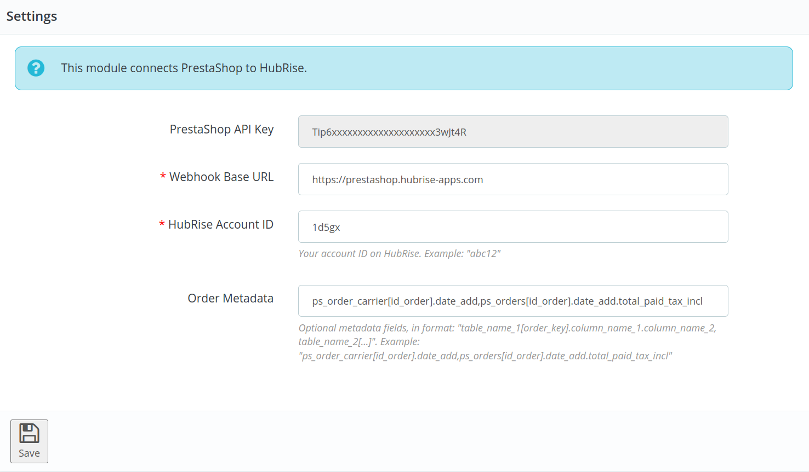
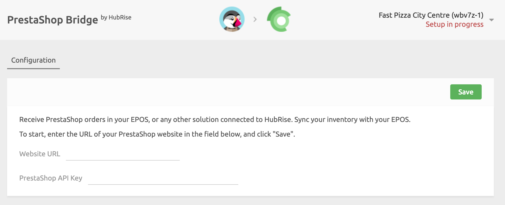

Connecting PrestaShop to HubRise can be done with a few steps.

---

**IMPORTANT NOTE:** If you do not have a HubRise account yet, register on our [Signup Page](https://manager.hubrise.com/signup). It only takes a minute!

---

## 1. Install the HubRise Module in PrestaShop

To send orders to HubRise, you must install the HubRise module in your PrestaShop back office.
The HubRise module is a software that lets PrestaShop connect to HubRise and send orders to HubRise in real time.
It also provides you with the API key you need to use to connect to PrestaShop Bridge.

To install the HubRise module, follow these steps:

1. Download the [HubRise module](https://drive.google.com/file/d/1sQxhDnqt3Rywv-n-18nqA8O06fSJsKwG/view?usp=sharing).
1. Log in to your PrestaShop back office.
1. From the menu, select **Modules** > **Modules manager**, then click **Upload a module**.
1. On the upload page, to install the module, drag the ZIP file of the module that you just downloaded.
1. Click **Configure** to open the module configuration page.
   
1. Record the **PrestaShop API key**; it is necessary to activate PrestaShop Bridge in the following section.
1. Keep the **Webhook Base URL** field at its default value: `https://prestashop.hubrise-apps.com`.
1. In the **HubRise account ID** field, enter the ID of your HubRise account.
1. Click the **Save** button.

For more information about the configuration of the HubRise module, see [HubRise Module Configuration](/apps/prestashop/configuration#hubrise-module-configuration).

## 2. Connect PrestaShop Bridge

To can connect PrestaShop to HubRise, follow these steps.

1. Log in to your HubRise account.
1. Select the location you want to connect from the dropdown menu.
1. Select **CONNECTIONS**, then **View available apps**.
1. Select **PrestaShop Bridge** from the list of apps.
1. Click **Connect**.
1. Click **Allow** to grant PrestaShop Bridge access to your registered location on HubRise. If your account has multiple locations, expand the **Choose location** section to select the desired location, and then click **Allow**.
1. A new page asks you to configure PrestaShop Bridge.
   - Under **Website URL**, enter the URL of your PrestaShop store.
   - Under **PrestaShop API key**, enter the value you copied from the HubRise module in PrestaShop.
   - Click **Save** to confirm.
     
1. If you encounter an **Invalid API key** error, see [Troubleshooting](/apps/prestashop/troubleshooting#invalid-api-key) for help.
1. Configure the behaviour of PrestaShop Bridge, then click **Save** to complete the connection. For more information about configuring your PrestaShop Bridge, see [Configuration](/apps/prestashop/configuration).

## 3. Upload Your Catalog

If you have a catalog of products on HubRise, you can upload it to your PrestaShop store with a single click.

For more information on HubRise catalogs, see [Catalogs](/docs/catalog). To learn how to push your HubRise catalog into PrestaShop, see [Push the Catalog](/apps/prestashop/push-catalog).
