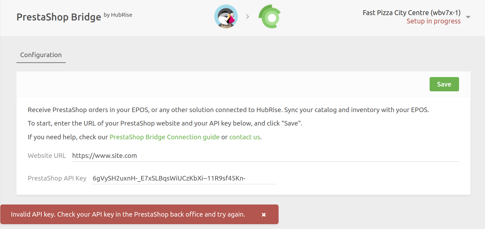

## Invalid API Key When Connecting to HubRise

When attempting to establish a connection between PrestaShop and HubRise, you may encounter the `Invalid API key. Check your API key in the PrestaShop back office and try again.` error message after entering the Website URL and API key.



Follow these troubleshooting steps to diagnose and resolve the issue.

### Confirm Your API Key

To verify your API key:

1. Open a new browser tab.
1. Enter the following URL: `https://[site_url]/api?ws_key=[api_key]` replacing `[site_url]` with your PrestaShop website URL and `[api_key]` with the API key you've entered.
1. If a browser login dialog appears, it means the key is incorrect. Conversely, if a page with XML content loads without prompting for login, your key is correct.

If the API key is incorrect, refer to the [Connect to HubRise](/apps/prestashop/connect-hubrise) to find the correct API key, and try again.

If the key is correct, proceed to the next step.

### Add an .htaccess File for Apache Servers

If your API key is correct, the issue might be that your server is configured to strip the `Authorization` header from incoming requests.

If your web server is Apache, which is typically used with PrestaShop, follow these steps:

1. Access your PrestaShop server via FTP or SSH.
2. Navigate to the `webservice` directory.
3. Create an `.htaccess` file in the `webservice` directory with the following code:
   ```apache
   <IfModule mod_rewrite.c>
     RewriteEngine on
     RewriteRule .* - [E=HTTP_AUTHORIZATION:%{HTTP:Authorization}]
   </IfModule>
   ```

This rewrite rule ensures that the HTTP Authorization headers are passed to PrestaShop through a PHP environment variable.

### Retry the Connection

Once the `.htaccess` file is in place, try to connect the PrestaShop Bridge again:

1. Return to the PrestaShop Bridge configuration page in HubRise.
1. Enter the Website URL and API key once more.
1. Click **Save**.

If the error message no longer appears and the connection is successful, the issue has been resolved.

If the problem persists, or if you are not using Apache as your web server, contact HubRise support at support@hubrise.com for assistance.
