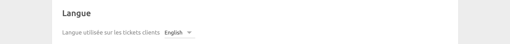
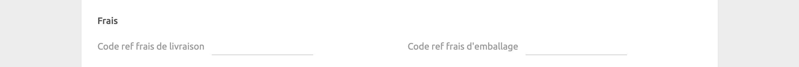

La page de configuration permet de personnaliser le comportement de PrestaShop Bridge.

---

**REMARQUE IMPORTANTE :** La configuration de PrestaShop Bridge nécessite un certain niveau de connaissances techniques, en raison de la nature très personnalisable de l'outil. Si vous n'êtes pas à l'aise avec cette configuration, passez quelques commandes de test, avec différentes méthodes de paiement, et contactez-nous à support@hubrise.com en mentionnant le logiciel de caisse que vous utilisez. Nous serons ravis de vous aider !

---

## Langue



Choisissez la langue à utiliser pour les éléments génériques tels que `Delivery charge` (Frais de livraison). Ces noms peuvent apparaître dans votre logiciel de caisse et sur les reçus des clients.

## Commandes

### Statuts de commande {#order-statuses}


Dans cette section, vous pouvez personnaliser la façon dont les changements de statut dans HubRise se reflètent dans PrestaShop.

Pour chaque statut de commande HubRise, spécifiez le statut de commande PrestaShop correspondant. Pour ignorer un changement de statut, sélectionnez **Ne pas associer**.

### Types de service {#service-types}


Cette section affiche la liste des transporteurs que vous avez définis dans votre back-office PrestaShop. Vous pouvez spécifier le code ref pour chaque transporteur, qui sera envoyé en tant que `service_type_ref` dans les objets JSON de la commande. Ce code ref est utilisé pour identifier le transporteur dans votre logiciel de caisse.

Pour connaître les codes à utiliser, consultez la documentation de votre logiciel de caisse sur la [page Apps](/apps) du site internet de HubRise.

### Articles spéciaux


Dans cette section, vous pouvez spécifier le code ref utilisé pour les articles cadeaux PrestaShop. Il correspond généralement à un produit spécifique de votre logiciel de caisse.

### Remises


Dans cette section, vous pouvez spécifier le code ref de la remise appliquée à vos produits, dans le cas où vous avez des règles de remise actives dans votre back-office PrestaShop.
Pour obtenir le code ref correspondant, reportez-vous à la documentation de votre logiciel de caisse sur la [page Apps](/apps) du site internet de HubRise.

### Frais



Si des frais s'appliquent, un code ref peut être nécessaire. Pour vérifier, référez-vous à la documentation de votre logiciel de caisse sur la [page Apps](/apps) du site internet de HubRise.

Dans cette section, vous pouvez spécifier le code ref des frais de livraison et des frais d'emballage.

### Heure souhaitée


PrestaShop propose un support natif pour les dates de livraison. Si vous utilisez cette fonctionnalité native ou si vous n'utilisez pas du tout les dates de livraison, laissez **Valeurs à utiliser** défini sur **Aucune**, et PrestaShop Bridge enverra les dates de livraison à HubRise en tant que `expected_time`.

Cependant, si vous utilisez un module PrestaShop tiers pour gérer les dates et les heures de livraison, vous devez déterminer les tables et champs qui contiennent ces informations dans votre base de données. Vous trouverez une explication plus détaillée dans la section [Métadonnées de commande](#order-metadata).

Dans le menu déroulant **Valeurs à utiliser**, choisissez comment les heures souhaitées sont encodées : **Une valeur contenant la date et l'heure** ou **Deux valeurs : une pour la date, une pour l'heure**. En fonction de l'option sélectionnée, un ou deux champs apparaissent, où vous pouvez spécifier les noms des champs de métadonnées contenant la date et l'heure souhaitées.

Si votre module utilise une clé de métadonnées, les formats pris en charge sont les suivants :

- Une chaîne ISO 8601, par exemple : `2021-07-22T12:00:30+02:00`
- Un type de date ou d'heure SQL
- Un horodatage Unix, par exemple : `1642422302`

Si votre module utilise deux clés de métadonnées, les formats pris en charge sont les suivants :

- La date doit être une date ou une heure analysable, par exemple : `dd/mm/yyyy`, `yyyy-mm-dd`, ou une chaîne ISO 8601 dont la partie heure est ignorée.
- L'heure doit être une heure analysable, par exemple : `hh:mm:ss`, `hh:mm`, ou une chaîne ISO 8601 dont la partie date est ignorée.

### Paiements


Les clients PrestaShop peuvent payer leur commande en ligne ou en espèces à la livraison, en fonction des modules que vous installez dans votre back-office PrestaShop. Les paiements en ligne incluent les paiements par chèque, virement bancaire ou des plateformes de paiement en ligne comme PayPal.

Dans cette section, vous pouvez spécifier les codes ref des deux types de paiement. Pour connaître les codes à utiliser, consultez la documentation de votre logiciel de caisse sur la [page Apps](/apps) du site internet de HubRise.

### Multisite


Configurez cette section si vous prenez en charge plusieurs points de vente sur le même site internet PrestaShop.

Chaque point de vente doit être connecté à PrestaShop Bridge et identifié par une valeur de métadonnée unique incluse dans la requête de commande envoyée à HubRise. Les commandes ne sont transmises qu'au point de vente dont la valeur configurée correspond. Pour inclure des métadonnées dans la requête de commande, vous devez configurer le module HubRise dans votre back-office PrestaShop. Pour plus d'informations, voir [Métadonnées de commande](#order-metadata).

Dans le champ **Clé de métadonnée multisite**, spécifiez la clé de métadonnée utilisée pour identifier les points de vente.

Dans le champ **Valeur(s) pour ce point de vente**, indiquez la valeur associée au point de vente. Si vous spécifiez plusieurs valeurs, séparez-les par des virgules.

## Catalogue


### Variante de catalogue à envoyer

Les variantes de catalogue vous donnent la flexibilité de désactiver des articles ou d'ajuster les prix spécifiquement pour votre site internet PrestaShop. Pour plus d'informations, voir [Variantes de catalogues](/apps/catalog-manager/variants) dans notre documentation en ligne du Catalog Manager.

Si votre catalogue comprend des variantes, vous pouvez sélectionner celle que vous souhaitez utiliser. Lorsque **(aucun)** est sélectionné, les articles par défaut ainsi que leurs prix standards sont utilisés. Si votre catalogue n'a pas de variante, le menu déroulant est masqué.

### Envoi automatique du catalogue

Sélectionnez la case **Activer l'envoi automatique du catalogue** pour synchroniser votre catalogue HubRise avec PrestaShop chaque fois qu'il est mis à jour.

Seuls les nouveaux produits ajoutés au catalogue HubRise seront envoyés à PrestaShop. Les produits existants dans PrestaShop resteront inchangés.

## Inventaire


Grâce à la synchronisation de l'inventaire, les produits dont la quantité en stock est nulle peuvent être masqués sur votre site internet PrestaShop.

Sélectionnez la case **Activer l'envoi automatique de l'inventaire** pour synchroniser votre inventaire HubRise avec PrestaShop chaque fois qu'il est mis à jour.

## Enregistrer la configuration

Pour enregistrer la configuration, cliquez sur **Enregistrer** en haut de la page.

## Réinitialiser la configuration

Si vous avez besoin de réinitialiser la configuration, cliquez sur **Réinitialiser la configuration** en bas de la page.

---

**REMARQUE IMPORTANTE** : La réinitialisation de la configuration déconnectera instantanément le bridge de PrestaShop.

---

La réinitialisation de la configuration ne supprime pas les logs des opérations affichés sur la page principale.

## Configuration du module HubRise {#hubrise-module-configuration}

Le module HubRise est un module gratuit que vous devez installer dans votre back-office PrestaShop afin de connecter PrestaShop à HubRise. Pour télécharger et installer le module, suivez les instructions de la section [Connexion à HubRise](/apps/prestashop/connect-hubrise).

Pour configurer le module HubRise, suivez ces étapes :

1. Connectez-vous à votre back-office PrestaShop.
2. Dans le menu, sélectionnez **Modules** > **Gestionnaire de modules**.
3. Trouvez le module **HubRise** et cliquez sur **Configurer**.

L'interface utilisateur du module HubRise s'affiche.


La page contient les informations suivantes :

- **PrestaShop API Key** : clé API que vous devez saisir dans la page de configuration de PrestaShop Bridge. Automatiquement générée lorsque vous installez le module HubRise, elle ne peut être modifiée.
- **Webhook Base URL** : URL de base du crochet Web que votre boutique PrestaShop utilise pour envoyer des mises à jour de commande à HubRise. La valeur par défaut `https://prestashop.hubrise-apps.com` ne doit pas être modifiée.
- **HubRise Account ID** : ID de compte HubRise.
- **Order Metadata** : permet de spécifier les champs de la base de données qui doivent être envoyés à HubRise en tant que métadonnées lorsqu'une commande est créée. Pour plus d'informations, voir [Métadonnées de commande](#order-metadata).

Pour modifier la configuration, mettez à jour les champs, puis cliquez sur **Save** (Enregistrer).

### Métadonnées de commande {#order-metadata}

Afin de prendre en charge le plus large éventail de modules PrestaShop possible, notre module PrestaShop vous permet de choisir certains champs de base de données à envoyer à HubRise en tant que métadonnées lorsqu'une commande est créée. Les métadonnées sont ensuite interprétées par PrestaShop Bridge en fonction de la configuration du bridge.

Par exemple, si vous utilisez un module PrestaShop qui ajoute une heure de livraison à vos commandes, vous pouvez spécifier le champ de base de données où le module stocke l'heure de livraison, et configurer le bridge pour qu'il récupère ce champ en tant qu'heure souhaitée.

#### Configuration des métadonnées de commande

La configuration des métadonnées de commande dans PrestaShop Bridge se fait généralement en trois étapes :

1. **Identifiez les champs pertinents de la base de données** : Déterminez les tables et champs de la base de données qui contiennent les données que vous souhaitez envoyer en tant que métadonnées. Pour un module de gestion des créneaux de livraison, l'heure de livraison peut être stockée dans une table nommée `ps_prestatill_drive_creneau`, les champs `day` et `hour` représentant la date et l'heure de livraison. Assurez-vous que la table inclut une colonne associée à l'ID de commande (par exemple `id_order`), car c'est un prérequis pour utiliser une table de métadonnées de commande.

   Si vous n'avez pas directement accès à votre base de données, voir [Outil d'exploration de base de données de PrestaShop](#prestashop-database-exploration).

2. **Configurez le module HubRise** : Dans les paramètres du module, spécifiez les champs de base de données à envoyer. Dans notre exemple, définissez **Order Metadata** sur `ps_prestatill_drive_creneau[id_order].day.hour`. Cela indique au module qu'il doit récupérer les champs `day` et `hour` de la table `ps_prestatill_drive_creneau`, associés à la commande par le champ `id_order`.

   Les métadonnées sont envoyées dans les objets JSON de la commande de la façon suivante :

   ```json
   {
     // ... order fields ...
     "metadata": {
       "ps_prestatill_drive_creneau__day": "2021-07-22",
       "ps_prestatill_drive_creneau__hour": "12:00"
     }
   }
   ```

3. **Configurez PrestaShop Bridge** : La prochaine étape consiste à configurer les clés de métadonnées dans PrestaShop Bridge, au format `nom_table + "__" + nom_champ`. Dans notre exemple, définissez **Valeurs à utiliser** sur **Deux valeurs : une pour la date, une pour l'heure**. Deux champs apparaissent, où vous pouvez spécifier les noms des champs de métadonnées, dans ce cas `ps_prestatill_drive_creneau__day` et `ps_prestatill_drive_creneau__hour`.

#### Test de la configuration

Lorsque cette configuration est terminée, passez une commande de test pour vous assurer que tout fonctionne correctement.

En cas de problème, suivez ces étapes de dépannage :

- Examinez l'objet JSON de la commande pour confirmer la présence des champs de métadonnées.
- Vérifiez dans les logs PrestaShop qu'il n'y a pas d'erreur liée au module HubRise. Pour accéder aux logs, allez dans **Paramètres Avancés** > **Logs**.

Si vous ne parvenez pas à résoudre le problème, contactez-nous à l'adresse support@hubrise.com. Il pourrait être utile de nous créer un compte temporaire dans votre back-office PrestaShop, pour que nous puissions étudier directement le problème.

#### Outil d'exploration de base de données PrestaShop {#prestashop-database-exploration}

Si vous n'avez pas directement accès à votre base de données, PrestaShop fournit un outil intégré d'exploration de base de données.

Pour l'utiliser afin d'explorer votre base de données, suivez ces étapes :

1. Connectez-vous à votre back-office PrestaShop.
2. Dans le menu, sélectionnez **Paramètres avancés** > **Base de données**.
3. Cliquez sur **Ajouter une requête SQL**.
4. Sélectionnez une table dans la section **Liste des tables MySQL**.
5. La structure de la table est affichée dans la section **Liste des attributs de cette table MySQL**.


Pour afficher le contenu d'une table :

1. Saisissez un nom temporaire dans **Nom de la requête SQL**.
2. Dans le champ **Requête SQL**, saisissez `SELECT * FROM [nom_table]` dans le champ de requête après avoir remplacé `[nom_table]` par le nom de la table que vous souhaitez explorer, puis cliquez sur **Enregistrer**.
3. Recherchez la requête que vous venez d'enregistrer, développez le menu **Actions**, et cliquez sur **Afficher**.
4. Le contenu de la table s'affiche, comme dans la capture d'écran ci-dessous.


