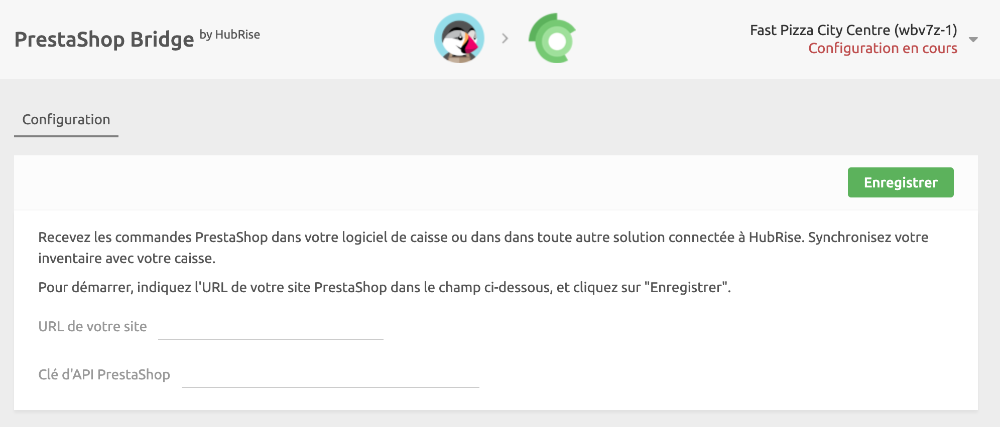

La connexion de PrestaShop à HubRise s'effectue en quelques étapes seulement.

---

**REMARQUE IMPORTANTE :** Si vous ne possédez pas encore de compte HubRise, rendez-vous sur la [page d'inscription à HubRise](https://manager.hubrise.com/signup). L'inscription ne prend qu'une minute !

---

## 1. Installer le module HubRise dans PrestaShop

Pour envoyer des commandes à HubRise, vous devez installer le module HubRise dans votre back-office PrestaShop.
Ce module est un logiciel qui permet à PrestaShop de se connecter à HubRise et de lui envoyer des commandes en temps réel.
Il fournit également la clé d'API dont vous avez besoin pour vous connecter à PrestaShop Bridge.

Pour installer le module HubRise, suivez ces étapes :

1. Téléchargez le [module HubRise](https://drive.google.com/file/d/1sQxhDnqt3Rywv-n-18nqA8O06fSJsKwG/view?usp=sharing).
2. Connectez-vous à votre back-office PrestaShop.
3. Dans le menu, sélectionnez **Modules** > **Gestionnaire de modules**, puis cliquez sur **Installer un module**.
4. Faites glisser le fichier ZIP du module à installer. Cliquez ensuite sur **Configurer**.
5. Sur la page du module **HubRise**, notez la valeur de la clé d'API PrestaShop (**PrestaShop API Key**) dont vous avez besoin pour activer PrestaShop Bridge à l'étape suivante.

Pour plus d'informations sur la configuration du module HubRise, consultez [Configuration du module HubRise](/apps/prestashop/configuration#hubrise-module-configuration).

## 2. Connecter PrestaShop Bridge

Pour connecter PrestaShop à HubRise, suivez ces étapes.

1. Connectez-vous à votre compte HubRise.
2. Dans le menu déroulant, sélectionnez le point de vente que vous souhaitez connecter.
3. Sélectionnez **CONNEXIONS**, puis **Voir les apps disponibles**.
4. Sélectionnez **PrestaShop Bridge** dans la liste des applications.
5. Cliquez sur **Connecter**.
6. Cliquez sur **Autoriser** pour autoriser PrestaShop Bridge à accéder à votre point de vente enregistré sur HubRise. Si votre compte possède plusieurs points de vente, développez **Choisissez le point de vente**, sélectionnez le point de vente à connecter, puis cliquez sur **Autoriser**.
7. Une nouvelle page vous invite à configurer PrestaShop Bridge.
   - Sous **URL de votre site**, saisissez l'URL de votre boutique PrestaShop.
   - Sous **Clé d'API PrestaShop**, saisissez la valeur que vous avez notée sur la page du module HubRise dans PrestaShop.
   - Cliquez sur **Enregistrer** pour confirmer.
     
8. Configurez le comportement de PrestaShop Bridge, puis cliquez sur **Enregistrer** pour finaliser la connexion. Pour plus d'informations sur la configuration de PrestaShop Bridge, consultez [Configuration](/apps/prestashop/configuration).

## 3) Envoyer votre catalogue

Si vous disposez d'un catalogue de produits sur HubRise, vous pouvez l'envoyer dans votre boutique PrestaShop en un seul clic.

Pour plus d'informations sur les catalogues HubRise, voir [Catalogues](/docs/catalog). Pour savoir comment envoyer votre catalogue HubRise dans PrestaShop, voir [Envoyer le catalogue](/apps/prestashop/push-catalog).
