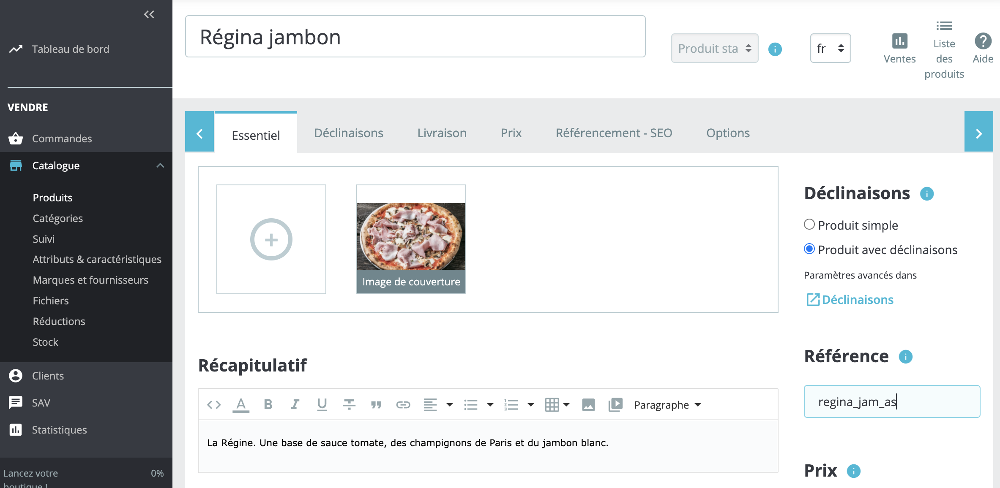
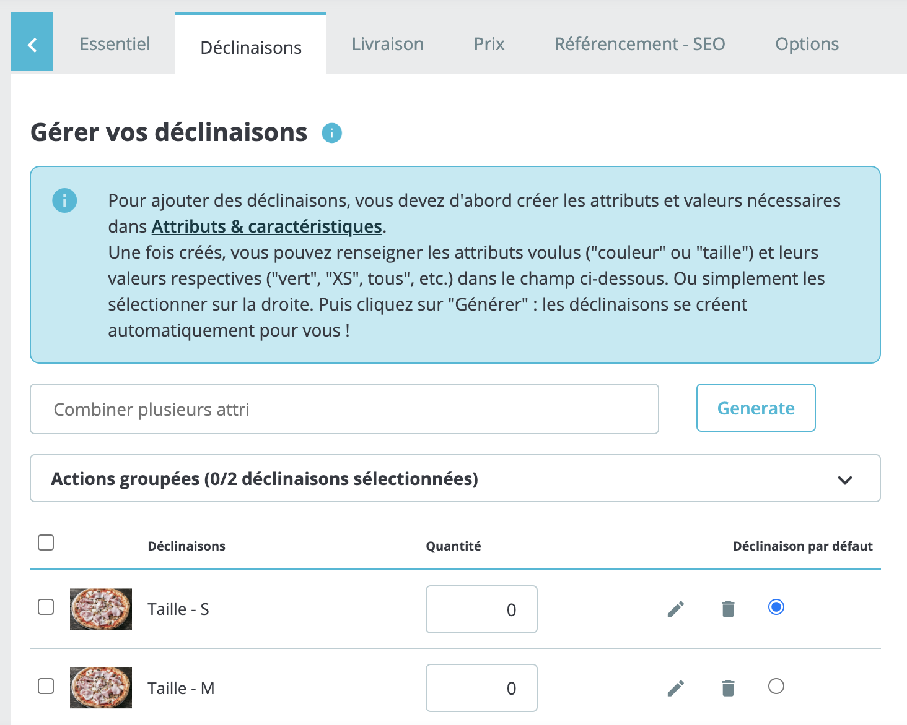
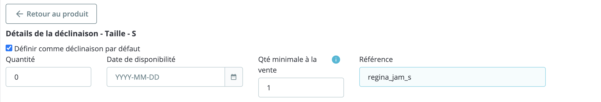

Pour traiter correctement les commandes, la plupart des logiciels de caisse exigent un code ref pour chaque produit. Vous devez donc vérifier que chaque produit dans PrestaShop est associé au bon code ref.

Cette page explique comment configurer manuellement les codes ref dans PrestaShop. Cependant, certains logiciels de caisse offrent la possibilité d'exporter leur catalogue vers HubRise, ce qui permet de renseigner automatiquement les bons codes ref des produits PrestaShop. Pour plus de détails, voir [Envoyer le catalogue](/apps/prestashop/push-catalog).

Pour attribuer des codes ref à vos produits PrestaShop, suivez ces étapes :

1. Connectez-vous à votre back-office PrestaShop.
2. Dans le menu, sélectionnez **Catalogue** > **Produits**.
3. Dans la liste, sélectionnez le produit pour lequel vous voulez ajouter le code ref.
4. Sur la page du produit, dans l'onglet **Essentiel**, saisissez le code ref du produit dans le champ **Référence**.
   
5. Pour confirmer, cliquez sur **Enregistrer**.

Si votre produit contient des SKU, vous devez saisir les codes ref pour chaque déclinaison de votre produit. Suivez ces étapes :

1. Sur la page du produit, dans l'onglet **Déclinaisons**, cliquez sur l'icône Crayon&nbsp;<InlineImage width="20" height="20"></InlineImage> à côté de la déclinaison.
   
2. Sur la page de la déclinaison, sous **Détails de la déclinaison**, saisissez le code ref dans le champ **Référence**.
   
3. Répétez le processus pour toutes les déclinaisons disponibles, puis cliquez sur **Enregistrer** pour confirmer.

Répétez cette procédure pour chacun de vos produits.
