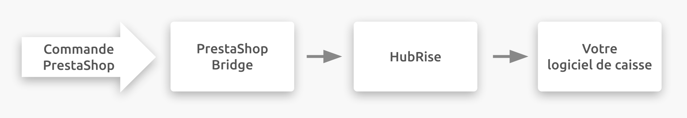

## Description

PrestaShop est une solution open source de création de site e-commerce. Elle permet de vendre sur votre site tout type de produit, d'accepter les paiements en ligne, de gérer la livraison et l'inventaire. Vous pouvez aussi consulter les métriques d'activité de votre site e-commerce.

PrestaShop est une solution multilingue et multidevise utilisée dans le monde entier.

Elle bénéficie d'une communauté étendue et offre un panel très fourni d'applications et de thèmes, qui vous permettront d'enrichir les fonctionnalités et de personnaliser l'apparence de votre site.

PrestaShop peut être hébergé ou fonctionner sur votre propre serveur.

## Fonctionnalités de l'intégration

Connecter PrestaShop Bridge permet à HubRise de :

- Recevoir les commandes de PrestaShop, dont les statuts de commande.
- Recevoir les informations clients de PrestaShop.
- Envoyer un catalogue vers PrestaShop, avec support des variantes.
- Synchroniser l'inventaire avec PrestaShop.

PrestaShop peut être connecté à HubRise depuis le back-office de HubRise.

## Pourquoi se connecter ?

En connectant PrestaShop à HubRise, vous permettez à votre site e-commerce de communiquer avec les autres applications que vous utilisez de manière quotidienne. Vous pouvez ainsi recevoir des commandes dans votre logiciel de caisse, envoyer des commandes vers votre imprimante connectée ou vers votre système de gestion des stocks, ou envoyer votre catalogue HubRise dans PrestaShop.

Grâce à HubRise, vous pouvez synchroniser votre menu, vos informations clients et vos commandes avec votre logiciel de caisse et de commande en ligne, les plateformes de livraison de repas (dont Deliveroo, Uber Eats et Just Eat), les solutions de gestion de livreurs, les services de livraison, les solutions d'e-marketing (SMS/e-mail), les systèmes de business intelligence, de gestion de stock et de fidélisation client, et bien d'autres encore. Le nombre d'applications compatibles augmente chaque mois. Pour voir les applications que vous pouvez connecter, rendez-vous sur notre [page Apps](/apps).

## Prérequis

Pour établir la connexion entre PrestaShop et HubRise, vous devez disposer d'un compte PrestaShop.
