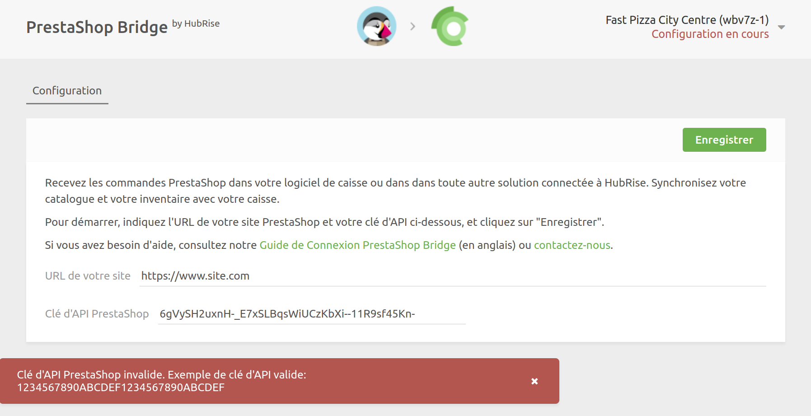

Ce guide fournit des instructions de dépannage pour résoudre les problèmes courants lors de la connexion de PrestaShop à HubRise. La plupart des instructions ici nécessitent des connaissances techniques avancées et doivent être effectués par un développeur ou un administrateur système.

## Clé d'API invalide lors de la connexion à HubRise {#invalid-api-key}

En tentant d'établir une connexion entre PrestaShop et HubRise, vous pouvez rencontrer le message d'erreur suivant après avoir saisi l'URL du site internet et la clé d'API :

`Clé d'API PrestaShop invalide. Exemple de clé d'API valide: 1234567890ABCDEF1234567890ABCDEF`



Suivez ces étapes pour diagnostiquer et résoudre le problème.

### Vérifier votre clé d'API

Pour vérifier votre clé d'API :

1. Ouvrez un nouvel onglet du navigateur.

2. Saisissez l'URL suivante : `https://[site_url]/api?ws_key=[api_key]` en remplaçant `[site_url]` par l'URL de votre site internet PrestaShop et `[api_key]` par la clé d'API que vous avez saisie.

   - Si une boîte de dialogue de connexion du navigateur apparaît, la clé est incorrecte. Pour trouver la clé d'API correcte, consultez la section [Connexion à HubRise](/apps/prestashop/connect-hubrise).
   - À l'inverse, si une page avec du contenu XML se charge sans invitation à se connecter, votre clé est correcte. Passez à l'étape suivante.

### Vérifiez que l'en-tête Authorization est accepté

Si votre clé est correcte, le problème est probablement que votre serveur n'est pas configuré pour accepter l'en-tête `Authorization`. Pour vérifier, exécutez la commande suivante dans un terminal :

```bash
curl -i --location --request GET 'https://<shop_domain>/api/shops/1' --header 'Authorization: Basic <base64 encoding of (api key + ":")>'
```

Si la réponse est une erreur 401, essayez la requête suivante, équivalente mais qui n'utilise pas l'en-tête `Authorization` :

```bash
curl -i --location --request GET 'https://<shop_domain>/api/shops/1?ws_key=<api key>'
```

Si cette requête fonctionne, demandez à l'administrateur du serveur d'activer l'en-tête `Authorization`. Le correctif dépendra du serveur utilisé (Apache, Nginx, etc.) et de la configuration du serveur. La section suivante propose un correctif courant pour les serveurs Apache.

### Ajouter ou modifier le fichier .htaccess pour les serveurs Apache

Si vous avez un serveur web Apache, généralement utilisé avec PrestaShop, il peut être configuré pour supprimer l'en-tête `Authorization`. Pour résoudre ce problème, ajoutez une règle de réécriture afin de vous assurer que l'en-tête est transmise à PrestaShop via une variable d'environnement PHP :

1. Accédez à votre serveur PrestaShop via FTP ou SSH.

2. Accédez au répertoire `webservice`.

3. Créez un fichier `.htaccess` dans le répertoire `webservice` avec le code suivant :
   ```apache
   <IfModule mod_rewrite.c>
     RewriteEngine on
     RewriteRule .* - [E=HTTP_AUTHORIZATION:%{HTTP:Authorization}]
   </IfModule>
   ```

4. Essayez de reconnecter PrestaShop Bridge.

5. Si cela ne résout pas le problème, vérifiez le fichier `.htaccess` dans le répertoire racine de PrestaShop et ajustez les règles de réécriture. Bien que le correctif réel puisse varier, l'exemple suivant montre un correctif courant.

   Ancien code :

   ```apache
   RewriteRule . - [E=REWRITEBASE:/]
   RewriteRule ^api(?:/(.*))?$ %{ENV:REWRITEBASE}webservice/dispatcher.php?url=$1 [QSA,L]
   ```

   Nouveau code :

   ```apache
   RewriteCond %{HTTP:Authorization} ^(.*)
   RewriteRule . - [E=HTTP_AUTHORIZATION:%1]

   RewriteRule . - [E=REWRITEBASE:/]
   RewriteRule .* - [E=HTTP_AUTHORIZATION:%{HTTP:Authorization}]
   RewriteRule ^api$ api/ [L]

   RewriteRule ^api/(.*)$ %{ENV:REWRITEBASE}webservice/dispatcher.php?url=$1 [QSA,L]
   ```

6. Enregistrez les modifications et essayez de connecter PrestaShop Bridge à nouveau.

Si le problème persiste ou si vous utilisez un serveur web différent, contactez le support HubRise à l'adresse support@hubrise.com pour obtenir de l'aide.

## Erreurs lors de l'envoi du catalogue {#push-catalog-errors}

Lors de l'envoi du catalogue, l'erreur suivante peut apparaître dans l'onglet **Opérations** :

```
{
  "errors": [
    {
      "code": 15,
      "message": "[PHP Unknown error #8192] Return type of Ramsey\\Collection\\AbstractArray::offsetGet($offset) should either be compatible with ArrayAccess::offsetGet(mixed $offset): mixed, or the #[\\ReturnTypeWillChange] attribute should be used to temporarily suppress the notice (/home/your_site/www/modules/ps_accounts/vendor/ramsey/collection/src/AbstractArray.php, line 87)"
    },
```

Cette erreur se produit parce que la bibliothèque `ramsey/collection` utilisée dans le module `ps_accounts` a des problèmes de compatibilité avec PHP 8.1+. Le correctif a été implémenté entre les versions 8.1.1 et 8.1.5 de PrestaShop. Pour résoudre le problème, mettez à jour PrestaShop vers la dernière version.

Si vous ne parvenez pas à mettre à jour PrestaShop, vous pouvez essayer de résoudre manuellement le problème en ajoutant [cette ligne](https://github.com/ramsey/collection/blob/1.2.0/src/AbstractArray.php#L89) au fichier indiqué dans le message d'erreur.

## Commandes non synchronisées {#orders-not-syncing}

Si PrestaShop Bridge est connecté à HubRise, mais les commandes ne se synchronisent pas, vérifiez les éléments suivants :

### Dans HubRise

- Ouvrez PrestaShop Bridge depuis la page **CONNEXIONS**.
- Assurez-vous que PrestaShop Bridge est entièrement configuré. Le message **Configuration en cours** (en rouge) ne doit pas apparaître dans le coin supérieur droit.

### Dans PrestaShop

Vérifiez l'installation du module HubRise :

- Ouvrez **Modules** > **Gestionnaire de modules**.
- Vérifiez que le module HubRise est listé, installé et activé. Si le module est listé mais n'est pas activé, vous verrez une option **Activer** dans le menu contextuel. Cliquez dessus pour activer le module.
- Ouvrez **Modules** > **Gestionnaire de modules**.
- Cliquez sur **Configurer** sur le module HubRise.
- Assurez-vous que tous les champs obligatoires sont correctement remplis. Si des champs sont manquants, complétez-les et cliquez sur **Enregistrer**.

Vérifier la configuration du Webservice :

- Allez dans **Paramètres avancés** > **Webservice**.
- Cherchez une clé nommée **HubRise integration key**. Si la clé n'existe pas, réinstallez le module HubRise et vérifiez à nouveau.
- Sélectionnez la clé pour afficher sa configuration.
- Vérifiez que **Activer la clé webservice** est défini sur **Oui**.
- Vérifiez que toutes, ou presque toutes, les permissions de `GET`, `PUT`, `POST`, et `DELETE` sont activées. Si ce n'est pas le cas, cela peut indiquer un problème de configuration, et vous devez réinstaller le module HubRise.

Vérifier les points d'accroche :

- Ouvrez **Modules** > **Gestionnaire de modules**.
- Cliquez sur **Configurer** sur le module HubRise.
- Sélectionnez **Points d'accroche**.
- Activer la case à cocher **Afficher les points d'accroche invisibles** pour voir tous les points d'accroche.
- Confirmez que le module HubRise est accroché aux événements suivants :
  - `actionValidateOrder`
  - `actionOrderStatusPostUpdate`
- Si un autre module est connecté aux mêmes événements, il pourrait bloquer le module HubRise ; essayez de déplacer le module HubRise en haut de la liste pour vous assurer qu'il s'exécute en premier. Si cela résout le problème, réordonnez les modules si nécessaire, en veillant à ce que les modules dont dépend le module HubRise pour la création de métadonnées soient exécutés en premier.

Si le problème persiste après ces vérifications, contactez-nous à support@hubrise.com.
