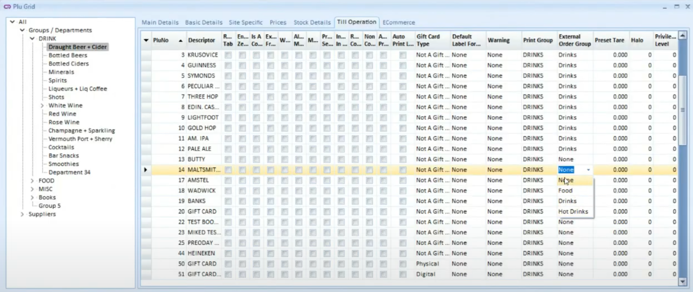
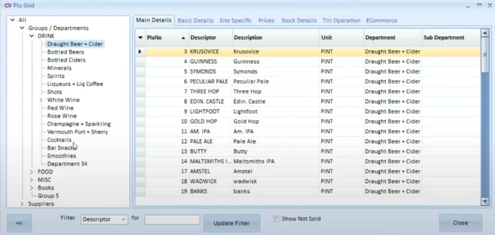
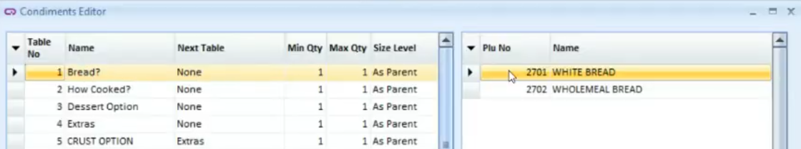
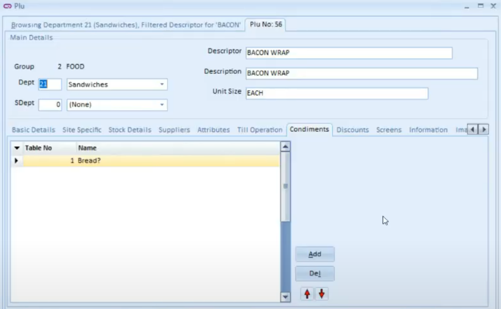

Once your Quantum EPOS system is connected to HubRise, you must configure your other connected applications so that the various elements in the orders are properly identified by Quantum.

Quantum identifies each element of an order by a ref code. You must enter the ref codes provided by Quantum in your other applications so that orders can be received.

There are two ways to proceed:

- You can export the Quantum catalog to HubRise, then import this catalog into your other applications.
- Alternatively, you can manually enter the ref codes in your other applications.

Only certain applications allow the import of a catalog from HubRise. For others, you will need to enter the ref codes manually.

## Export the Catalog {#export-catalog}

---

**IMPORTANT NOTE:** This operation will overwrite the HubRise catalog connected to Quantum.

---

To manually export a catalog to HubRise, follow these steps:

1. Open the Quantum back office.
2. Navigate to **Communications** > **External Ordering**
3. Click **Upload This Site**.
4. Confirm the operation by clicking **Yes**.

You must now import the HubRise catalog into your other applications connected to HubRise. To perform this operation, refer to the documentation for these applications on the HubRise website.

The following elements are exported:

- **Categories**. External order groups are exported as categories.

- **Products**. Products are exported along with their description, sizes, prices, condiments, images, and list of allergens. Only products attached to external order groups are exported. To check whether a product is attached to an external order group:

  - Open the Quantum back office.
  - Navigate to **Plu** > **Edit Plu Grid**.
  - In the left pane, open the group or department that contains the product.
  - In the right pane, select the **Till Operation** tab.
  - Check if the **External Order Group** field is set for the product.
    

- **Option lists**. Condiments are exported as option lists and are associated with SKUs.

## Products {#products}

To find the ref code of a product, follow these steps:

1. Open the Quantum back office.
2. Navigate to **Plu** > **Edit Plu Grid**.
3. In the left pane, open the group or department that contains the product.
4. In the right pane, find the product in the list. The ref code is displayed in the **PluNo** column.

## SKUs

SKUs in HubRise correspond to product sizes in Quantum. Each product can be associated to up to 3 different sizes. To find the ref code of an SKU, follow these steps:

1. Find the ref code of the product. For instructions, refer to the [Products](#products) section.
2. Append the size order number to the product ref code, separated by a comma. For example, if the product ref code is `12345`, the SKU ref code of the second size would be `12345,2`.

## Options

Options in HubRise are products in Quantum. They are associated to specific products via Condiments.

- Condiments are set up in the **Condiments Editor**, available from the **Till Setup** > **Edit Condiments** menu.
  

- The association between a specific product and a condiment is done through the **Condiments** tab in the product details.
  

To find the ref code of an option, follow the same steps as for [Products](#products).

## Deals

Deals in HubRise are special offers that apply to certain items. Deals in HubRise orders are skipped in Quantum, so they do not have a ref code.

## Discounts

Discounts in HubRise are special offers that apply to the entire order. Discounts do not have a ref code in Quantum: they are identified by their name.

## Charges

Charges do not have a ref code in Quantum. They are identified by their name.

## Payment Methods

Payment methods in HubRise orders are automatically associated with the payment methods in Quantum, based on the order source. They do not have a ref code.

## Service Types

Service types do not have a ref code in Quantum. They are identified by their name, which can be `delivery`, `collection`, or `eat_in`.
