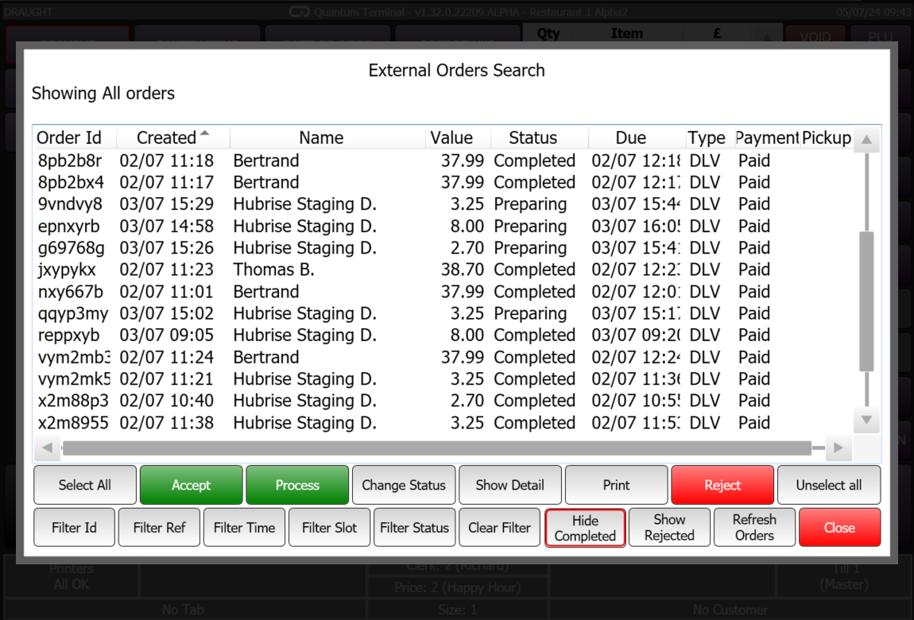
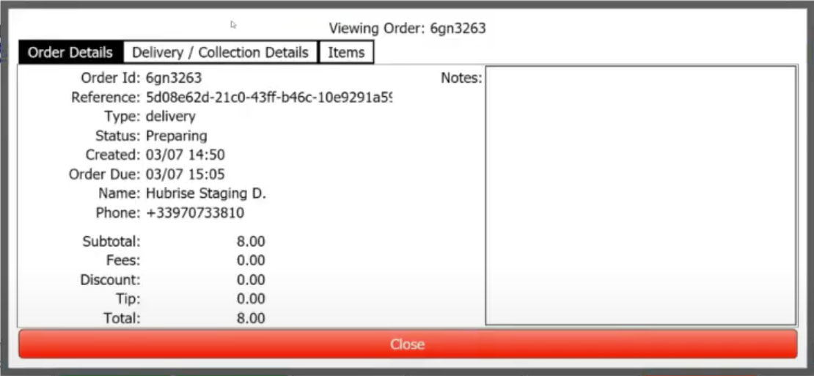
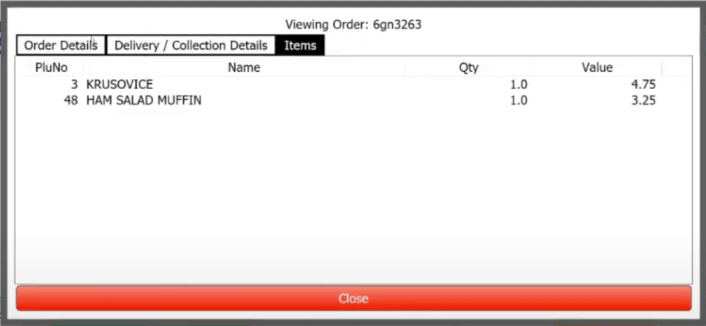
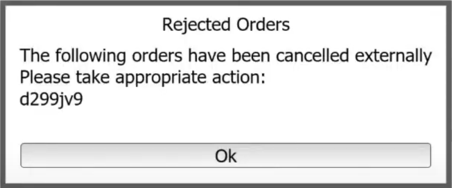
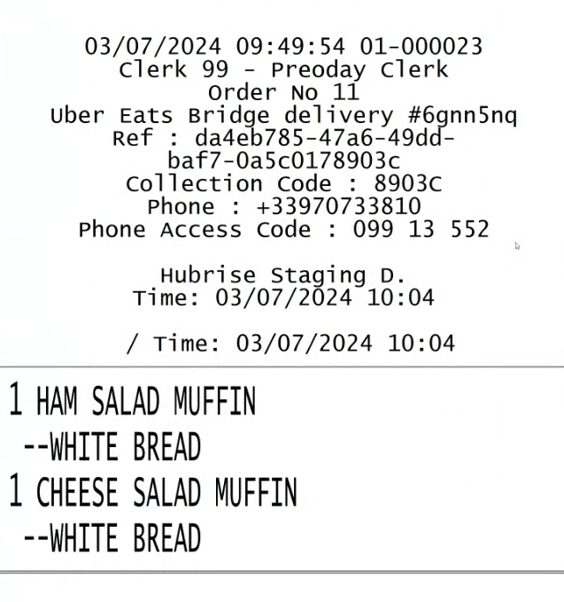

When Quantum is connected to HubRise, it receives orders from HubRise in real time.

## User Interface

### Order List {#order-list}

Orders which are in progress can be viewed in the **External Orders Search** screen. To view this screen, follow these steps:

1. Open Quantum Terminal.
2. Click **EXTERNAL ORDERING**.

### Order Details {#order-details}

To view the details of an order, follow these steps:

1. Open Quantum Terminal.
2. Click **EXTERNAL ORDERING**.
3. Identify the order you want to view and click on it.
4. Click **Show Detail**. This will display various details about the order, including general information, delivery and collection details, and the items in the order.

### New Order

When a new order is received from HubRise, a notification appears in the Quantum Terminal and the order is added to the **External Orders Search** screen. To view the order, follow the steps described in [Order Details](#order-details).

### Update Order Status

You can update the status of an order from the **External Orders Search** screen. To update the status of an order, follow these steps:

1. Access the **External Orders Search** screen by following the steps described in [Order List](#order-list).
2. Identify the order you want to update and click on it.
3. Depending on the current status of the order, you may be able to click on **Accept**, **Process** or **Reject**.

The status of the order will be updated in Quantum and HubRise simultaneously.

### Order Updated Externally

When an order is cancelled externally, a notification will appear in Quantum, and the order will be marked as cancelled in Quantum.

## Receipts

Here is an example of a kitchen receipt generated by Quantum for a HubRise order:

## Technical Details

### Items and Options

Items in HubRise orders are recognised by Quantum based on their ref codes. Items with invalid ref codes are associated with a default product. The price in HubRise takes precedence over the price in Quantum.

Options are handled in a similar way as items.

### Order Statuses

When an order is received from HubRise, Quantum immediately changes its status to **Received**. Furthermore, if auto-accept mode is enabled, the order status is then automatically updated to **In preparation**, unless one of the items is out of stock.

Status changes made in Quantum are reflected in HubRise.

### Discounts

Discounts in HubRise orders are applied in Quantum using the same name and amount. The ref code is discarded.

### Charges

Charges in HubRise orders are applied in Quantum using the same name and amount. The ref code is discarded.

### Payments

Payments in HubRise orders are processed in Quantum using only the amount, not the ref codes. The payment method is associated based on the `created_by` field in HubRise.

If an order is fully paid, Quantum marks it as paid; otherwise, the operator must handle it manually.

### Customer Information

Quantum only supports guest orders. The customer information from HubRise orders is used, including the customer's name, email, and phone number, which are displayed in the order details.

### Customer Notes

Customer notes in HubRise orders are used by Quantum at both the order level and the item level. These notes are printed on receipts and displayed in the order details.
