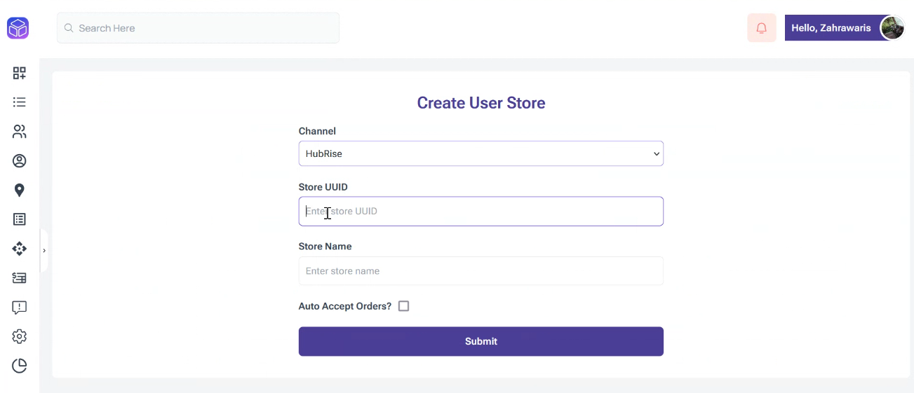

---

**IMPORTANT NOTE:** If you do not have a HubRise account yet, register on our [Signup Page](https://manager.hubrise.com/signup). It only takes a minute!

---

## Connect Quick Up

To ask the Quick Up support team to connect your Quick Up app to HubRise, proceed as follows:

1. Grant Quick Up access to your HubRise account. For more information, see [Grant Access to Quick Up Support](#give-access).
1. Contact the Quick Up support team who will establish the connection to HubRise. For more information, see [Contact Quick Up Support](#contact).

To connect Quick Up to HubRise autonomously, follow these steps:

1. From the Quick Up back office, click on **Settings**, then **User Store List** in the left-hand menu.
1. Click on the **Add User Store** button.
1. On the **Create User Store** page, select the `HubRise` Channel and click **Submit**; leave all other fields empty.
   
1. You are redirected to the HubRise interface. If this is your first time logging in, create a HubRise account. For more information, check out our [Getting Started Guide](/docs/get-started).
1. If your account has multiple locations, expand the **Choose location** section to select the desired location, and click **Allow**. For locations with multiple customer lists or catalogs, click **Next** to display the corresponding dropdown lists, and select the desired options.
1. Click **Authorise**.
1. You are redirected to the Quick Up interface, and the connection to HubRise is established.

## Grant Access to Quick Up Support {#give-access}

To ask the Quick Up support team to connect your Quick Up app and to facilitate the handling of your support requests thereafter, you need to grant your Quick Up provider access to your HubRise account.

To grant access to Quick Up, proceed as follows:

1. From the HubRise back office, select **SETTINGS** in the left-hand menu.
1. In the **Permissions** section, enter `support@quickup.uk`.
1. Click on **Add User**.
1. In the dropdown menu for selecting a predefined role, select **Technical Partner**.
1. Click on **Set Permissions**.

Adding a user is the recommended way to grant access to a third party to your HubRise account or location. Sharing passwords is not recommended for security reasons. For more information on permissions, see the [Permissions](/docs/permissions) help page.

## Contact Quick Up Support {#contact}

To request the connection of your Quick Up on-demand courier and delivery platform, contact Quick Up support by email at support@quickup.uk. You can include support@hubrise.com in copy for a coordinated follow-up between our two teams.

Include in your request the name of your HubRise account, its HubRise identifier and the location to connect. For more information, see [Location Name and ID](/docs/locations#location-name-and-id).

## Disconnect Quick Up

To disconnect Quick Up from HubRise, proceed as follows:

1. From the Quick Up back office, click on **Settings**, then **User Store List** in the left-hand menu.
1. Locate the HubRise store you want to disconnect
1. Click the red bin icon on the far right.
1. When prompted to confim, clik **Yes, remove it!**.
1. Quick Up is now disconnected from HubRise.

If you only need to temporarily stop [receiving orders from HubRise], you can block the connection between Quick Up and HubRise. For more information, see [Block or Disconnect App](/docs/connections#block-or-disconnect).
