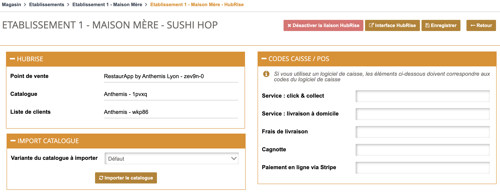

---

**REMARQUE IMPORTANTE :** Si vous ne possédez pas encore de compte HubRise, commencez par en ouvrir un sur la [page d'inscription à HubRise](https://manager.hubrise.com/signup). L'inscription ne prend que quelques minutes !

---

## Connecter Restaur'App

Vous pouvez connecter Restaur'App à votre compte HubRise de manière autonome. 

Pour connecter Restaur'App à HubRise, suivez ces étapes :

1. Depuis le back-office de Restaur'App, cliquez sur **Magasin** > **Etablissements** dans la barre de navigation en en-tête de la page.
1. Sélectionnez l'établissement que vous souhaitez connecter pour l'éditer. 
1. Accédez à l'onglet **Services Tiers**.
1. Cliquez sur le bouton **Connecter un compte HubRise**. Vous êtes redirigé vers l'interface HubRise.
1. Si vous avez plusieurs points de vente, choisissez le point de vente à connecter. Si le point de vente sélectionné possède plusieurs listes de clients ou catalogues, cliquez sur **Suivant** pour afficher les listes déroulantes correspondantes, puis sélectionnez les options voulues.
1. Cliquez sur **Autoriser**.
1. Vous êtes redirigé vers l'interface de Restaur'App, et la connexion à HubRise est établie.

Vous pouvez également confier cette tâche à Restaur'App. 

Pour que Restaur'App puisse vous venir en aide, procédez comme suit :

1. Donnez accès à votre compte à l'équipe support de Restaur'App. Pour plus d'information, voir [Donner accès au support de Restaur'App](#give-access).
1. Contactez l'équipe de support de Restaur'App qui se chargera d'établir la connexion à HubRise. Pour plus d'information, voir [Contacter le support de Restaur'App](#contact).

## Donner accès au support de Restaur'App {#give-access}

Pour faciliter la prise en charge de vos demandes de support, nous vous recommandons de donner accès à votre compte HubRise à l'éditeur de la solution Restaur'App.

Pour donner accès à Restaur'App, procédez comme suit :

1. Depuis le back-office de HubRise, sélectionnez **CONFIGURATION** dans le menu de gauche.
1. Dans la section **Permissions**, ajoutez support@anthemis.fr en sélectionnant l'option **Manager** dans la liste déroulante des rôles.
1. Cliquez sur l'icône **+** pour ajouter le nouvel utilisateur.

L'ajout d'un utilisateur est le moyen recommandé de donner accès à un tiers à votre point de vente. Le partage de mot de passe est déconseillé pour des raisons de sécurité.

## Contacter le support de Restaur'App {#contact}

Pour demander la connexion de Restaur'App, contactez l'équipe de support de Restaur'App par email sur support@anthemis.fr. Vous pouvez inclure support@hubrise.com en copie pour un suivi coordonné entre nos deux équipes.

Indiquez dans votre demande le nom de votre compte HubRise, son identifiant HubRise et le point de vente à connecter. Pour plus d'informations voir [Nom et identifiant du point de vente](/docs/locations#location-name-and-id).

## Déconnecter Restaur'App

1. Depuis le back-office de Restaur'App, cliquez sur **Magasin** > **Etablissements** dans la barre de navigation en en-tête de la page.
1. Sélectionner l'établissement que vous souhaitez connecter pour l'éditer.
1. Accédez à l'onglet **Services Tiers**.
1. Cliquez sur le bouton **Éditer les informations HubRise**.
1. Cliquez sur le bouton **Désactiver la liaison à HubRise** en haut à droite de la page.
1. Une fenêtre de confirmation s'affiche. À la question **Êtes-vous sûr de vouloir désactiver la liaison avec HubRise**, sélectionnez **Oui**.

Sans déconnecter l'application, vous pouvez bloquer les échanges de données entre Restaur'App et HubRise, ou déconnecter Restaur'App devotre compte HubRise, depuis le back office de HubRise. Pour plus d'information, voir [Bloquer ou déconnecter une application](/docs/connections#block-or-disconnect).
