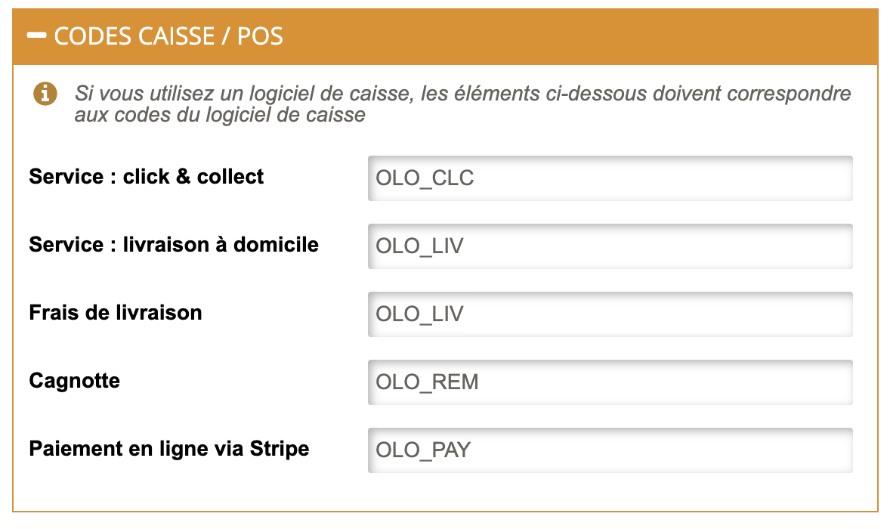

Afin d'assurer le traitement des commandes Restaur'App par votre logiciel de caisse ou par toute autre application connectée, il est essentiel d'attribuer des codes ref à chaque article de votre catalogue, y compris les choix disponibles dans chaque composition ainsi que les promotions.

Dans certains cas, le logiciel de caisse nécessite également des codes ref pour les moyens de paiement, les types de service et les frais de livraison ou les promotions. Pour plus de détails, reportez-vous à la documentation de votre logiciel de caisse sur notre [page Apps](/apps).

Cette page explique comment configurer manuellement les codes ref dans Restaur'App. Certains logiciels de caisse offrent la possibilité d'exporter leur menu vers HubRise, ce qui permet de renseigner automatiquement les bons codes ref des produits Restaur'App. Pour plus de détails, voir [Récupérer le catalogue](/apps/restaur-app/pull-catalog).

## Produits et SKUs

Les produits sur HubRise correspondent aux articles sur Restaur'App. Les SKUs sur HubRise permettent de distinguer les différentes variantes d'un même produit, comme les tailles ou les couleurs.

Deux cas de figure se présentent :

- **Produit avec un seul SKU :** Un produit avec un seul SKU est représenté par un article unique sur Restaur'App. Le code ref de l'article est le même que celui du SKU.

- **Produit avec plusieurs SKUs :** Un produit avec plusieurs SKUs est représenté par un article principal, avec des sous-articles pour chaque SKU, liés à l'article principal par une composition. Le code ref de chaque sous-article est le même que celui du SKU. Le code ref de l'article principal est indifférent et peut être laissé vide.

Pour mettre à jour le code ref d'un article, suivez ces étapes :

1. Depuis le back-office de Restaur'App, cliquez sur **Catalogue** > **Articles** dans la barre de navigation en en-tête de la page.
1. Sélectionnez le produit à mettre à jour.
1. Dans la section **INFORMATIONS**, mettez à jour le code ref dans le champ **Référence**.
1. Cliquez sur **Enregistrer** pour confirmer.

## Options

Les listes d'options sur HubRise correspondent aux compositions sur Restaur'App, et les options correspondent aux choix de ces compositions. Le code ref d'un choix de composition est le même que celui de l'option correspondante.

Pour mettre à jour le code ref d'un choix de composition, suivez ces étapes :

1. Depuis le back-office de Restaur'App, cliquez sur **Catalogue** > **Articles** dans la barre de navigation en en-tête de la page.
1. Sélectionnez la composition à mettre à jour.
1. Dans la section **CHOIX POSSIBLES**, Sélectionnez l'élément que vous souhaitez mettre à jour.
1. Une fenêtre de confirmation s'affiche. Mettez à jour le code ref dans le champ **Référence**.
1. Cliquez sur **Enregistrer** pour confirmer.
1. Suivez cette même procédure pour chacun des éléments de la composition.

## Promotions et remises

Les promotions HubRise s'appliquent à des articles spécifiques. Elles n'ont pas d'équivalent dans Restaur'App.

Les remises HubRise s'appliquent à la totalité de la commande. Elles correspondent aux codes promos et au programme de cagnotte dans Restaur'App.

Pour mettre à jour le code ref d'un code promo, suivez ces étapes :

1. Depuis le back-office de Restaur'App, cliquez sur **Marketing** > **Codes promos** dans la barre de navigation.
1. Cliquer sur l'icône en forme de crayon sur le code promo à mettre à jour.
1. Saissisez le code ref dans le champ **Référence**.
1. Cliquez sur **Enregistrer** pour confirmer.

Si vous utilisez le programme de cagnotte, et que votre logiciel de caisse nécessite un code ref pour les remises, procédez comme suit :

1. Depuis le back-office de Restaur'App, cliquez sur **Magasin** > **Etablissements** dans la barre de navigation.
1. Cliquez sur l'icône en forme de crayon sur l'établissement à configurer.
1. Ouvrez l'onglet **Services Tiers**.
1. Cliquez sur le bouton **Éditer les informations HubRise**.
1. Section **CODES CAISSE / POS**, saisissez le code ref dans le champ **Cagnotte**.
1. Cliquez sur **Enregistrer** pour confirmer.

## Moyens de paiement

Les moyens de paiement que vous configurez dans Restaur'App peuvent nécessiter un code ref. Pour le vérifier, reportez-vous à la documentation de votre logiciel de caisse sur notre [page Apps](/apps).

Pour ajouter un code ref à un moyen de paiement, suivez ces étapes :

1. Depuis le back-office de Restaur'App, cliquez sur **Magasin** > **Etablissements** dans la barre de navigation.
1. Cliquez sur l'icône en forme de crayon sur l'établissement à configurer.
1. Ouvrez l'onglet **Services Tiers**.
1. Cliquez sur le bouton **Éditer les informations HubRise**.
1. Section **CODES CAISSE / POS**, saisissez le code ref dans le champ **Paiement en ligne via Stripe**.
1. Cliquez sur **Enregistrer** pour confirmer.

## Types de service

Les types de service tels que la livraison, le retrait ou la consommation sur place peuvent nécessiter un code ref. Pour le vérifier, reportez-vous à la documentation de votre logiciel de caisse sur notre [page Apps](/apps).

Pour ajouter un code ref à un type de service, suivez ces étapes :

1. Depuis le back-office de Restaur'App, cliquez sur **Magasin** > **Etablissements** dans la barre de navigation.
1. Cliquez sur l'icône en forme de crayon sur l'établissement à configurer.
1. Ouvrez l'onglet **Services Tiers**.
1. Cliquez sur le bouton **Éditer les informations HubRise**.
1. Section **CODES CAISSE / POS**, saisissez le code ref dans chacun des champs **Service : click & collect** et **Service : livraison à domicile**.
1. Cliquez sur **Enregistrer** pour confirmer.

## Frais de livraison

Si vos commandes incluents des frais de livraison, un code ref peut être requis par le logiciel de caisse. Pour le vérifier, reportez-vous à la documentation de votre logiciel de caisse sur le site internet de HubRise.

Pour spécifier le code ref des frais de livraison, suivez ces étapes :

1. Depuis le back-office de Restaur'App, cliquez sur **Magasin** > **Etablissements** dans la barre de navigation.
1. Cliquez sur l'icône en forme de crayon sur l'établissement à configurer.
1. Ouvrez l'onglet **Services Tiers**.
1. Cliquer sur le bouton **Éditer les informations HubRise**.
1. Section **CODES CAISSE / POS**, saisissez le code ref dans chacun des champs **Frais de livraison**.
1. Cliquez sur **Enregistrer** pour confirmer.
