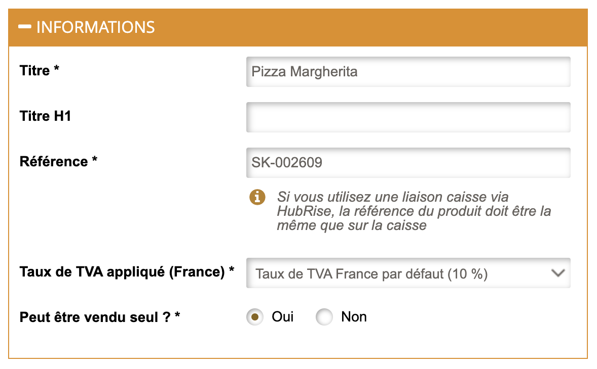
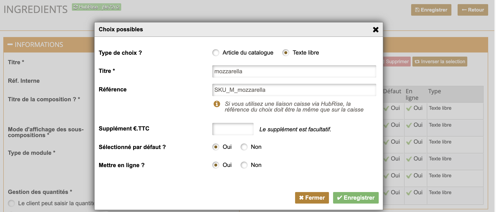
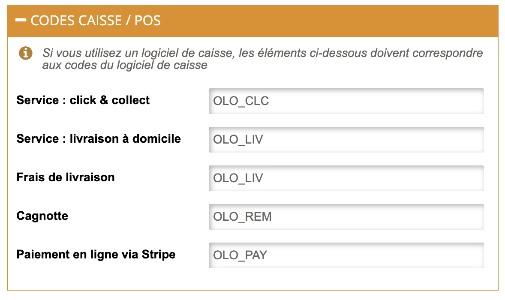

Afin d'assurer le traitement des commandes Restaur'App par votre logiciel de caisse ou par toute autre application connectée, il est essentiel d'attribuer des codes ref à chaque article de votre catalogue, y compris les choix disponibles dans chaque composition ainsi que les promotions.

Dans certains cas, le logiciel de caisse nécessite également des codes ref pour les moyens de paiement, les types de service et les frais de livraison ou les promotions. Pour plus de détails, reportez-vous à la documentation de votre logiciel de caisse sur notre [page Apps](/apps).

Cette page explique comment configurer manuellement les codes ref dans Restaur'App. Certains logiciels de caisse offrent la possibilité d'exporter leur menu vers HubRise, ce qui permet de renseigner automatiquement les bons codes ref des produits Restaur'App. Pour plus de détails, voir [Récupérer le catalogue](/apps/restaur-app/pull-catalog).

## Produits et SKUs

Chaque produit a un ou plusieurs SKU. Chaque SKU, correspondant à des articles sur Restaur'App et dispose d'un code ref qui doit être associé à l'article correspondant dans votre logiciel de caisse.

Pour mettre à jour le code ref de chaque article, suivez ces étapes :

1. Depuis le back-office de Restaur'App, cliquez sur **Catalogue** > **Articles** dans la barre de navigation en en-tête de la page.
1. Sélectionnez le produit à mettre à jour.
3. Dans la section **INFORMATIONS**, mettez à jour le code ref dans le champ **Référence**.
4. Cliquez sur **Enregistrer** pour confirmer.

## Suppléments, ingrédients et options

Restaur'App prend en charge différents types de modifications optionnelles des produits par le biais de **Composition modèles**. Chacune de ces compositions peut inclure un **Choix unitaire** ou un **Choix multiple**.

Pour mettre à jour le code ref des choix inclus dans chacune de ces compositions, suivez ces étapes :

1. Depuis le back-office de Restaur'App, cliquez sur **Catalogue** > **Articles** dans la barre de navigation en en-tête de la page.
1. Sélectionnez la composition à mettre à jour.
1. Dans la section **CHOIX POSSIBLES**, Sélectionnez l'élément que vous souhaitez mettre à jour. 
1. Une fenêtre de confirmation s'affiche. Mettez à jour le code ref dans le champ **Référence**.
1. Cliquez sur **Enregistrer** pour confirmer.
1. Suivez cette même procédure pour chacun des éléments de la composition. 

## Promotions et remises

Restaur'App permet de fidéliser les clients grâce à un programme de cagnotte. Afin que les commandes avec ces promotions soient correctement transmises à votre logiciel de caisse et aux autres applications connectées à HubRise, il est essentiel que les codes ref soient corrects.

Pour ajouter un code ref à une promotion, suivez ces étapes :

1. Depuis le back-office de Restaur'App, cliquez sur **Magasin** > **Etablissements** dans la barre de navigation en en-tête de la page.
1. Sélectionner l'établissement que vous souhaitez éditer.
1. Accédez à l'onglet **Services Tiers**.
1. Cliquez sur le bouton **Éditer les informations HubRise**.
1. Section **CODES CAISSE / POS**, saisissez le code ref dans le champ **Cagnotte**.
1. Cliquez sur **Enregistrer** pour confirmer.

***

**REMARQUE IMPORTANTE :** En fonction de votre logiciel de caisse, les promotions peuvent être transmises sans code ref. Vérifiez que ces promotions sont configurées de façon à répondre aux exigences de votre logiciel de caisse sur notre [page Apps](/apps).

***

## Moyens de paiement

Les moyens de paiement que vous configurez dans Restaur'App peuvent nécessiter un code ref. Pour le vérifier, reportez-vous à la documentation de votre logiciel de caisse sur notre [page Apps](/apps).

Pour ajouter un code ref à un moyen de paiement, suivez ces étapes :

1. Depuis le back-office de Restaur'App, cliquez sur **Magasin** > **Etablissements** dans la barre de navigation en en-tête de la page.
1. Sélectionner l'établissement que vous souhaitez éditer.
1. Accédez à l'onglet **Services Tiers**.
1. Cliquez sur le bouton **Éditer les informations HubRise**.
1. Section **CODES CAISSE / POS**, saisissez le code ref dans le champ **Paiement en ligne via Stripe**.
1. Cliquez sur **Enregistrer** pour confirmer.

## Types de service

Les types de service tels que la livraison, le retrait ou la consommation sur place peuvent nécessiter un code ref. Pour le vérifier, reportez-vous à la documentation de votre logiciel de caisse sur notre [page Apps](/apps).

Pour ajouter un code ref à un type de service, suivez ces étapes :

1. Depuis le back-office de Restaur'App, cliquez sur **Magasin** > **Etablissements** dans la barre de navigation en en-tête de la page.
1. Sélectionner l'établissement que vous souhaitez éditer.
1. Accédez à l'onglet **Services Tiers**.
1. Cliquez sur le bouton **Éditer les informations HubRise**.
1. Section **CODES CAISSE / POS**, saisissez le code ref dans chacun des champs **Service : click & collect** et **Service : livraison à domicile**.
1. Cliquez sur **Enregistrer** pour confirmer.

## Frais de livraison

Si des frais de livraison s'appliquent pour le service proposé, un code ref peut être requis. Pour le vérifier, reportez-vous à la documentation de votre logiciel de caisse sur le site internet de HubRise.

Pour ajouter un code ref à des frais de livraison, suivez ces étapes :

1. Depuis le back-office de Restaur'App, cliquez sur **Magasin** > **Etablissements** dans la barre de navigation en en-tête de la page.
1. Sélectionner l'établissement que vous souhaitez éditer.
1. Choisir l'onglet **Services Tiers**.
1. Cliquer sur le bouton **Éditer les informations HubRise**.
1. Section **CODES CAISSE / POS**, saisissez le code ref dans chacun des champs **Frais de livraison**.
1. Cliquez sur **Enregistrer** pour confirmer.