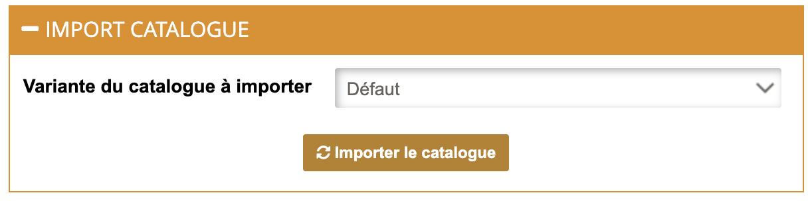

Afin d'assurer le traitement des commandes Restaur'App par votre logiciel de caisse ou par toute autre application connectée, il est essentiel d'attribuer des codes ref à chaque article de votre catalogue, y compris les choix disponibles dans chaque composition ainsi que les promotions.

Certains logiciels de caisse permettent d'exporter des menus vers HubRise. Votre menu Restaur'App sera alors alimenté automatiquement avec les bons codes ref. Pour le vérifier, reportez-vous à la documentation de votre logiciel de caisse sur notre [page Apps](/apps).

Si votre logiciel de caisse ne prend pas en charge l'envoi de menu vers HubRise, vous devez associer manuellement les codes ref. Pour plus de détails, voir [Associer les codes ref](/apps/restaur-app/map-ref-codes).

Pour récupérer un catalogue HubRise dans Restaur'App :

1. Depuis le back-office de Restaur'App, cliquez sur **Magasin** > **Etablissements** dans la barre de navigation en en-tête de la page.
1. Sélectionner l'établissement pour lequel vous souhaitez importer le catalogue.
1. Accédez à l'onglet **Services Tiers**.
1. Section **IMPORT CATALOGUE** > **Variante du catalogue à importer**, sélectionnez la variante que vous souhaitez importer dans la liste déroulante. Pour plus d'informations voir [Variantes](/apps/catalog-manager/variants).
1. À la question **Êtes-vous sûr de vouloir importer le catalogue ?**, sélectionnez **Oui**.

***

**REMARQUE IMPORTANTE :** La récupération d'un catalogue HubRise écrase tous les produits existants dans Restaur'App. Cette action est irréversible.

***
