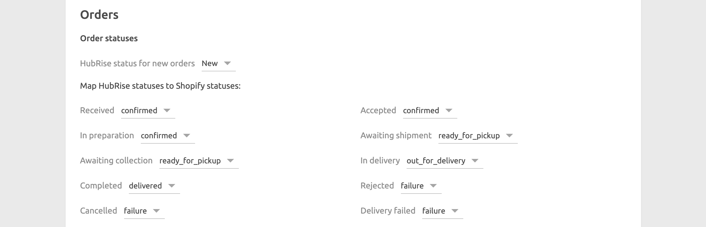
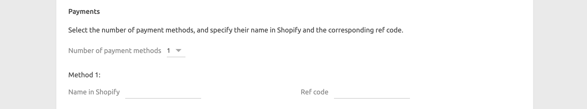
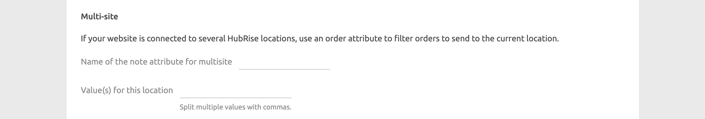
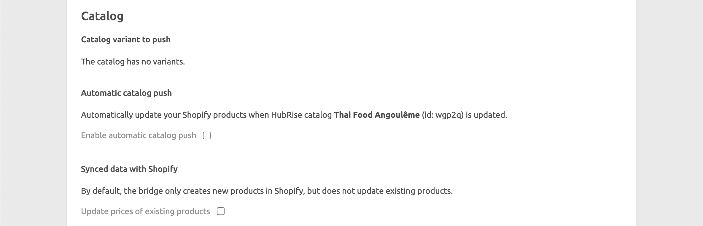
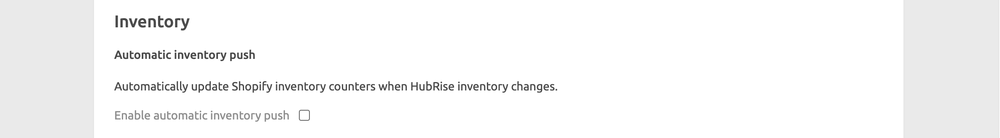

---

**IMPORTANT NOTE:** This page is being updated. Some of the information may be outdated.

---

The configuration page allows you to customise the behaviour of Shopify Bridge based on your preferences. These are divided into different sections for an easier navigation.

## Orders

### Order Statuses {#order-statuses}

In this section, you can customise how to map order status changes in HubRise back to Shopify. To ignore an order status change in HubRise, select **Do nothing**.

## Service Types

In the **Service type ref code** field, enter the ref code for the service that your EPOS expects.
Refer to your EPOS documentation on the HubRise website [Apps page](/apps) to check requirements.

## Expected Time

From the **Values to use** drop-down menu, select if you want to use metadata to push the order expected time to HubRise.

Depending on the plugin you use, Shopify can encode the the expected time in one or two metadata fields.

If your plugin uses one metadata, the supported formats are the following:

- ISO 8601. For example: `2021-07-22T12:00:30+02:00`.
- Unix timestamp. For example: `1642422302`.

If your plugin uses two metadata, the supported formats are the following:

- The date must be in the `dd/mm/yyyy` format.
- The time must be in the `hh:mm` format.

## Payments

To correctly parse the payment method in your orders, the **Payments** section lets you specify the payment name and ref code for up to 15 payment methods.
Refer to your EPOS documentation on the HubRise website [Apps page](/apps) to verify the ref codes required by your EPOS.

To identify the payment names for your supported payments, send a test order to HubRise for each method and review the logs in the [Orders page](/docs/data#orders).

### Multi-site

If you support multiple stores from the same Shopify website, you need to configure the **Multi-site** section.

Each location must be connected to Shopify Bridge and identified by a unique order attribute value. Orders are only forwarded to the location that matches the configured value.

In the **Name of the note attribute for multisite** field, specify the name of the order attribute that contains the location value.

In the **Value(s) for this location** field, specify the value associated with the location. You can specify multiple values separated by a comma.

## Catalog {#catalog}

The **Catalog** section lets you customise how you send the HubRise catalog to Shopify.

If you have variants in your catalog, select which catalog variant you want to push to Shopify from the **Variant** drop-down menu.

If you want to automatically update your Shopify products every time your HubRise catalog is updated, tick the **Enable automatic catalog push** checkbox.
Only new products added to the HubRise catalog will be sent to Shopify. Any existing products within Shopify will remain unchanged.

By default, when you push a catalog into Shopify, Shopify Bridge creates new products in Shopify but does not update existing products.
To update prices of existing products, tick the **Update prices of existing products** checkbox.

## Location

If you have multiple Shopify stores, from the **Location** drop-down menu, select the store that you want to associate with the HubRise location.

## Inventory

The **Inventory** section lets you configure automatic updates of the Shopify inventory counters when the HubRise inventory changes.
To enable this feature, tick the **Enable automatic inventory push** checkbox.

## Save the Configuration

To save the configuration, click **Save** at the top of the page.

## Reset the Configuration

If you need to reset the configuration, click **Reset the configuration** at the bottom of the page.

---

**IMPORTANT NOTE:** Resetting the configuration will instantly disconnect the bridge from Shopify.

---

Resetting the configuration does not delete the operation logs displayed in the main page.
