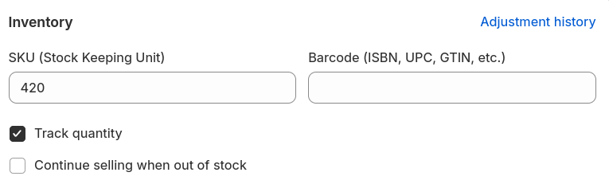

Shopify Bridge can synchronise your HubRise inventory with Shopify.

Some EPOS and inventory management solutions can update the inventory data in HubRise. To check whether a specific app supports inventory synchronisation, refer to its documentation on our [Apps page](/apps). Alternatively, you can manage your inventory using [OrderLine](/apps/orderline/overview).

## Inventory Synchronisation

When HubRise inventory is updated, Shopify Bridge can automatically adjust the inventory counters in Shopify.

Only items with the **Track Quantity** checkbox enabled in Shopify are updated. To check if this option is enabled for a specific product, follow these steps:

1. Log in to your Shopify account.
2. Open the **Products** page.
3. Select a product.
4. If the product has variants, select a variant; otherwise, proceed to the next step.
5. In the **Inventory** section, ensure that the **Track Quantity** checkbox is activated.

## Manual Inventory Push

To push your HubRise inventory into Shopify, follow these steps:

1. Log in to your [HubRise account](https://manager.hubrise.com).
1. Select the HubRise account and location connected with your Shopify store.
1. Open the **CONNECTIONS** page, then select **Shopify Bridge** from the list of connected apps.
1. In Shopify Bridge, select the **Actions** tab.
1. In the **Synchronise your inventory with Shopify** section, click **Push inventory**.

## Automatic Inventory Push

Shopify Bridge can push your inventory into Shopify every time it is updated in HubRise. To enable this option, follow these steps:

1. Log in to your [HubRise account](https://manager.hubrise.com).
1. Select the HubRise account and location connected with your Shopify store.
1. Open the **CONNECTIONS** page, then select **Shopify Bridge** from the list of connected apps.
1. In Shopify Bridge, select the **Configuration** tab.
1. In the **Inventory** section, tick **Enable automatic inventory push**.
1. Click **Save**.
