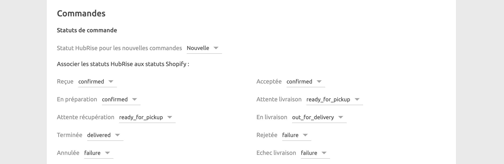
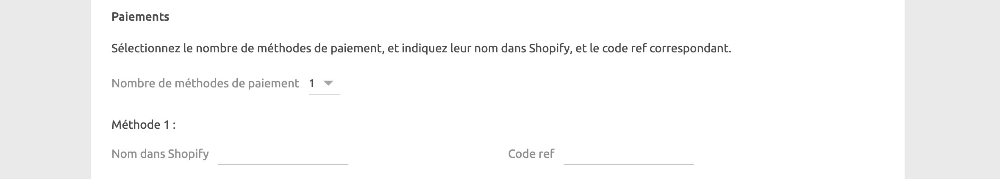
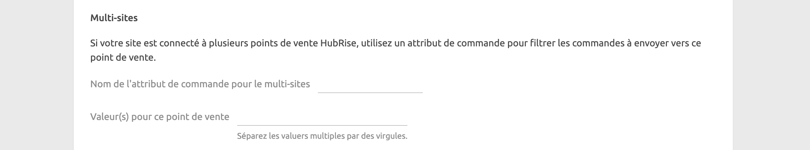
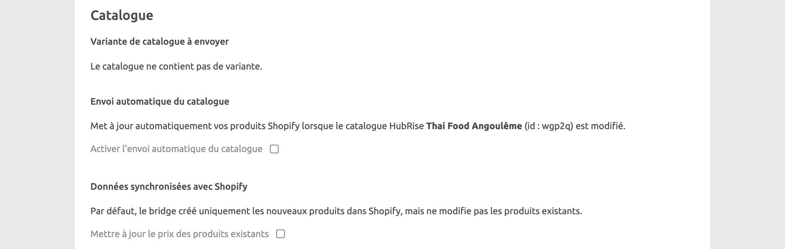
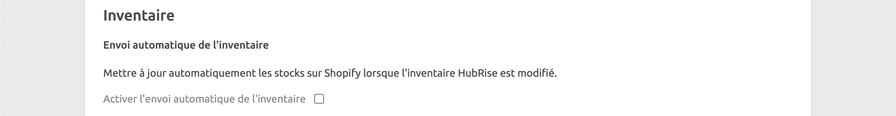

La page de configuration permet de personnaliser le comportement de Shopify Bridge.

***

**REMARQUE IMPORTANTE :** En raison de sa nature très personnalisable, la configuration de Shopify Bridge nécessite un certain niveau de connaissances techniques. Si vous n'êtes pas à l'aise avec cette configuration, passez quelques commandes de test, avec différentes méthodes de paiement, et contactez-nous à support\@hubrise.com en mentionnant le logiciel de caisse que vous utilisez. Nous serons ravis de vous aider !

***

## Commandes

### Statuts de commande {#order-statuses}

Dans cette section, vous pouvez personnaliser la façon dont les changements de statut dans HubRise se reflètent dans Shopify.

Pour chaque statut de commande HubRise, spécifiez le statut de commande Shopify correspondant. Pour ignorer un changement de statut, sélectionnez **Ne pas associer**.

### Types de service

Dans le champ **Code ref du type de service**, saisissez le code ref du type de service que votre logiciel de caisse attend pour les commandes Shopify. Pour connaître ses exigences, reportez-vous à la documentation de votre logiciel de caisse sur notre [page Apps](/apps).

### Heure souhaitée

La prise en charge des heures de livraison dans Shopify nécessite un plugin, car Shopify ne supporte pas nativement cette fonctionnalité.

Si vous n'utilisez pas les heures de livraison, laissez le menu déroulant **Valeurs à utiliser** défini sur **Aucune**.

Sinon, vous devrez choisir entre deux options d'encodage de l'heure de livraison par votre plugin : **Une valeur contenant la date et l'heure** ou **Deux valeurs : une pour la date, une pour l'heure**.

Pour déterminer comment votre plugin encode l'heure de livraison, passez une commande de test et examinez les logs sur la [page Commandes](/docs/data#orders). Recherchez le champ `note_attributes` dans le JSON de la commande, et identifiez les attributs contenant la date et l'heure souhaitées. Si vous ne trouvez pas l'heure de livraison dans le champ `note_attributes`, contactez le développeur du plugin pour obtenir de l'aide.

En fonction de l'option sélectionnée dans le menu déroulant **Valeurs à utiliser**, un ou deux champs apparaîtront, où vous pourrez spécifier les noms d'attribut de commande contenant la date et l'heure souhaitées.

Si votre plugin utilise un attribut de commande, les formats pris en charge sont les suivants :

- ISO 8601. Par exemple : `2021-07-22T12:00:30+02:00`.
- Horodatage Unix. Par exemple : `1642422302`.

Si votre plugin utilise deux attributs de commande, les formats pris en charge sont les suivants :

- La date doit être au format `dd/mm/yyyy`.
- L'heure doit être au format `hh:mm`.

### Paiements

La section **Paiements** permet d'attribuer un code ref à pas moins de 15 méthodes de paiement différentes.

Pour chaque méthode de paiement prise en charge, saisissez son nom exact tel qu'il apparaît dans les commandes Shopify, ainsi que le code ref attendu par votre logiciel de caisse.

Pour déterminer le nom d'une méthode de paiement, envoyez une commande de test à HubRise et examinez les logs sur la [page Commandes](/docs/data#orders). Recherchez l'attribut `payment_gateway_names` dans le JSON de la commande, qui affiche une valeur telle que `Stripe` ou `PayPal` : c'est le nom que vous devez entrer dans le champ **Nom dans Shopify**.

Pour trouver les codes ref à utiliser, reportez-vous à la documentation de votre logiciel de caisse sur notre [page Apps](/apps).

### Multi-sites

Si vous prenez en charge plusieurs boutiques du même site internet Shopify, vous devez configurer la section **Multi-sites**.

Chaque point de vente doit être connecté à Shopify Bridge et identifié par une valeur d'attribut de commande unique. Les commandes ne sont transmises qu'au point de vente dont la valeur configurée correspond.

Dans le champ **Nom de l'attribut de commande pour le multi-sites**, indiquez le nom de l'attribut de commande qui contient la valeur du point de vente.

Dans le champ **Valeur(s) pour ce point de vente**, indiquez la valeur associée au point de vente. Si vous spécifiez plusieurs valeurs, séparez-les par des virgules.

## Catalogue

### Variante de catalogue à envoyer

Les variantes de catalogue vous donnent la flexibilité de désactiver des articles ou d'ajuster les prix spécifiquement pour votre site internet Shopify.

Si votre catalogue comprend des variantes, vous pouvez sélectionner celle que vous souhaitez utiliser. Lorsque **(aucun)** est sélectionné, les articles par défaut ainsi que leurs prix standards sont utilisés. Si votre catalogue n'a pas de variante, le menu est masqué et un message s'affiche.

### Envoi automatique du catalogue

Pour mettre à jour automatiquement vos produits Shopify à chaque modification de votre catalogue HubRise, cochez la case **Activer l'envoi automatique du catalogue**.

### Données synchronisées avec Shopify

Par défaut, lorsque vous envoyez un catalogue dans Shopify, Shopify Bridge crée de nouveaux produits dans Shopify, mais ne met pas à jour les produits existants. Pour mettre à jour le prix des produits existants, cochez la case **Mettre à jour le prix des produits existants**.

## Point de vente

Si votre compte Shopify a plusieurs points de vente, sélectionnez celui qui est associé à Shopify Bridge. Cette information est utilisée pour la gestion des stocks.

## Inventaire

Dans la section **Inventaire**, vous pouvez activer la mise à jour automatique des compteurs d'inventaire Shopify lorsque l'inventaire HubRise est modifié.
Pour activer cette fonctionnalité, cochez la case **Activer l'envoi automatique de l'inventaire**.

## Enregistrer la configuration

Pour enregistrer la configuration, cliquez sur **Enregistrer** en haut de la page.

## Réinitialiser la configuration

Si vous avez besoin de réinitialiser la configuration, cliquez sur **Réinitialiser la configuration** en bas de la page.

***

**REMARQUE IMPORTANTE** : La réinitialisation de la configuration déconnectera instantanément le bridge de Shopify.

***

La réinitialisation de la configuration ne supprime pas les logs des opérations affichés sur la page principale.
