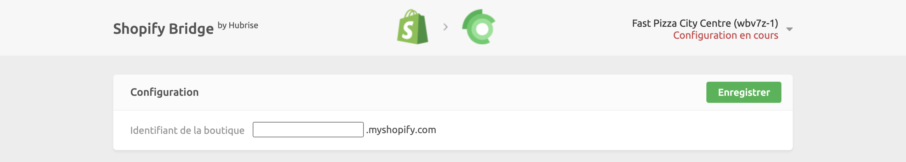
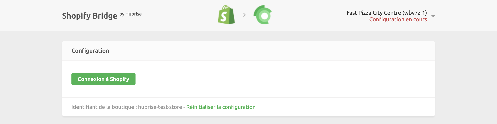
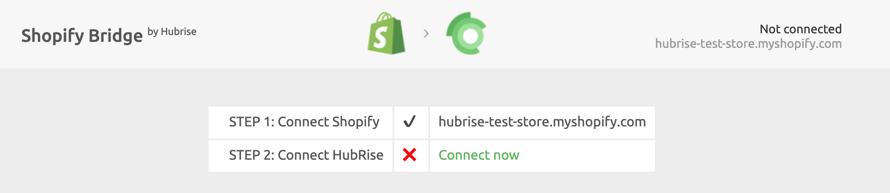

La connexion de Shopify à HubRise s'effectue en quelques étapes seulement.

***

**REMARQUE IMPORTANTE :** Si vous ne possédez pas encore de compte HubRise, rendez-vous sur la [page d'inscription à HubRise](https://manager.hubrise.com/signup). L'inscription ne prend qu'une minute !

***

Pour connecter Shopify à HubRise, choisissez l'une de ces deux procédures :

- Connexion depuis le back-office de HubRise.
- Connexion depuis Shopify App Store.

Une fois que Shopify Bridge est connecté, vous pouvez soit envoyer votre catalogue produit dans Shopify, soit associer manuellement le code ref des produits.

## Connecter Shopify Bridge depuis HubRise

Pour connecter Shopify Bridge depuis le back-office de HubRise, suivez ces étapes.

1. Connectez-vous à votre [compte HubRise](https://manager.hubrise.com).

2. Dans le menu déroulant, sélectionnez le point de vente que vous souhaitez connecter.

3. Sélectionnez **CONNEXIONS**, puis **Voir les apps disponibles**.

4. Sélectionnez **Shopify Bridge** dans la liste des applications.

5. Cliquez sur **Connecter**.

6. Cliquez sur **Autoriser** pour autoriser Shopify Bridge à accéder à votre point de vente enregistré sur HubRise. Si votre compte possède plusieurs points de vente, développez **Choisissez le point de vente**, sélectionnez le point de vente à connecter, puis cliquez sur **Autoriser**.

7. Dans une nouvelle page, vous êtes invité à indiquer l'identifiant de votre boutique Shopify. Entrez l'identifiant de votre boutique, puis cliquez sur **Enregistrer**.

   

8. Cliquez sur le bouton **Connexion à Shopify**. Vous êtes alors redirigé vers la page Shopify, où vous pouvez sélectionner la boutique à connecter ou saisir vos identifiants Shopify.

   

9. Dans le back-office de Shopify, vérifiez les permissions et cliquez sur **Installer l'application**. Vous êtes redirigé vers Shopify Bridge.

10. Configurez le comportement de Shopify Bridge, puis cliquez sur **Enregistrer** pour finaliser la connexion. Pour plus d'informations sur la configuration de Shopify Bridge, consultez [Configuration](/apps/shopify/configuration).

## Connecter Shopify Bridge depuis Shopify

Pour connecter Shopify depuis Shopify App Store, suivez ces étapes.

1. Accédez à la [page HubRise](https://apps.shopify.com/hubrise) de Shopify App Store.
2. Cliquez sur **Ouvrir l'application**.
3. Si vous n'êtes pas déjà connecté à votre compte Shopify, saisissez vos identifiants Shopify.
4. Sur la page des autorisations, vérifiez les permissions et cliquez sur **Installer l'application**. Vous êtes redirigé vers Shopify Bridge.
5. Cliquez sur **Connect now** (Connecter maintenant).

1. Sur la page des autorisations HubRise, sélectionnez le point de vente HubRise que vous voulez connecter, puis cliquez sur **Autoriser**.
2. Configurez le comportement de Shopify Bridge, puis cliquez sur **Enregistrer** pour finaliser la connexion. Pour plus d'informations sur la configuration de Shopify Bridge, consultez [Configuration](/apps/shopify/configuration).

## Envoyer votre catalogue de produits

Si vous disposez d'un catalogue de produits sur HubRise, vous pouvez l'envoyer dans votre boutique Shopify en un seul clic.

Pour plus d'informations sur les catalogues HubRise, voir la rubrique [Catalogues](/docs/catalog).
Pour savoir comment envoyer votre catalogue HubRise dans Shopify, voir [Envoyer le catalogue](/apps/shopify/push-catalog).
