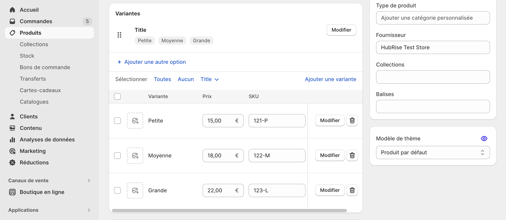
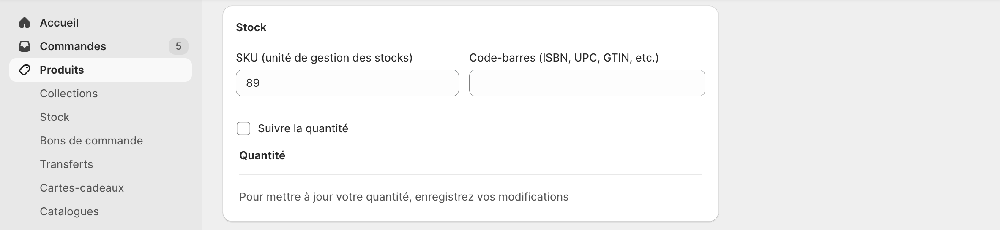

Pour traiter correctement les commandes, la plupart des logiciels de caisse exigent un code ref pour chaque produit. Vous devez donc vérifier que chaque produit dans Shopify est associé au bon code ref.

Cette page explique comment configurer manuellement les codes ref dans Shopify. Cependant, certains logiciels de caisse offrent la possibilité d'exporter leur catalogue vers HubRise, ce qui permet de renseigner automatiquement les bons codes ref des produits Shopify. Pour plus de détails, voir [Envoyer le catalogue](/apps/shopify/push-catalog).

Pour attribuer des codes ref à vos produits Shopify, suivez ces étapes :

1. Connectez-vous à votre back-office Shopify.

2. Dans le menu, sélectionnez **Produits**, puis **Tous** pour afficher tous les produits.

3. Dans la liste des produits, sélectionnez celui pour lequel vous voulez ajouter le code ref.

4. Dans la section **Variantes**, vérifiez si le produit a des options :

   - Si c'est le cas, dans la section **Variantes** saisissez le code ref pour chaque variante dans le champ **SKU**.
     

   - Si ce n'est pas le cas, dans la section **Stock** saisissez le code ref dans le champ **SKU (unité de gestion des stocks)**.
     

5. Cliquez sur **Enregistrer** pour confirmer.

Répétez cette procédure pour chacun de vos produits.
