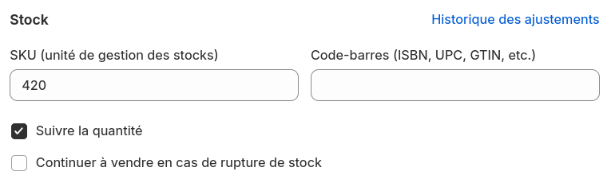

Avec Shopify Bridge, vous pouvez synchroniser votre inventaire HubRise avec Shopify.

Certains logiciels de caisse et de gestion des stocks peuvent mettre à jour les données d'inventaire dans HubRise. Pour vérifier si une application spécifique prend en charge la synchronisation de l'inventaire, reportez-vous à sa documentation sur notre [page Apps](/apps). Vous pouvez également gérer votre inventaire en utilisant [OrderLine](/apps/orderline/overview).

## Synchronisation de l'inventaire

Lorsque l'inventaire HubRise est mis à jour, Shopify Bridge peut ajuster automatiquement les compteurs d'inventaire dans Shopify.

Seuls les articles dont la case à cocher **Suivre la quantité** est activée dans Shopify sont mis à jour. Pour vérifier si cette option est activée pour un produit spécifique, suivez ces étapes :

1. Connectez-vous à votre compte Shopify.
2. Ouvrez la page **Produits**.
3. Sélectionnez un produit.
4. Si le produit possède des variantes, sélectionnez une variante.
5. Dans la section **Stock**, assurez-vous que la case à cocher **Suivre la quantité** est activée.

## Envoi manuel de l'inventaire

Pour envoyer votre inventaire sur Shopify, suivez ces étapes :

1. Connectez-vous à votre [compte HubRise](https://manager.hubrise.com).
2. Sélectionnez le compte HubRise et le point de vente connecté à votre boutique Shopify.
3. Ouvrez la page **CONNEXIONS**, puis sélectionnez **Shopify Bridge** dans la liste des applications connectées.
4. Dans Shopify Bridge, sélectionnez l'onglet **Actions**.
5. Dans la section **Envoyer l'inventaire vers Shopify**, cliquez sur **Envoyer l'inventaire**.

## Envoi automatique de l'inventaire

Shopify Bridge peut envoyer votre inventaire vers Shopify à chaque fois qu'il est mis à jour dans HubRise. Pour activer cette option, suivez ces étapes :

1. Connectez-vous à votre [compte HubRise](https://manager.hubrise.com).
2. Sélectionnez le compte HubRise et le point de vente connecté à votre boutique Shopify.
3. Ouvrez la page **CONNEXIONS**, puis sélectionnez **Shopify Bridge** dans la liste des applications connectées.
4. Dans Shopify Bridge, sélectionnez l'onglet **Configuration**.
5. Dans la section **Inventaire**, cochez **Activer l'envoi automatique de l'inventaire**.
6. Cliquez sur **Enregistrer**.
