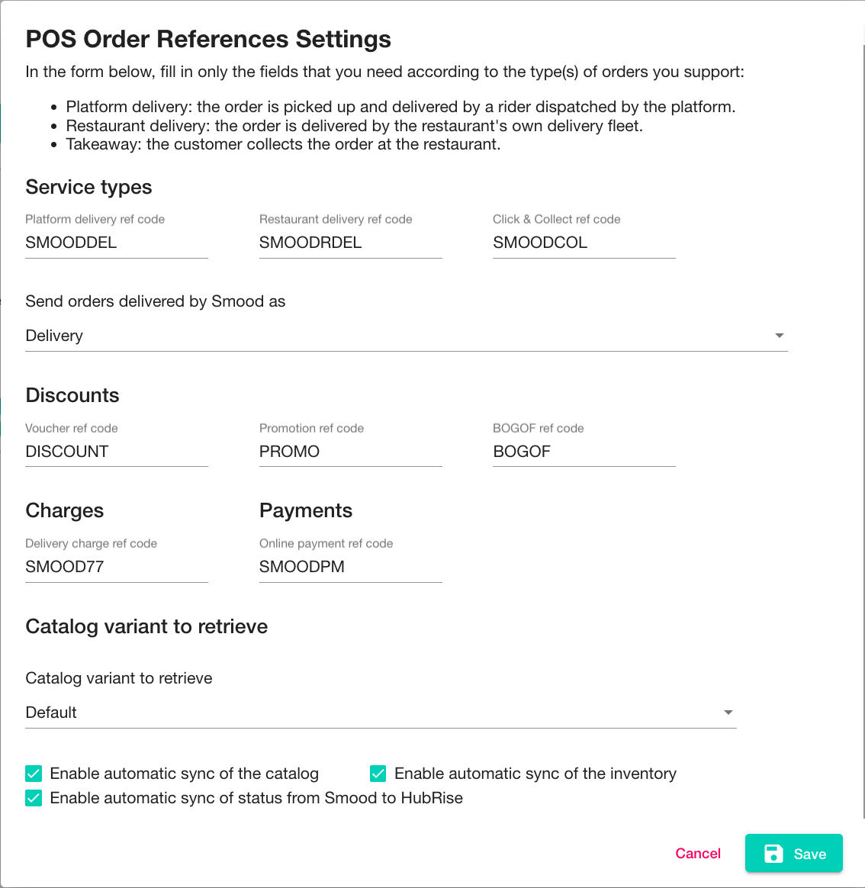

The Smood **Configuration** page lets you configure how orders are sent to your EPOS, or any other solution connected to HubRise. It also includes other settings related to the integration.

This page explains how to open the configuration page and configure your connection.

## Open the Configuration Page

To open the configuration page, follow these steps:

- Log in to your [Smood back office](https://manager.smood.ch).
- Select the restaurant from the dropdown menu in the left sidebar.
- Click the **Settings** tab.
- In the **Integrations** section, click **Settings**.

You will also be redirected to the configuration page when you connect Smood to HubRise. For more information, see [Connect to HubRise](/apps/smood/connect-hubrise).

## Configure Your Parameters {#parameters}

### Service Types {#service-types}

Service types such as Smood **Platform delivery**, **Restaurant delivery**, or **Takeaway**, might require the corresponding ref code entry. To verify, refer to your EPOS documentation on the HubRise website [Apps page](/apps). For more information, see the **Terminology** paragraph, section [Smood Service Types](/apps/smood/terminology#smood-service-types).

Additionally, from this section, you can choose to categorise orders fulfilled by Smood as either delivery or collection orders. Orders fulfilled by the restaurant fleet are always marked as delivery orders. This feature is useful to address specific business requirements or to differentiate these orders in financial reports.

### Discounts {#discounts}

In this section, you can configure the ref codes to use for discounts and deals sent to HubRise:

- **Voucher ref code**: The ref code used for discounts applied to the whole order, for example a 10% discount.
- **Promotion ref code**: The ref code for deals with a single deal line. These are promotions applied to a single product, for example a 10% discount on a specific pizza.
- **BOGOF ref code**: The ref code for *buy one get one free* (BOGOF) deals.

The ref codes that you specify in this section do not apply to the deals that you create in your HubRise catalog and that you synchronise with Smood. 

### Charges {#charges}

Delivery charges are sent to the EPOS for orders delivered by the restaurant. In this section, you can configure the ref code to use.

### Payments {#payments}

All Smood orders are paid online. Smood includes a payment in the order sent to the EPOS. In this section, you can configure the ref code to use.

### Catalog Variant to Retrieve {#variant-to-retrieve}

In this section, you can choose the HubRise catalog variant that you want to push to Smood every time you synchronise the catalog.
With a catalog variant, you can customise the price and availability of the products in your Smood catalog. For more information, see [Catalog Variants](https://hubrise.com/blog/catalog-variants).

### Synchronisation Settings {#synchronisation-settings}

The checkboxes in this section control the synchronisation workflow between Smood and HubRise:

- **Enable automatic sync of the catalog**: When checked, the Smood menu is automatically updated when the HubRise catalog changes.
- **Enable automatic sync of the inventory**: When checked, items are automatically removed from the Smood menu when they are out of stock in the HubRise inventory.
- **Enable automatic sync of status from Smood to HubRise**: When an order is cancelled on Smood, the status update is always sent to HubRise. When this option is checked, other Smood statuses are also sent.

### Save Your Changes

When you are done configuring your parameters, click **Save**.
