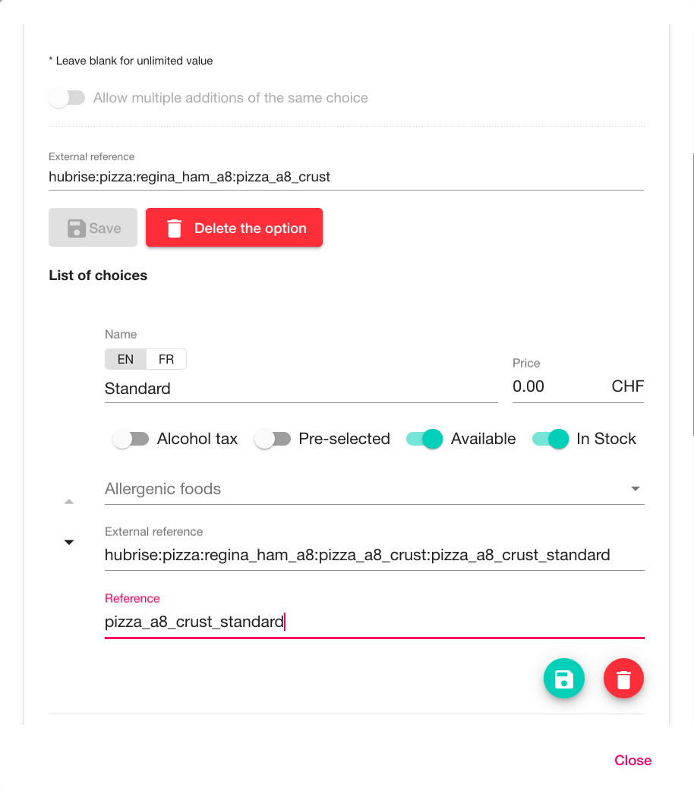

Most EPOS solutions require a ref code for each product to properly interpret orders. Therefore, you need to make sure that each product in Smood is assigned to the correct ref code.

This page explains how to configure ref codes manually in Smood. Some EPOS solutions offer the ability to export their catalog to HubRise, allowing you to populate Smood products automatically with the correct ref codes. For more details, see [Pull the Catalog](/apps/smood/pull-catalog).

---

**IMPORTANT NOTE:** You cannot manually edit the Smood menu or ref codes when [automatic catalog syncing is enabled](https://www.hubrise.com/apps/smood/configuration/#synchronisation-settings).

---

## Products and SKUs

To assign ref codes to your Smood products, follow these steps:

1. Log in to your [Smood back office](https://manager.smood.ch/).
1. Select the restaurant in the left sidebar.
1. Click the **Menu** tab, then select the menu that you want to edit.
1. Expand the category that contains the products that you want to edit, then click on the product name.
1. In the **Edit a product** dialog that appears, enter the ref code in the **Reference** field.
   
1. To confirm, **Save**, then click **Confirm**.

You need to repeat this manual procedure for all your available products.

## Options

To assign ref codes to your Smood options, follow these steps:

1. Log in to your [Smood back office](https://manager.smood.ch/).
1. Select the restaurant in the left sidebar.
1. Click the **Menu** tab, then select the menu that you want to edit.
1. Expand the category that contains the products that you want to edit, then click on the product name.
1. In the **Edit a product** dialog that appears, click **Manage options**.
   
1. In the **Product options** dialog that appears, expand the option group that you want to edit.
1. In the **List of choices** section, identify the option to which you want to add the ref code, then enter the value in the **Reference** field.
   
1. To confirm, click **Save**, then click **Confirm**.

You need to repeat this manual procedure for all of the options associated with the product.

## Service Types, Discounts, Charges, and Payments

Smood lets you specify the ref codes that are used for service types, discounts, delivery charges, and payments. To customise your ref codes, follow the steps indicated in the [Configuration](/apps/smood/configuration) page.

To find the ref codes to use, refer to your EPOS documentation on the HubRise website [Apps page](https://www.hubrise.com/apps/). For example, if you use Lightspeed, check the [Food Ordering Platforms, Smood section](/apps/lightspeed-restaurant/food-ordering-platforms#smood).
