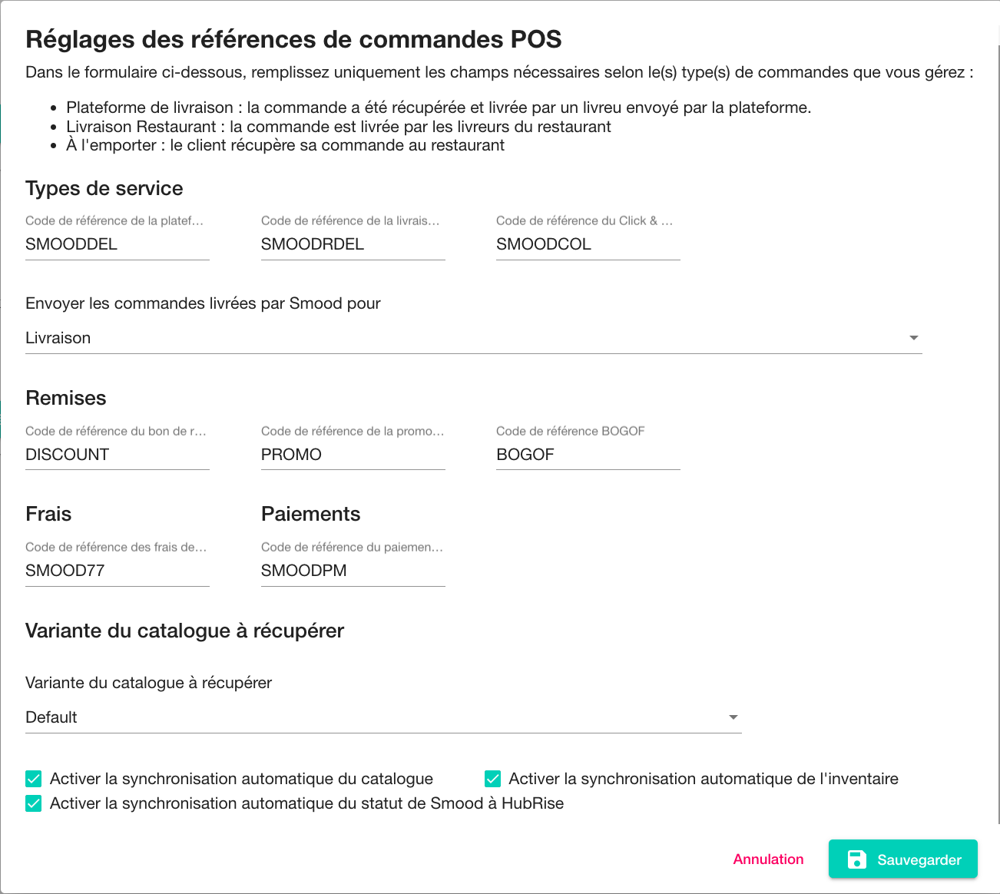

La page de **Configuration** Smood vous permet de configurer la manière dont les commandes sont envoyées à votre logiciel de caisse, ou à toute autre solution connectée à HubRise. Elle inclut également d'autres paramètres liés à l'intégration.

Cette page explique comment ouvrir la page de configuration et configurer votre connexion.

## Ouvrir la page de configuration

Pour ouvrir la page de configuration, suivez ces étapes :

- Connectez-vous à votre [back-office Smood](https://manager.smood.ch).
- Sélectionnez le restaurant dans le menu déroulant de la barre latérale gauche.
- Cliquez sur l'onglet **Paramètres**.
- Dans la section **Intégrations** , cliquez sur **Configuration**.

Vous êtes également redirigé vers la page de configuration lorsque vous connectez Smood à HubRise. Pour plus d'informations, voir la rubrique [Connexion à HubRise](/apps/smood/connect-hubrise).

## Configurer vos paramètres {#settings}

La page de configuration comprend les sections suivantes :

### Types de service {#service-types}

Les types de service tels que **Livraison par la plateforme de livraison**, **Livraison par le restaurant**, ou **À L'emporter**, peuvent nécessiter une entrée de code ref correspondante. Pour vérifier, reportez-vous à la documentation de votre logiciel de caisse sur la [page Apps](/apps) du site internet de HubRise. Pour plus d'informations, voir le paragraphe **Terminologie**, section [Types de service Smood](/apps/smood/terminology#smood-service-types).

De plus, dans cette section, vous pouvez choisir de marquer les commandes livrées par Smood comme étant en livraison ou à emporter. Les commandes livrées par le restaurant sont toujours marquées comme des commandes en livraison. Cette fonctionnalité vous permet de répondre à vos besoins spécifiques ou à différencier ces commandes dans les rapports d'activité.

### Remises {#discounts}

Dans cette section, vous pouvez configurer les codes ref à utiliser pour les remises et promotions envoyées à HubRise :

- **Code de référence du bon de réduction** : Le code ref utilisé pour les remises qui s'appliquent à l'intégralité de la commande, par exemple une remise de 10 %.
- **Code de référence de la promotion**: Le code ref pour les promotions avec une seule ligne. Il s'agit des promotions appliquées à un seul produit, par exemple une réduction de 10 % sur une pizza spécifique.
- **Code de référence BOGOF**: Le code ref pour les offres _"1 produit acheté, 1 offert"_ (BOGOF).

Les codes ref que vous spécifiez dans cette section ne s'appliquent pas aux promotions que vous créez dans votre catalogue HubRise et que vous synchronisez avec Smood.

### Frais {#charges}

Des frais de livraison s'appliquent aux commandes livrées par le restaurant. Dans cette section, vous pouvez configurer le code ref à utiliser.

### Paiements {#payments}

Toutes les commandes Smood sont payables en ligne. Les commandes envoyées au logiciel de caisse incluent un paiement. Dans cette section, vous pouvez configurer le code ref à utiliser.

### Variante du catalogue à récupérer {#variant-to-retrieve}

Dans cette section, vous pouvez choisir la variante de catalogue HubRise que Smood récupérera à chaque synchronisation du catalogue. Les variantes de catalogue sont utiles pour gérer les différences de prix et de disponibilité selon les canaux de vente. Pour plus d'informations, voir [Variantes de catalogue](https://hubrise.com/blog/catalog-variants).

### Paramètres de synchronisation {#synchronisation-settings}

Les cases à cocher de cette section permettent de configurer le flux de synchronisation entre Smood et HubRise :

- **Enable automatic sync of the catalog** (Activer la synchronisation automatique du catalogue) : cochez la case pour que le menu Smood soit automatiquement mis à jour à chaque modification du catalogue HubRise.
- **Enable automatic sync of the inventory** (Activer la synchronisation automatique de l'inventaire) : cochez la case pour que les articles en rupture de stock dans l'inventaire HubRise soient automatiquement supprimés du menu Smood.
- **Activer la synchronisation automatique du statut de Smood à HubRise**: Lorsqu'une commande est annulée dans Smood, la mise à jour de ce statut est toujours envoyée à HubRise. Quand cette option est cochée, d'autres statuts Smood sont également envoyés.

### Enregistrer vos modifications

Une fois vos paramètres configurés, cliquez sur **Enregistrer**.
