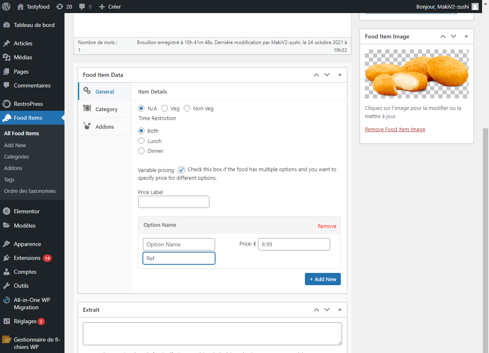

## Produits

Un produit sur HubRise correspond à un _Food Item_ dans l'interface SuperDigital.fr.

Pour modifier le code ref d'un produit, suivez ces étapes :

1. Depuis le back office SuperDigital.fr, dans le menu de gauche, cliquez sur **Food Items**, puis sur **All Food Items**.
2. Dans la liste de produits, cliquez sur le nom d'un produit ou sur **Modifier**.
   
3. Sur la page d'un produit, dans la section **Food Item Data**, le code ref du produit se trouve dans le champ **Ref**. Modifiez le code ref du produit.
   
4. En haut à droite de la page produit, cliquez sur le bouton **Mettre à jour** pour sauvegarder.

## SKUs

Une SKU sur HubRise correspond à une _Option_ dans SuperDigital.fr. On peut définir plusieurs SKUs pour un même produit en cochant la case **Variable Pricing**.

Pour modifier le code ref d'une SKU, suivez ces étapes :

1. Depuis le back office SuperDigital.fr, dans le menu de gauche, cliquez sur **Food Items**, puis sur **All Food Items**.
2. Dans la section **Food Item Data**, lorsque **Variable pricing** est coché, sous **Option Name**, le code ref se trouve dans le champ **Ref**. Modifiez le code ref de l'_Option_.
   
3. En haut à droite de la page produit, cliquez sur le bouton **Mettre à jour** pour sauvegarder.

## Options

Les options sur HubRise correspondent aux _Addons_ dans SuperDigital.fr.

Pour modifier le code ref d'une option, suivez ces étapes :

1. Depuis le back office SuperDigital.fr, dans le menu de gauche, cliquez sur **Food Items**, puis sur **Addons**.
2. Dans la liste des _Addons_, cliquez sur le nom d'un _Addon_ ou sur **Modifier**.
   
3. Sur la page d'un _Addon_, le code ref se trouve dans le champ **Ref**. Modifiez le code ref de l'_Addon_.
   
4. Cliquez sur le bouton **Mettre à jour** pour sauvegarder.

## Promotions

Les promotions dans HubRise sont les offres spéciales qui s'appliquent à certains produits. SuperDigital.fr ne supporte pas les promotions sur les produits.

## Remises

Les remises dans HubRise sont les offres spéciales qui s'appliquent à l'ensemble de la commande. Elles correspondent aux **Discount codes** dans l'interface SuperDigital.fr.

Pour modifier le code ref d'un _Discount Code_, suivez ces étapes :

1. Depuis le back office SuperDigital.fr, dans le menu de gauche, cliquez sur **RestroPress**, puis sur **Discount Codes**.
2. Dans la liste des _Discount Codes_, sur la ligne d'un _Discount Code_, cliquez sur **Modifier**.
   
3. Sur la page d'un _Discount Code_, le code ref se trouve dans le champ **Ref**. Modifiez le code ref du _Discount Code_.
   
4. Cliquez sur le bouton **Update Discount Code** pour sauvegarder.

## Méthodes de paiement

Les méthodes de paiement dans HubRise correspondent aux _Payment Gateways_ sur SuperDigital.fr. Selon les apps connectées à SuperDigital.fr, les méthodes de paiement peuvent nécessiter un code ref. Référez-vous à la documentation des apps connectées sur le site de HubRise pour vérifier.

Pour modifier le code ref d'une méthode de paiement, suivez ces étapes :

1. Depuis le back office SuperDigital.fr, dans le menu de gauche, cliquez sur **RestroPress**, puis sur **Settings**.
2. Cliquez sur l'onglet **Payment Gateways**.
3. Dans le sous-onglet **Général**, dans la section **Payment Gateways**, les codes ref des méthodes de paiement se trouvent dans les champs **Ref** des méthodes **PayPal Standard**, **Test Payment**, **Payer en espèces**, **Amazon** et **Stripe**. Modifiez le code ref de la méthode de paiement.
   
4. Cliquez sur le bouton **Enregistrer les modifications** pour sauvegarder.

## Types de service

Les types de service dans HubRise correspondent aux _Service Options_ sur SuperDigital.fr. Selon les apps connectées à SuperDigital.fr, les types de service peuvent nécessiter un code ref. Référez-vous à la documentation des apps connectées sur le site de HubRise pour vérifier.

Pour modifier le code ref d'un type de service, suivez ces étapes :

1. Depuis le back office SuperDigital.fr, dans le menu de gauche, cliquez sur **RestroPress**, puis sur **Settings**.
2. Dans l'onglet **Général**, cliquez sur le sous-onglet **Service Options**. Les codes ref des types de service se trouvent dans les champs **Delivery Ref** et **Pickup Ref**.
   
3. Modifiez le code ref et cliquez sur le bouton **Enregistrer les modifications** pour sauvegarder.