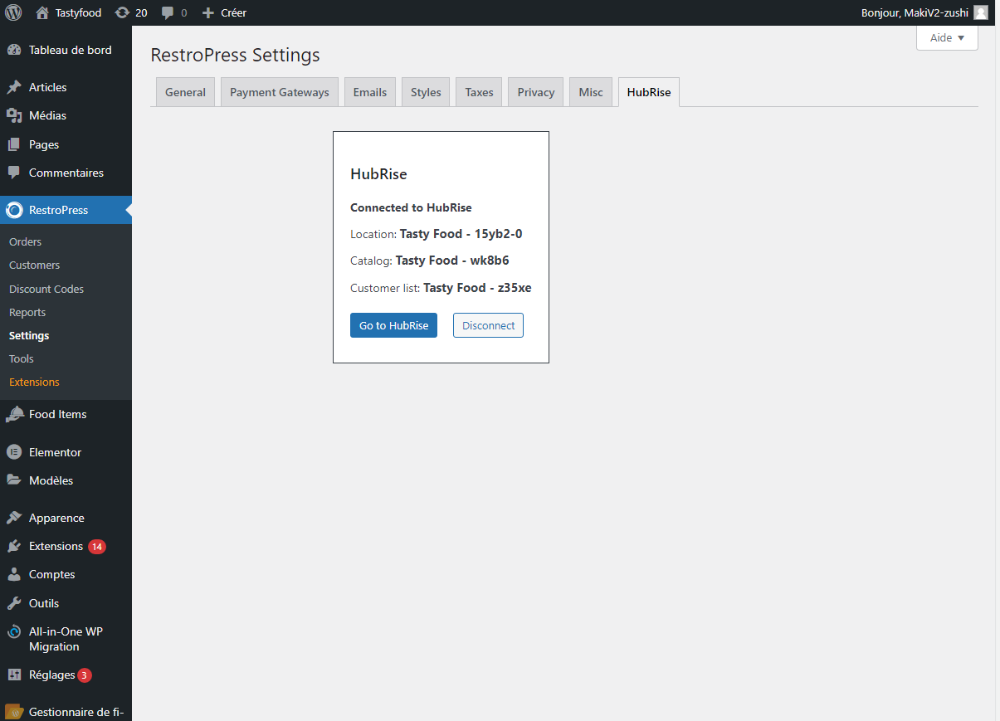

---

**REMARQUE IMPORTANTE :** Si vous ne possédez pas encore de compte HubRise, commencez par en ouvrir un sur la [page d'inscription à HubRise](https://manager.hubrise.com/signup). L'inscription ne prend que quelques minutes !

---

## Connecter SuperDigital.fr

Pour établir la connexion entre SuperDigital.fr et HubRise :

1. Depuis le back office SuperDigital.fr, dans le menu de gauche, cliquez sur **Extensions**.
2. Dans la barre de recherche à droite, tapez **hubrise**. L'extension **RestroPress - Hubrise** s'affiche.
3. Cliquez sur **Activer**.
4. Dans le menu de gauche, cliquez sur **RestroPress**, puis sur **Settings**.
5. Cliquez sur l'onglet **HubRise**.
6. Dans le cadre HubRise, cliquez sur le bouton **Connect**. La page HubRise s'ouvre dans votre navigateur.
7. Si vous avez plusieurs points de vente, choisissez le point de vente à connecter. Si le point de vente sélectionné possède plusieurs listes de clients ou catalogues, cliquez sur **Suivant** pour afficher les listes déroulantes correspondantes, puis sélectionnez les options voulues.
8. Cliquez sur **Autoriser**.

## Déconnecter SuperDigital.fr

Pour déconnecter SuperDigital.fr de HubRise, suivez ces étapes :

1. Depuis le back office SuperDigital.fr, dans le menu de gauche, cliquez sur **RestroPress**, puis sur **Settings**.
2. Cliquez sur l'onglet **HubRise**.
   
3. Dans le cadre HubRise, cliquez sur le bouton **Disconnect**.