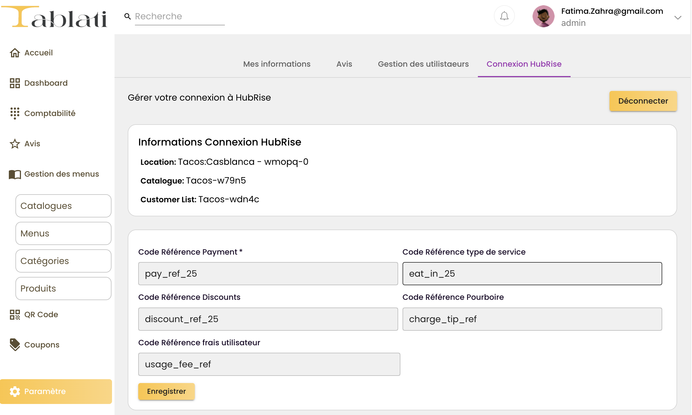

---

**REMARQUE IMPORTANTE :** Si vous ne possédez pas encore de compte HubRise, rendez-vous sur la [page d'inscription à HubRise](https://manager.hubrise.com/signup). L'inscription ne prend qu'une minute !

---

## Connecter Tablati

Pour connecter Tablati à HubRise, suivez ces étapes :

1. Depuis le back-office de Tablati, cliquez sur **Paramètres** puis **Connexion HubRise**.
2. Cliquez sur le bouton **Connecter**. Vous êtes redirigé vers l'interface HubRise. S'il s'agit de votre première connexion, créez un compte HubRise. Pour plus d'informations, consultez notre [Guide de démarrage](/docs/get-started).
3. Si votre compte possède plusieurs points de vente, développez **Choisissez le point de vente**, sélectionnez le point de vente à connecter, puis cliquez sur **Autoriser**. Si le point de vente sélectionné possède plusieurs listes de clients ou catalogues, cliquez sur **Suivant** pour afficher les listes déroulantes correspondantes, puis sélectionnez les options souhaitées.
4. Cliquez sur **Autoriser**.
5. Vous êtes redirigé vers l'interface Tablati et la connexion à HubRise est établie.

## Donner accès au support de Tablati

Pour faciliter le traitement de vos demandes de support, vous devez accorder à votre fournisseur Tablati l'accès à votre compte HubRise.

Pour donner accès à Tablati, procédez comme suit :

1. Depuis le back-office de HubRise, sélectionnez **CONFIGURATION** dans le menu de gauche.
2. Dans la section **Permissions**, ajoutez `contact@tablati.ma`.
3. Cliquez sur **Modifier les permissions** puis attribuez les droits nécessaires afin d’accorder au support Tablati l’accès à votre compte ou à votre point de vente. Parmi les rôles prédéfinis du menu déroulant, celui de **Partenaire technique** est recommandé.

L'ajout d'un utilisateur est le moyen recommandé de donner accès à un tiers à votre compte HubRise ou au point de vente. Le partage de mot de passe est déconseillé pour des raisons de sécurité. Pour plus d'informations sur les permissions, voir notre aide en ligne, page [Permissions](/docs/permissions).

## Contacter le support de Tablati

Pour demander la connexion de votre solution de commande et de paiement à table à l'éditeur, contactez le support de Tablati par e-mail sur contact@tablati.ma. Vous pouvez inclure support@hubrise.com en copie pour un suivi coordonné entre nos deux équipes.

Indiquez dans votre demande le nom de votre compte HubRise, son identifiant HubRise et le point de vente à connecter. Pour plus d'informations, voir [Nom et identifiant du point de vente](/docs/locations#location-name-and-id).

## Déconnecter Tablati

Si vous avez besoin d'arrêter temporairement la réception des commandes envoyées sur HubRise, vous pouvez bloquer la connexion entre Tablati et HubRise. Pour plus d'informations, voir [Bloquer ou déconnecter une application](/docs/connections#block-or-disconnect).

Si, au contraire, vous souhaitez arrêter définitivement l'envoi de commandes Tablati à HubRise, il est préférable de déconnecter Tablati de HubRise via le back-office de Tablati.

Pour déconnecter Tablati de HubRise, suivez ces étapes :

1. Depuis le back-office de Tablati, cliquez sur **Paramètres** puis **Connexion HubRise**.
2. Cliquez sur le bouton **Déconnecter**.
3. Vous êtes déconnecté. Le message suivant s'affiche sur fond vert **Le Token a été supprimé avec succès !**
