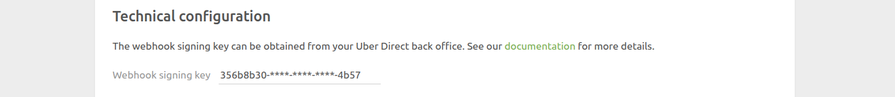
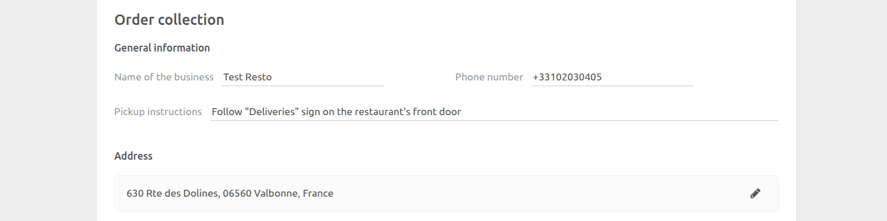
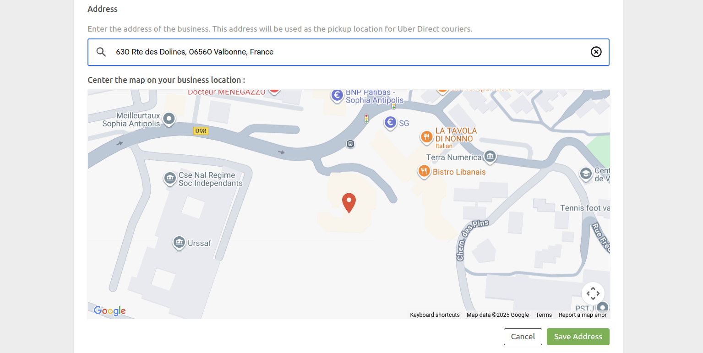
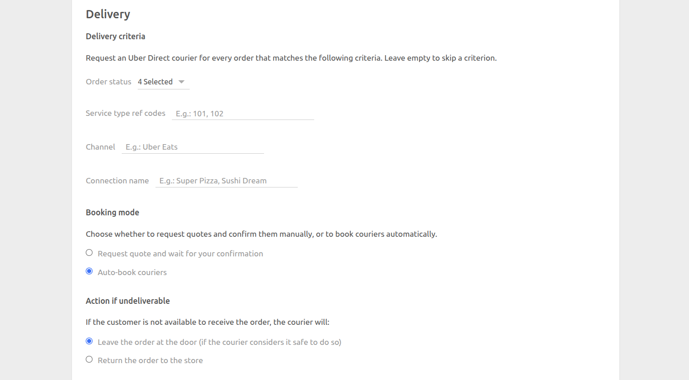

The Configuration page lets you customise the behaviour of the Uber Direct integration.

The pas is divided into several sections: **Technical Configuration**, **Order Collection**, and **Delivery**.

## Technical Configuration

### Webhook Signing Key

Enter the webhook signing key that you retrieved from Uber Direct. For more information on how to retrieve this key, see [Connect to HubRise](/apps/uber-direct/connect-hubrise#setup-webhook).

This key is used to verify the authenticity of webhook messages sent by Uber Direct to HubRise.

## Order Collection {#order-collection}

This section defines the business information and pickup address that will be sent to Uber Direct in delivery requests.

### General Information

- **Name of the business**: Enter the name of your business as it should appear to the courier.
- **Phone number**: Enter the phone number the courier will call if they need to reach you during pickup.
- **Pickup instructions**: Enter any special instructions for the courier when they arrive at your location (maximum 280 characters). For example, "Follow green 'Pickup' sign in the parking lot."

### Address {#address}

Enter the address where the courier will collect the order.

To set the address:

- Use the autocomplete field to search for your business address, and select it from the suggestions.
- Fine-tune the marker position on the map if needed to ensure the exact pickup location.

### Preparation Time

The preparation time is used for ASAP orders, to ensure that couriers do not arrive too early.

By default, the preparation time is synchronised with the HubRise location settings. If you need to use a different value, uncheck **Sync preparation time with HubRise** and enter the desired time in minutes.

## Delivery

This section defines when and how Uber Direct deliveries should be requested.

### Delivery Criteria {#delivery-criteria}

Uber Direct Bridge will request a courier for every order that matches the following criteria. Each criterion is optional: just leave it empty to skip it.

#### Order Status

Select the order status(es) that should trigger a delivery request. For example, if you only want to request a courier when an order is ready for pickup, select `Awaiting shipment`.

By default, the following statuses are selected:

- `Received`
- `Accepted`
- `In preparation`
- `Awaiting shipment`

#### Service Type Ref Code

Enter the service type ref codes that should trigger a delivery request. For example, if you only want to request a courier for orders with a service type ref code of `101` or `102`, enter both codes. Press Enter or use comma to separate multiple ref codes.

#### Channel

Enter the channels (e.g. "Uber Eats", "WooCommerce", etc.) that should trigger a delivery request. For example, if you only want to request a courier for orders from the `Uber Eats` channel , enter this exact name. Press Enter or use comma to separate multiple channels.

#### Connection name

Enter the connection names that should trigger a delivery request. Connection names are typically used in Dark Kitchen setups. For example, if you only want to request a courier for orders from the `Sushi Dream` connection, enter this exact name. Press Enter or use comma to separate multiple connection names.

### Booking Mode

Choose how delivery requests should be handled:

- **Request a quote and wait for your confirmation**: Uber Direct Bridge creates a delivery quote but does not automatically book a courier. You will need to manually confirm the delivery from your EPOS or another app connected to HubRise.
- **Auto-book couriers** (enabled by default): Uber Direct Bridge automatically books a courier. This is the recommended option for most use cases.

### Undeliverable Action

If the customer is not available to receive the order, choose what the courier should do:

- **Leave the order at the door** (enabled by default): The courier will leave the order at the customer's door if they consider it safe to do so.
- **Return the order to the store**: The courier will return the order to your business. When this option is selected, you can enter special return instructions for the courier (maximum 280 characters). For example, "Please meet store members at the counter."

## Save the Configuration

To save the configuration, click **Save** at the top of the page.

## Reset the Configuration

If you need to reset the configuration, click **Reset the configuration** at the bottom of the page.

---

**IMPORTANT NOTE:** Resetting the configuration will instantly disconnect the bridge from Uber Direct. You will need to reconnect using your Uber Direct credentials.

---

Resetting the configuration does not delete the operation logs displayed in the main page.
