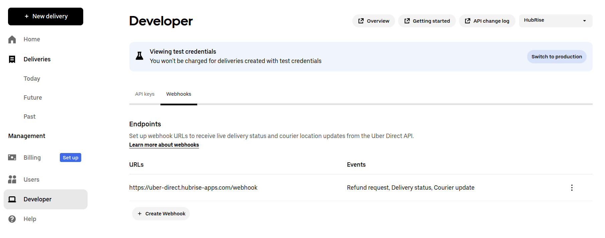

Connecting Uber Direct to HubRise can be done in a few steps.

---

**IMPORTANT NOTE:** If you do not have a HubRise account yet, register on our [Signup Page](https://manager.hubrise.com/signup). It only takes a minute!

---

## 1. Connect Uber Direct Bridge {#connect-uber-direct-bridge}

To connect Uber Direct Bridge to HubRise, follow these steps:

- Log in to your [HubRise account](https://manager.hubrise.com).
- Select the location you want to connect from the dropdown menu.
- Select **CONNECTIONS**, then **View available apps**.
- Select **Uber Direct Bridge** from the list of apps.
- Click **Connect**.
- Click **Allow** to grant Uber Direct Bridge access to your registered location on HubRise. If your account has multiple locations, expand the **Choose location** section to select the desired location, and then click **Allow**.
- Enter your **Customer ID**, **Client ID**, and **Client Secret**. To find out how to get these credentials, see [Retrieve Uber Direct Credentials](#retrieve-credentials).
  
- Click **Complete the setup**. The bridge opens the **Configuration** page.
- Create a webhook in your Uber Direct account. See [Set Up Webhook](#setup-webhook).
- Complete the configuration of the bridge. See [Configure Your Preferences](#configure-preferences).

### 1.1. Retrieve Uber Direct Credentials {#retrieve-credentials}

To retrieve your Customer ID, Client ID, and Client Secret:

- Log in to your Uber Direct account at [https://direct.uber.com](https://direct.uber.com).
- Open the **Developer** tab.
- In the **API keys** section, find your **Customer ID**, **Client ID** and **Client Secret**, and copy their values.

### 1.2. Set Up Webhook {#setup-webhook}

Uber Direct uses webhooks to send delivery updates to HubRise. You need to configure the webhook URL and retrieve the signing key.

To configure the webhook:

- Log in to your Uber Direct account at [https://direct.uber.com](https://direct.uber.com).
- In the **Developer** tab, go to the **Webhooks** section.
- Click **Create Webhook**
- Enter the following **Webhook URL**: `https://uber-direct.hubrise-apps.com/webhook`
- Select all event types: `event.delivery_status`, `event.courier_update` and `event.refund_request`.
- Click **Save**.

You will need the webhook signing key to complete the bridge configuration. To retrieve it:

- In the **Webhooks** section, click the three dots next to the webhook you just created.
- Select **Edit**.
- Copy the **Signing Key**.

## 2. Configure Your Preferences {#configure-preferences}

After connecting the bridge, you need to configure the parameters on the **Configuration** page for correct operation. This includes:

- Webhook signing key
- Business information (name, phone number, address)
- Delivery criteria and booking preferences

For more information about navigating the bridge, see [User Interface](/apps/uber-direct/user-interface#configuration). For details on how to configure the parameters of Uber Direct Bridge, see [Configuration](/apps/uber-direct/configuration).

## 3. Test the Integration

After saving your configuration, your Uber Direct integration is ready to use.

To ensure everything is working correctly, perform the following tests:

- Create a test order in a connected application, such as your online ordering system or EPOS.
- Verify that the order triggers a quote or delivery request in Uber Direct, according to your settings.
- If a delivery was requested, check that delivery status updates are received in HubRise.

If you encounter problems during the tests, contact us at support@hubrise.com.
