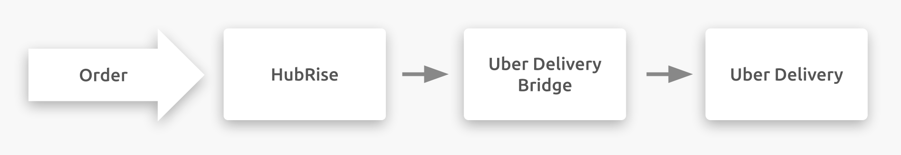

---

**IMPORTANT NOTE**: Full documentation of this integration will be available soon.

---

## Description

Uber Direct is a white-label delivery service offered by Uber. Businesses can use it to offer on-demand delivery.

Instead of maintaining their own fleet, businesses can rely on Uber Direct to dispatch packages, products, or goods directly to their customers. This service is specifically tailored for, but not limited to, restaurants, virtual restaurants, grocery stores, convenience stores, retail stores, liquor stores, pet stores, and flower shops. It helps them leverage Uber Eats' extensive driver network for scheduled, same-day, or even instant deliveries.

Uber Direct connects to your HubRise account through the Uber Direct Bridge, an app developed by HubRise.

## Integration Features

Connecting Uber Direct to HubRise allows your delivery service provider to:

- Pull orders from HubRise, including order status.
- Pull customer information from HubRise.
- Synchronise final delivery time with HubRise.

Deliveroo Bridge can be connected to HubRise from the HubRise back office.

## Why Connect?

By connecting Uber Direct to HubRise, your delivery service provider can communicate with your other everyday applications. Receive orders from your EPOS solution, your online ordering solution, or your food delivery platforms in your Uber Direct delivery service provider dashboard.

Thanks to HubRise, you can synchronise your menu, your customer information and your orders with your EPOS, your online ordering solution, food delivery platforms (including Deliveroo, Uber Eats and Just Eat), delivery management solutions or delivery services, eMarketing (SMS/emailing), business intelligence, inventory management and customer loyalty systems, and more. The number of compatible applications increases every month. To see which apps you can connect, see our [Apps page](/apps).

## Prerequisites

To establish a connection between Uber Direct and HubRise, you must have an existing Uber Direct account.
