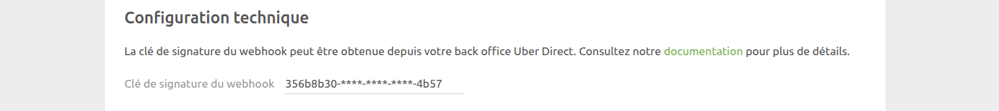
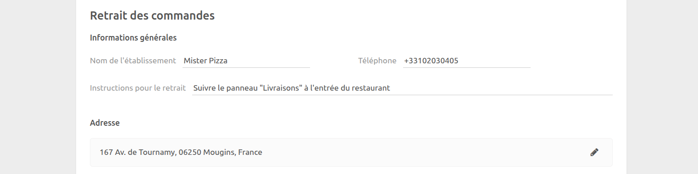
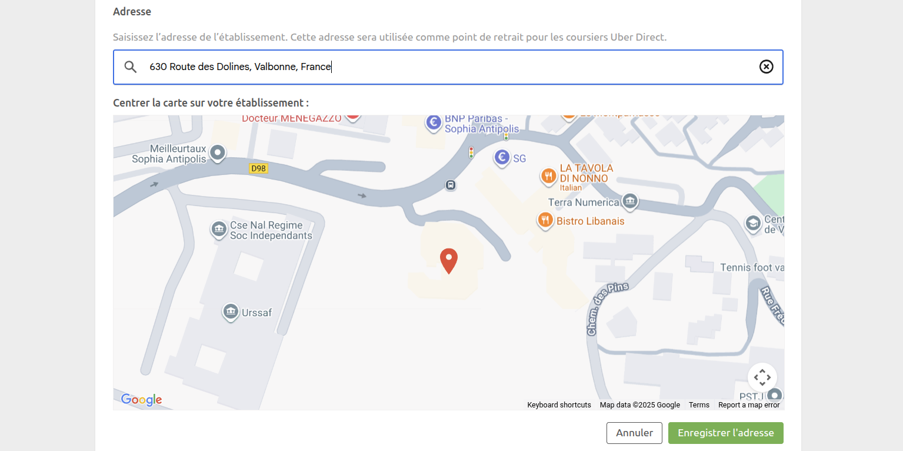
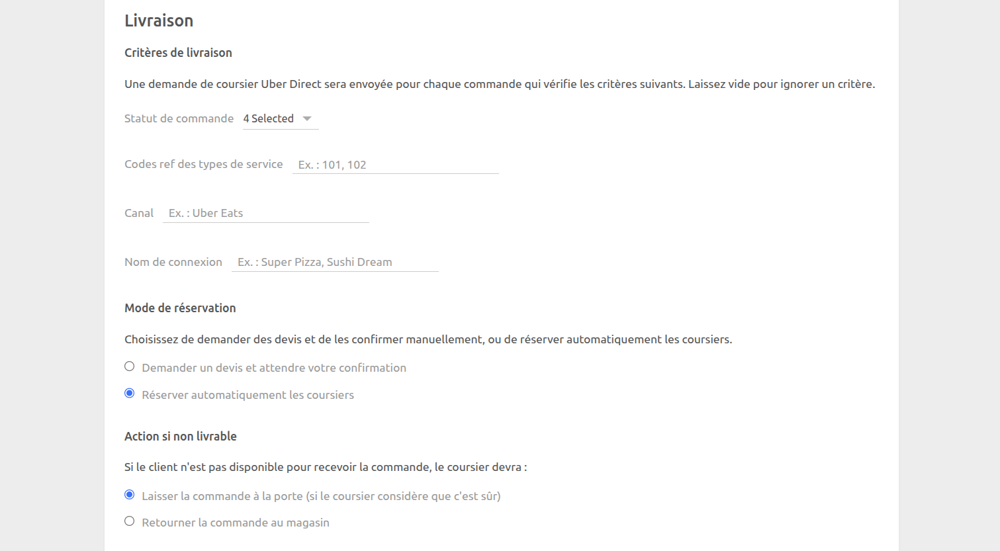

La page de configuration permet de personnaliser le comportement de l'intégration Uber Direct.

La page est divisée en plusieurs sections : **Configuration technique**, **Retrait des commandes** et **Livraison**.

## Configuration technique

### Clé de signature du crochet Web

Saisissez la clé de signature du crochet Web que vous avez récupérée sur Uber Direct. Pour plus d'informations sur la façon de récupérer cette clé, voir [Connexion à HubRise](/apps/uber-direct/connect-hubrise#setup-webhook).

Cette clé sert à vérifier l'authenticité des messages de crochet Web envoyés par Uber Direct à HubRise.

## Retrait des commandes {#order-collection}

Cette section définit les informations de l'enseigne et l'adresse de retrait qui seront envoyées à Uber Direct dans les demandes de livraison.

### Informations générales

- **Nom de l'enseigne** : Saisissez le nom de votre enseigne tel qu'il apparaîtra pour le coursier.
- **Numéro de téléphone** : Indiquez le numéro de téléphone que le coursier appellera s'il doit vous joindre lors du retrait.
- **Instructions de retrait** : Saisissez toute instruction particulière pour le coursier lorsqu'il arrive à votre point de vente (280 caractères maximum). Par exemple, "Suivez le panneau vert \"Retrait\" depuis le parking."

### Adresse {#address}

Saisissez l'adresse à laquelle le coursier récupérera la commande.

Pour définir l'adresse :

- Utilisez le champ de saisie semi-automatique pour rechercher l'adresse de votre enseigne et sélectionnez-la parmi les suggestions.
- Ajustez la position du repère sur la carte si nécessaire pour repérer l'emplacement exact du retrait.

## Livraison

Cette section définit quand et comment les livraisons Uber Direct doivent être envoyées.

### Critères de livraison {#delivery-criteria}

Uber Direct Bridge envoie une demande un coursier pour toute commande correspondant aux critères suivants. Chaque critère est facultatif : il suffit de le laisser vide pour ne pas le prendre en compte.

#### Statut de commande

Sélectionnez le ou les statuts de commande devant déclencher une demande de livraison. Par exemple, si vous souhaitez demander un coursier uniquement lorsqu'une commande est prête pour le retrait, sélectionnez `En attente livraison`.

Par défaut, les statuts suivants sont sélectionnés :

- `Reçue`
- `Acceptée`
- `En préparation`
- `Attente livraison`

#### Code ref du type de service

Saisissez le ou les codes ref de type de service devant déclencher une demande de livraison. Par exemple, si vous souhaitez demander un coursier uniquement pour les commandes dont le code ref de type de service est `101` ou `102`, saisissez ces deux codes. Appuyez sur Entrée ou utilisez la virgule pour saisir plusieurs codes ref.

#### Canal

Saisissez le ou les canaux (par exemple "Uber Eats", "WooCommerce", etc.) devant déclencher une demande de livraison. Par exemple, si vous souhaitez demander un coursier uniquement pour les commandes provenant du canal `Uber Eats`, saisissez ce nom exact. Appuyez sur Entrée ou utilisez la virgule pour saisir plusieurs canaux.

#### Nom de connexion

Saisissez le ou les noms de connexion devant déclencher une demande de livraison. Les noms de connexion sont généralement utilisés par les Dark Kitchens. Par exemple, si vous souhaitez demander un coursier uniquement pour les commandes provenant de la connexion `Sushi Dream`, saisissez ce nom exact. Appuyez sur Entrée ou utilisez la virgule pour saisir plusieurs noms de connexion.

### Mode de réservation

Choisissez comment les demandes de livraison doivent être traitées :

- **Demander un devis et attendre votre confirmation** : Uber Direct Bridge crée un devis de livraison mais ne réserve pas automatiquement le coursier. Vous devrez confirmer manuellement la livraison depuis votre logiciel de caisse ou une autre application connectée à HubRise.
- **Réserver automatiquement les coursiers** (option par défaut) : Uber Direct Bridge réserve automatiquement un coursier. C'est l'option recommandée dans la plupart des cas d'utilisation.

### Action en cas de non-livraison

Si le client n'est pas disponible pour recevoir la commande, choisissez ce que doit faire le coursier :

- **Laisser la commande à la porte** (option par défaut) : Le coursier laisse la commande devant la porte, s'il estime que cela peut se faire en toute sécurité.
- **Rapporter la commande au magasin** : Le coursier rapporte la commande. Lorsque cette option est sélectionnée, vous pouvez saisir des instructions de retour spécifiques pour le coursier (280 caractères maximum). Par exemple, "Présentez-vous à un employé au comptoir."

## Enregistrer la configuration

Pour enregistrer la configuration, cliquez sur **Enregistrer** en haut de la page.

## Réinitialiser la configuration

Si vous avez besoin de réinitialiser la configuration, cliquez sur **Réinitialiser la configuration** en bas de la page.

---

**REMARQUE IMPORTANTE :** La réinitialisation de la configuration déconnecte instantanément le bridge d'Uber Direct. Vous devrez vous reconnecter en utilisant vos identifiants Uber Direct.

---

La réinitialisation de la configuration ne supprime pas les logs des opérations affichés sur la page principale.
