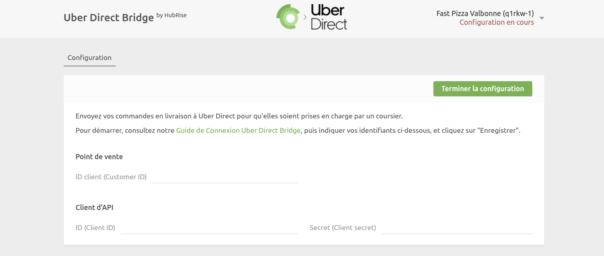
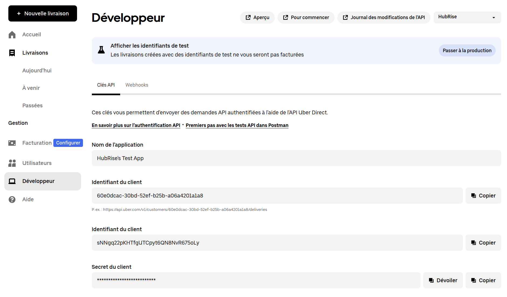
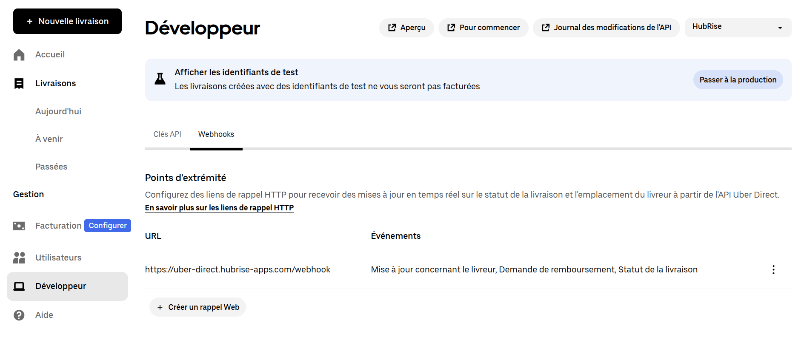
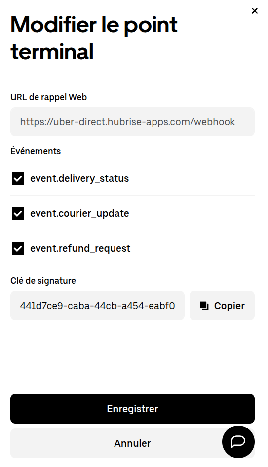

La connexion d'Uber Direct à HubRise se fait en quelques étapes.

---

**REMARQUE IMPORTANTE :** Si vous ne possédez pas encore de compte HubRise, rendez-vous sur la [page d'inscription à HubRise](https://manager.hubrise.com/signup). L'inscription ne prend qu'une minute !

---

## 2. Connecter Uber Direct Bridge {#connect-uber-direct-bridge}

Pour connecter Uber Direct Bridge à HubRise, suivez ces étapes :

- Connectez-vous à votre [compte HubRise](https://manager.hubrise.com).
- Dans le menu déroulant, sélectionnez le point de vente à connecter.
- Sélectionnez **CONNEXIONS**, puis **Voir les apps disponibles**.
- Sélectionnez **Uber Direct Bridge** dans la liste des applications.
- Cliquez sur **Connecter**.
- Cliquez sur **Autoriser** pour donner à Uber Direct Bridge l'accès à votre point de vente HubRise. Si votre compte possède plusieurs points de vente, développez **Choisissez le point de vente**, sélectionnez le point de vente à connecter, puis cliquez sur **Autoriser**.
- Saisissez votre **ID client** (Customer ID), **ID** (Client ID) et **Secret** (Client Secret). Pour savoir comment obtenir ces identifiants, voir [Récupérer les identifiants Uber Direct](#retrieve-credentials).
  
- Cliquez sur **Terminer la configuration**. Le bridge ouvre la page **Configuration**.
- Créez un crochet Web dans votre compte Uber Direct. Voir [Configurer le crochet Web](#setup-webhook).
- Terminez la configuration du bridge. Voir [Configurer vos préférences](#configure-preferences).

### 1.1. Récupérer les identifiants Uber Direct {#retrieve-credentials}

Pour récupérer votre ID client, ID et Secret :

- Connectez-vous à votre compte Uber Direct sur [https://direct.uber.com](https://direct.uber.com).
- Ouvrez l'onglet **Développeur**.
- Dans la section **Clés d'API**, recherchez les deux champs nommés **Identifiant du client** et le champ **Secret du client**, puis copiez leurs valeurs.

### 1.2. Configurer le crochet Web {#setup-webhook}

Uber Direct utilise des crochets Web pour envoyer des mises à jour de livraison à HubRise. Vous devez configurer l'URL du crochet Web et récupérer la clé de signature.

Pour configurer le crochet Web :

- Connectez-vous à votre compte Uber Direct sur [https://direct.uber.com](https://direct.uber.com).
- Dans l'onglet **Développeur**, accédez à la section **Webhooks**.
- Cliquez sur **Créer un rappel Web**
- Saisissez l'**URL de rappel Web** suivante : `https://uber-direct.hubrise-apps.com/webhook`
- Sélectionnez tous les types d'événements : `event.delivery_status`, `event.courier_update` et `event.refund_request`.
- Cliquez sur **Enregistrer**.

Vous aurez besoin de la clé de signature du crochet Web pour terminer la configuration du bridge. Pour la récupérer :

- Dans la section **Webhooks**, cliquez sur les trois points à côté du crochet Web que vous venez de créer.
- Sélectionnez **Modifier**.
- Copiez la **Clé de signature**.

## 2. Configurer vos préférences {#configure-preferences}

Après avoir connecté le bridge, vous devez configurer les paramètres sur la page **Configuration** pour un fonctionnement correct. Ceux-ci comprennent :

- Clé de signature du crochet Web
- Informations sur l'enseigne (nom, numéro de téléphone, adresse)
- Critères de livraison et préférences de réservation

Pour plus d'informations sur la navigation dans le bridge, voir [Interface utilisateur](/apps/uber-direct/user-interface#configuration). Pour plus d'informations sur la configuration des paramètres d'Uber Direct Bridge, voir [Configuration](/apps/uber-direct/configuration).

## 3. Tester l'intégration

Après avoir enregistré votre configuration, votre intégration Uber Direct est prête à être utilisée.

Pour vous assurer que tout fonctionne correctement, effectuez les tests suivants :

- Créez une commande test dans une application connectée, comme votre système de commande en ligne ou votre logiciel de caisse.
- Vérifiez que la commande déclenche un devis ou une demande de livraison dans Uber Direct, selon votre paramétrage.
- Si une livraison a été demandée, vérifiez que les mises à jour du statut de livraison sont reçues dans HubRise.

Si vous rencontrez des difficultés durant ces tests, contactez-nous à l'adresse : support@hubrise.com.
