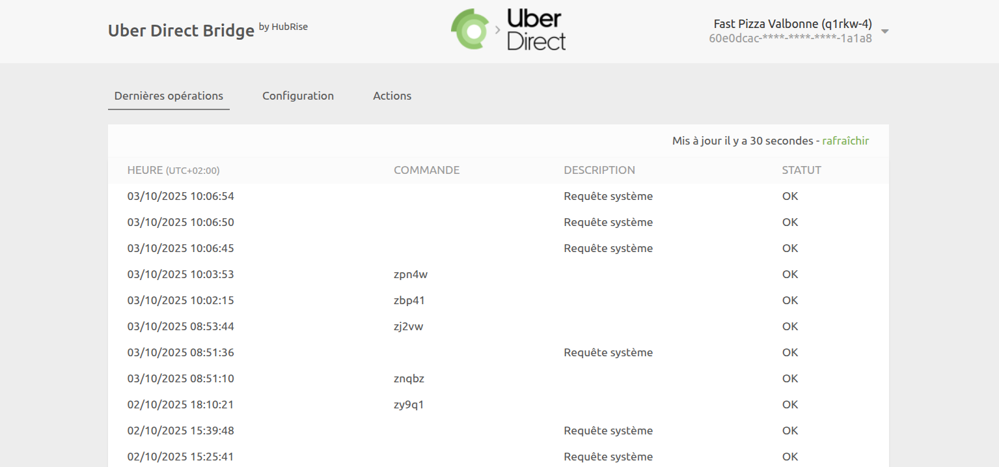

Dans Uber Direct Bridge, vous pouvez consulter les logs de toutes les opérations entre HubRise et Uber Direct, et accéder à la page de configuration de l'intégration.

## Dernières opérations

Il s'agit de la page qui s'affiche lorsque vous ouvrez Uber Direct Bridge. Elle contient les dernières opérations d'API échangées entre HubRise, Uber Direct et Uber Direct Bridge.

Ces opérations peuvent soit être liées à une livraison spécifique, soit être des requêtes système génériques exécutées par Uber Direct Bridge.

Chaque ligne de la page affiche les informations suivantes sur une opération :

- **HEURE** : date et heure de la commande.
- **COMMANDE** : identifiant HubRise de la commande, pour les opérations liées à une livraison.
- **DESCRIPTION** : description facultative pour les opérations qui ne sont pas liées à une commande spécifique. Cette colonne peut être vide, ou afficher une action particulière comme `Requête système` ou `Envoi catalogue`.
- **STATUT** : statut de l'opération. La valeur `OK` indique que l'opération s'est déroulée avec succès, sinon un code d'erreur s'affiche en rouge.

Le libellé "Requête système" indique que l'opération n'est pas liée à une commande spécifique.

Cliquez sur une ligne pour afficher une page avec les logs associés à l'opération.

### Opération de livraison

Sélectionnez une opération de livraison dans la liste de la page principale pour afficher tous les logs des requêtes d'API échangées entre HubRise et Uber Direct via Uber Direct Bridge.

Les requêtes sont classées par ordre chronologique inverse, et celles liées au même événement de livraison (création de devis, demande de coursier, mise à jour de statut, etc.) sont regroupées.

Dans les logs, chaque ligne contient les informations suivantes :

- **Heure** : date et heure d'envoi de la requête
- **Direction** : applications qui envoient et reçoivent la requête, selon le format Origine → Destination
- **Point de terminaison** : statut de la requête. La valeur `OK` indique que la requête a bien été reçue. Dans le cas contraire, un message précise le type d'erreur survenue.

Cliquez sur une requête pour la développer et afficher le détail des échanges.

Les logs constituent un puissant outil de débogage en cas d'incident. Pour comprendre comment lire ces logs, voir [Comprendre les logs HubRise](/docs/hubrise-logs/overview).

### Opération de requête système

Une page de requête système se présente de la même manière qu'une page de livraison.

Les requêtes système sont généralement envoyées par Uber Direct Bridge pour informer HubRise d'un changement de configuration ou pour récupérer les informations les plus récentes. Par exemple, elles peuvent vérifier la connexion avec Uber Direct.

Les pages de requête système fournissent des informations de débogage utiles aux équipes d'assistance, mais présentent généralement peu d'intérêt pour les autres utilisateurs.

## Configuration {#configuration}

Pour accéder à la page de configuration d'Uber Direct Bridge, cliquez sur **Configuration** en haut de l'écran.

Cette page vous permet de personnaliser le comportement d'Uber Direct Bridge. Pour plus de détails, voir [Configuration](/apps/uber-direct/configuration).

## Langue et navigation

En haut à droite de l'écran, vous pouvez cliquer sur la flèche <InlineImage width="20" height="20"></InlineImage> pour développer le menu. De là, vous pouvez alterner l'affichage de la page en anglais ou en français.

Un clic sur le logo d'Uber Direct ou de HubRise en haut de n'importe quelle page d'Uber Direct Bridge vous ramène à la page **Dernières opérations**.
