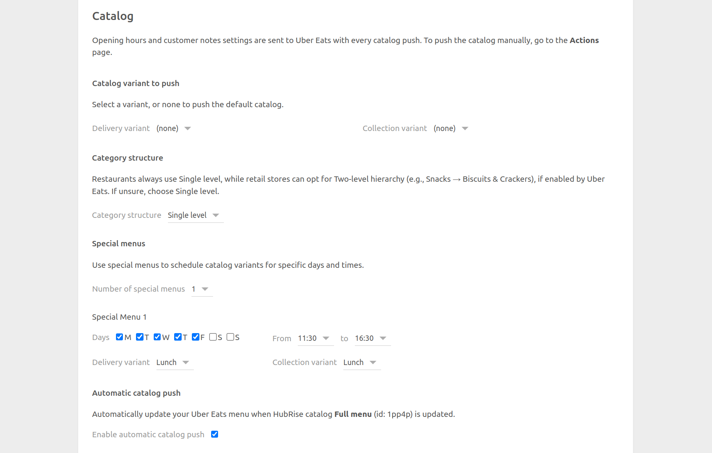
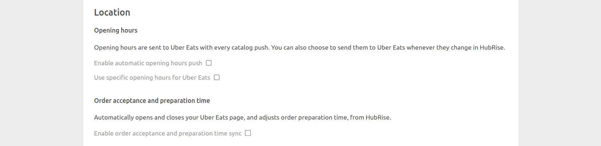
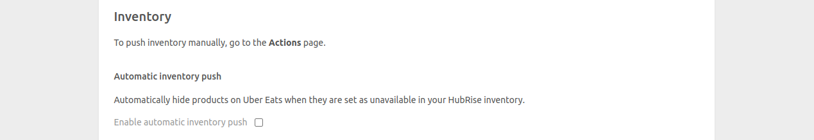

The Configuration page allows you to customise the behaviour of Uber Eats Bridge based on your preferences.

## Language

Choose the language to use for generic items such as `Delivery charge`. These names may appear in your EPOS and in customer receipts.

## Orders

### Order Statuses

Select from the dropdown menu the HubRise status which should make the order accepted in Uber Eats. Refer to your EPOS documentation on the HubRise website to verify your EPOS requirements.

### Service Types

Service types such as Uber Eats delivery, restaurant delivery, takeaway, or eat-in might require the corresponding ref code entry. Refer to your EPOS documentation on the HubRise website to verify your EPOS requirements.

Additionally, from this section, you can choose to categorise orders fulfilled by Uber Eats as either delivery or collection orders. Orders fulfilled by the restaurant fleet are always marked as delivery orders. This feature is useful to address specific business requirements or to differentiate these orders in financial reports.

### Special Items

By default, Uber Eats activates a checkbox in the checkout flow for costumers to **Request utensils, straws, etc.**, as shown in the screenshot below.

You can request Uber Eats to disable this functionality. If you prefer to keep it, create a "Disposable items" product in your EPOS, and use its ref code in the **Disposable items ref code** field.

### Discounts

**Discount ref code** is the ref code associated with Uber Eats discounts in your EPOS. Refer to your EPOS documentation on the HubRise website to know how to handle discounts in your EPOS.

### Charges

In this section, include the ref codes for the following charges:

- Delivery charges
- Small order fees
- Tips

The ref codes in this section are only applied to orders delivered by your restaurant fleet.

### Payments

Uber Eats customers can pay for their order either online or by cash for restaurant delivery orders.

This section of the configuration page allows you to specify the ref codes for these two payment methods. Refer to your EPOS documentation on the HubRise website to verify the correct codes to use.

## Customers

Enable the **Duplicate phone access code in delivery notes** option if your EPOS lacks native support for fetching phone access codes.

All EPOS systems integrated with HubRise can read delivery notes. If your EPOS has native support and this option is enabled, the code will appear duplicated. Refer to your EPOS documentation on the HubRise website to verify the correct value.

## Catalog {#catalog}

### Catalog Variant to Push

Catalog variants give you the flexibility to disable specific items or adjust prices for Uber Eats.

If your catalog includes variants, you have the option to select which ones to use. You can select different variants for the delivery and collection menus, or use the same variant for both. When **(none)** is selected, all items along with their standard prices are sent to Uber Eats.

### Automatic Catalog Push

Select the **Enable automatic catalog push** checkbox to synchronise your HubRise catalog with Uber Eats whenever it gets updated.

### Customer Notes

Customer notes for individual products can be activated by contacting Uber Eats support. This integration feature is supported, but it cannot be activated by HubRise.

If you enable customer notes, make sure that your connected EPOS supports product level customer notes.

## Location {#location}

Select **Enable automatic opening hours push** to synchronise your HubRise opening hours with Uber Eats. To enable this option, you must first set your opening hours in HubRise, and enable automatic catalog push.

If you use specific opening hours for Uber Eats, you can set them for Uber Eats only by selecting **Use specific opening hours for Uber Eats**, then entering your opening hours. This option will override the opening hours set in HubRise.

## Inventory

Through inventory synchronisation, products and options that have a stock quantity of zero can be hidden can be hidden on your Uber Eats store.

Select the **Enable automatic inventory push** checkbox to synchronise your HubRise inventory with Uber Eats whenever it gets updated.

## Save the Configuration

To save the configuration, click **Save** at the top of the page.

## Reset the Configuration

If you need to reset the configuration, click **Reset the configuration** at the bottom of the page.

---

**IMPORTANT NOTE:** Resetting the configuration will instantly disconnect the bridge from Uber Eats. You will need your Uber Eats Store UUID to reestablish the connection.

---

Resetting the configuration does not delete the operation logs displayed in the main page.
