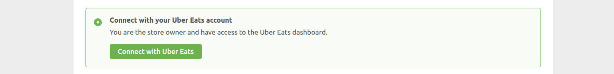
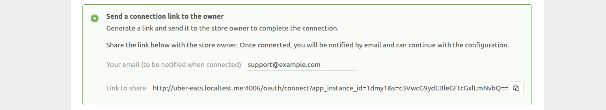
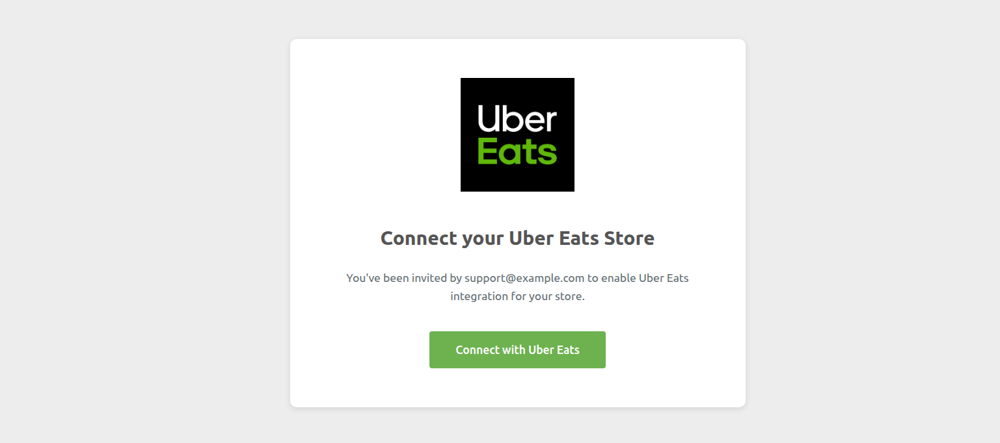
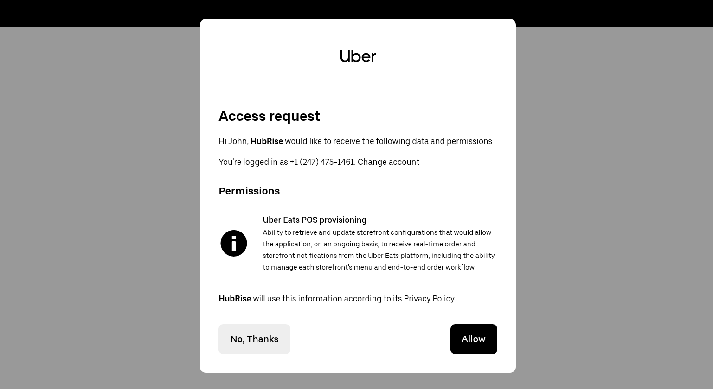
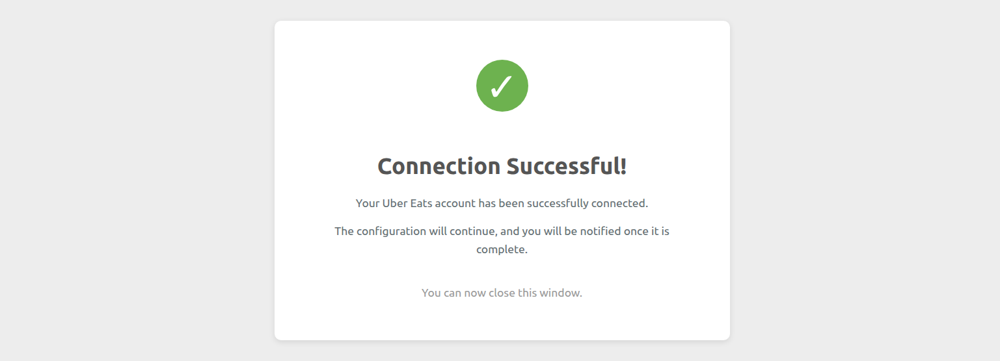
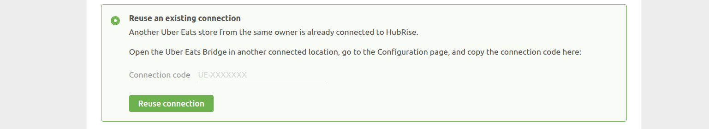
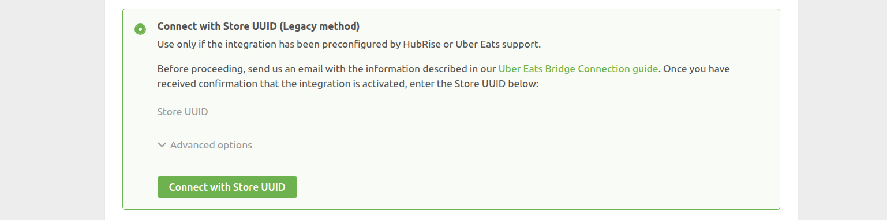

Connecting Uber Eats to HubRise can be done in a few steps. You can connect both types of Uber Eats storefronts:

- Your store hosted on the main Uber Eats platform, accessible at www.ubereats.com.
- Your own branded webstore on Uber Eats, identified by URLs beginning with www.order.store.

If you have a branded webstore, ensure you have read our [FAQ](/apps/uber-eats/faqs/connect-webstore) before proceeding.

---

**IMPORTANT NOTE:** If you do not have a HubRise account yet, register on our [Signup Page](https://manager.hubrise.com/signup). It only takes a minute!

---

## 1. Connect Uber Eats Bridge {#connect-uber-eats-bridge}

First set up the Uber Eats Bridge in HubRise by following these steps:

- Log in to your [HubRise account](https://manager.hubrise.com).
- Select the location you want to connect from the dropdown menu.
- Select **CONNECTIONS**, then **View available apps**.
- Select **Uber Eats Bridge** from the list of apps.
- Click **Connect**.
- Click **Allow** to grant Uber Eats Bridge access to your registered location on HubRise. If your account has multiple locations, expand the **Choose location** section to select the desired location, and then click **Allow**.

The bridge now shows the **Connect your Uber Eats store** page. Four connection methods are available, see below for details on each method.

Uber Eats applies default integration settings during onboarding, which you can change later. These settings are documented in the [Default integration settings](/apps/uber-eats/faqs/default-integration-settings) FAQ.

When any of the four flows completes, the bridge activates the integration and opens the **Configuration** page.

### 1.1 Connect With Your Uber Eats Account

Use this method if you are the store owner, are with them, or if you have access to Uber Eats Manager.

First, open the bridge as described above, then:

- Select **Connect with your Uber Eats account**.
- Click **Connect with Uber Eats** – you will be redirected to Uber Eats Manager.
- Sign in to Uber Eats if you are not already logged in.
- Approve the requested permissions.
- You will be redirected back to HubRise.
- Select the store to connect and click **Connect store**.

### 1.2 Send a Connection Link to the Owner

This method suits support teams: the owner simply clicks a link, signs in to their Uber Eats account, and they’re done. The HubRise brand remains mostly hidden during the process.

First open the bridge as described above, then:

- Select **Send a connection link to the owner** and enter your email address. You will be notified when the link is used.
- Click the icon to copy the link and send it to the owner.
- Wait for the email confirmation once the owner clicks the link.
- Complete the setup.

The owner will see these pages when they click the link:

### 1.3 Reuse an Existing Connection

Use this method when another store for the same legal owner has already been connected with one of the first two methods.

- Open the bridge for the already‑connected store.
- Open the **Configuration** page.
- Copy the connection code (format `UE-XXXXXXX`) in the footer.
- Close the page.

Then:

- Open the bridge for the new store.
- Choose **Reuse an existing connection**
- Paste the code.
- Click **Reuse connection**.

Note that the connection code appears only for stores connected via one of the first two methods and with authorisation under one year old. If you don't see the code, connect the new store using one of the other methods.

### 1.4. Connect With Store UUID (Legacy Method)

Use this method only if HubRise or Uber Eats support specifically instructs you to. Before you can proceed, email support@hubrise.com with:

- The UUID of your store. For example: `dc638853-bff1-411c-adba-8aa4d7abddd2`. For more information on how to find your UUID, see our [FAQ](/apps/uber-eats/faqs/find-uber-eats-uuid).
- The public URL of your store on Uber Eats. For example: https://www.ubereats.com/store/camile-thai-epsom/V6j2cjCWX9e0WXNyGTdYsg.
- Your HubRise location name and identifier. For example: `Fast Pizza London z6q31-0`.
- The order acceptance mode: **Manual accept** or **Offered state** mode. For more details, see our [FAQ](/apps/uber-eats/faqs/send-orders-to-epos-without-tablet).

After HubRise confirms that Uber Eats support has enabled the integration, open the bridge as described above, then:

- Choose **Connect with Store UUID (Legacy method)**.
- Enter the UUID.
- Click **Connect with Store UUID**.

## 2. Configure Your Preferences

After connecting the bridge, configure the parameters on the **Configuration** page for correct order transmission to your EPOS.

Some options (for example, status mappings and catalog variants) are visible in the bridge. Other parameters, such as _RD-Optional_, _Auto-Cancel_ and _Acceptance mode_, can only be changed through the HubRise support team. For the complete list, see [Default integration settings](/apps/uber-eats/faqs/default-integration-settings).

For more information about the configuration page and how to navigate to it, see [Configuration page](/apps/uber-eats/user-interface#configuration). For details on how to configure the parameters of the Uber Eats Bridge, see [Configuration](/apps/uber-eats/configuration).

## 3. Map Products Ref Codes

Most apps require a ref code for each product to process orders correctly. To learn how to map ref codes on Uber Eats, see [Map Ref Codes](/apps/uber-eats/map-ref-codes).

## 4. Receive Test Orders

You should place a few orders on your Uber Eats store, make sure they are correctly received by your EPOS, and then cancel them to get a refund. This will ensure that your restaurant is ready to go live.

If you want, you will also be able to get rid of your Uber Eats tablet by switching to a direct integration.
For more details, see [Can Orders Be Sent Directly To My EPOS Without Using Uber Eats Tablets](/apps/uber-eats/faqs/send-orders-to-epos-without-tablet).

If you encounter problems during the tests, contact us at support@hubrise.com.
