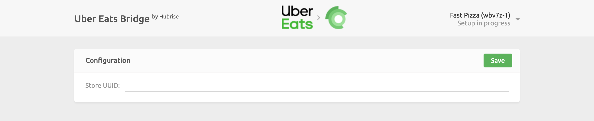

Connecting Uber Eats to HubRise can be done with a few steps. You can connect both kinds of Uber Eats storefronts:

- Your store hosted on the main Uber Eats platform, accessible at www.ubereats.com.
- Your own branded webstore on Uber Eats, identified by URLs that begin with www.order.store.

If you have a branded webstore, make sure you have read our [FAQ](/apps/uber-eats/faqs/connect-webstore) before proceeding.

---

**IMPORTANT NOTE:** If you do not have a HubRise account yet, register on our [Signup Page](https://manager.hubrise.com/signup). It only takes a minute!

---

## 1. Connect Uber Eats Bridge

First set up the Uber Eats Bridge in HubRise by following these steps:

- Log in to your [HubRise account](https://manager.hubrise.com).
- Select the location you want to connect from the dropdown menu.
- Select **CONNECTIONS**, then **View available apps**.
- Select **Uber Eats** from the list of apps.
- Click **Connect**.
- Click **Allow** to grant Uber Eats Bridge access to your registered location on HubRise. If your account has multiple locations, expand the **Choose location** section to select the desired location, and then click **Allow**.

The bridge now shows the **Connect your Uber Eats store** page. Four connection methods are available.

### 1.1 Connect with your Uber Eats account

Use this method when you are physically with the store owner, you are the owner yourself, or you can log in to the store in Uber Eats Manager.

First open the bridge as described above, then:

- Click **Connect with Uber Eats** and sign in to Uber Eats Manager.
- Approve the requested permissions.
- If several stores are listed, pick the correct one and click **Connect store**.

![Connect with your account] TO BE DONE

### 1.2 Send a connection link to the owner

This path is ideal for support teams. It spares the owner from any technical steps: they simply click a link, sign in, and are done. The HubRise brand is not shown during their experience.

First open the bridge as described above, then:

- Select **Send a connection link to the owner** and enter your email address. You will be notified when the link is used.
- Click the icon to copy the link and send it to the owner.
- Wait for the email confirmation when the owner clicks the link.
- Complete the setup.

Here is what the owner sees when they click the link:

![Owner – Connect] TO BE DONE
![Owner – Success] TO BE DONE

### 1.4. Connect with Store UUID (legacy method)

Use this only if HubRise or Uber Eats support specifically instructs you to. Before you can proceed, email support@hubrise.com with:

- The UUID of your restaurant. For example: `dc638853-bff1-411c-adba-8aa4d7abddd2`. For more information on how to find your UUID, see our [FAQ](/apps/uber-eats/faqs/find-uber-eats-uuid).
- The public URL of your restaurant on Uber Eats. For example: https://www.ubereats.com/store/camile-thai-epsom/V6j2cjCWX9e0WXNyGTdYsg.
- Your HubRise location name and identifier. For example: `Fast Pizza London z6q31-0`.
- The order acceptance mode: `Manual accept` or `Offered state` mode. For more details, see our [FAQ](/apps/uber-eats/faqs/send-orders-to-epos-without-tablet).

After HubRise confirms that Uber Eats support has enabled the integration, open the bridge as described above, then:

- Choose **Connect with Store UUID (Legacy method)**.
- Enter the UUID.
- Click **Connect with Store UUID**.

When any of the four flows completes, the bridge activates the integration and opens the _Configuration_ page.

## 2. Configure Your Preferences

After connecting the bridge, you need to configure a few parameters on the **Configuration** page to send orders correctly to your EPOS.

For more information about the configuration page and how to navigate to it, see [Configuration page](/apps/uber-eats/user-interface#configuration). For details on how to configure the parameters of the Uber Eats Bridge, see [Configuration](/apps/uber-eats/configuration).

## 3. Map Products Ref Codes

Most apps require a ref code for each product to process orders correctly. To learn how to map ref codes on Uber Eats, see [Map Ref Codes](/apps/uber-eats/map-ref-codes).

## 4. Receive Test Orders

Before you start receiving orders from real customers, we recommend that you test the whole integration workflow.

You should place a few orders on your Uber Eats restaurant, make sure they are correctly received by your EPOS, and then cancel them to get a refund. This will ensure that your restaurant is ready to go live.

If you want, you will also be able to get rid of your Uber Eats tablet by switching to a direct integration.
For more details, see [Can Orders Be Sent Directly To My EPOS Without Using Uber Eats Tablets](/apps/uber-eats/faqs/send-orders-to-epos-without-tablet).

If you encounter problems during the tests, contact us at support@hubrise.com.
