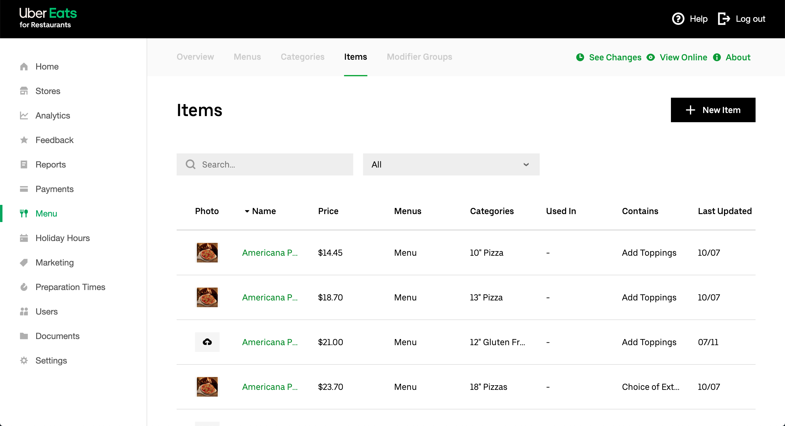
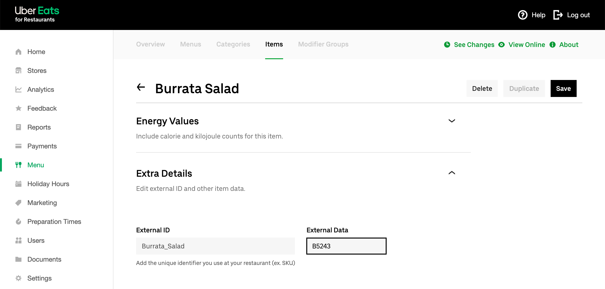

Most EPOS solutions require a ref code for each product to properly interpret orders. Therefore, when you create your menu on Uber Eats, you need to make sure that each product is assigned to the correct ref code.

To assign ref codes to your Uber Eats products, follow these steps:

1. Log in to your [Uber Eats back office](https://restaurant.uber.com/).
1. If you have a single Uber Eats store, select **Menu** from the menu on the left. If you have multiple Uber Eats stores, select the correct one from the dropdown menu, then select **Menu**.
1. Select **Items** from the top menu.
   
1. Click on the product or option you wish to modify from the list of items, then scroll down the page.
1. Click the **Extra Details** section to expand.
   
1. Enter the ref code in the **External Data** field.
1. Click **Save** to go back to the items list.

You will need to repeat this manual procedure for all your available items.

Note that items in the **Modifier Groups** tab also have the **External Data** field, but you generally do not need to enter any value as this is not sent to the EPOS.

## SKUs

SKUs in HubRise are variations of a same product, such as the sizes of a pizza.

While Uber Eats menus do not natively support variations, you can use modifiers to create a product with variations. For a step-by-step guide on how to do this, see [How To Create a Product With Variations in Uber Eats?](/apps/uber-eats/faqs/create-product-with-skus).

## Deals

Uber Eats menus do not natively support deals, such as a pizza + drink combination at a discounted price.

However, you can use modifiers with a special structure to create a product that works as a deal. For a step-by-step guide on how to do this, see [How To Create a Deal in Uber Eats?](/apps/uber-eats/faqs/create-deal-in-uber-eats).

## Customer Notes

Customer notes are comments that customers can add to individual products when placing an order. They are generally used for cooking instructions.

---

**IMPORTANT NOTE:** Customer notes are automatically disabled on your Uber Eats store when you connect to HubRise.

---

HubRise supports customer notes, but not all EPOS systems and integrations do. To avoid poor customer experience resulting from customer notes not being sent to the EPOS, these are automatically disabled when you first connect your Uber Eats store to HubRise.

If you rely on these comments for cooking or serving instructions (for example, "Medium rare cooking", or "Cut in slices"), you should add the corresponding items in your EPOS and include them as options in the Uber Eats menu, so that they are correctly encoded.

However, if your EPOS integration supports customer notes, or if you have an alternative way to read them, for example from your Uber Eats tablet, you can always request Uber Eats support to re-enable customer notes on your store.
