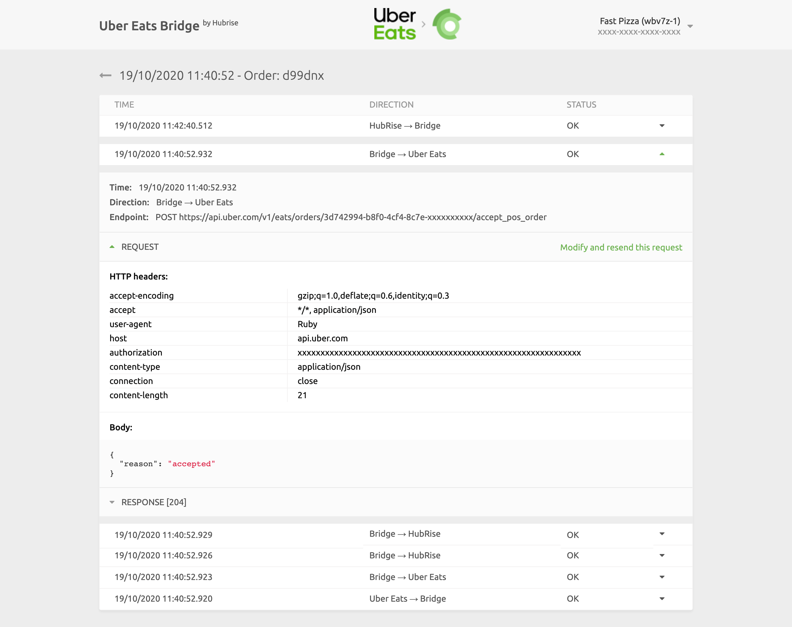
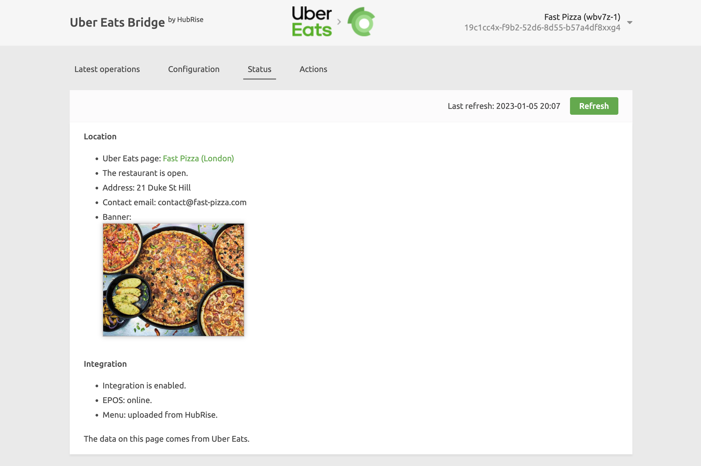

From Uber Eats Bridge, you can read the logs of all the operations between HubRise and Uber Eats, and access the configuration settings of the integration.

## Latest Operations

This is the default page when you open Uber Eats bridge. It displays the latest API operations between HubRise, Uber Eats, and Uber Eats Bridge.

Operations can either be related to a specific order, or be generic system requests performed by Uber Eats Bridge.

Each row in the page shows the following information about an operation:

- **TIME**: The date and time of the order.
- **ORDER**: The HubRise order ID, for order operations.
- **DESCRIPTION**: An optional description for operations that are not related to a specific order. It could be empty, or inform of a `System request` or a `Catalog push`.
- **STATUS**: The status of the order. The value `OK` indicates that the order has been successfully sent, otherwise an error code will be displayed in red.

The "System request" label indicates that the operation is not related to a specific order.

Clicking on a row will open a new page displaying the logs associated with the operation.

### Order Operation

Selecting an order operation from the list in the main page will display all the logs of the API requests exchanged between HubRise and Uber Eats via Uber Eats Bridge.

Requests are ordered with the latest on top, and those related to the same order event (order received, order cancelled, etc.) are visually grouped together.

Each row in the logs displays the following information:

- **Time**: The date and time the request was sent.
- **Direction**: The apps sending and receiving the request, in the format Origin → Destination.
- **Endpoint**: The status of the request. The value `OK` indicates that the request has been successfully received, otherwise a message will explain the type of error occurred.

Clicking on a request will expand it to reveal the detailed logs of the request and its response.

Logs are a powerful debugging tool in case of issues. To understand in detail how to read logs, see [Understanding HubRise Logs](/docs/hubrise-logs/).

### System Request Operation

The layout of a system request page is identical to that of an order page.

System requests are generally sent by Uber Eats Bridge to notify HubRise about a change in the configuration or to fetch the most up-to-date information. As an example, the following image displays a request to update the Uber Eats Bridge callback after a configuration change.

System request pages can provide useful debugging insights to support teams, but are rarely of interest to other users.

## Configuration

To access the Uber Eats Bridge configuration page, click **Configuration** at the top of the screen.

From this page, you will be able to customise the behaviour of Uber Eats Bridge. For more details, see [Configuration](/apps/uber-eats/configuration).

## Status

The information available on the **Status** page is pulled from the Uber Eats API. It shows the configuration of the integration on Uber Eats' side. 

To view the current status, you need to refresh the page by clicking **Refresh**, in the top right corner. The **Latest refresh** date will update when the information is retrieved. 

The **Location** section clearly identifies the Uber Eats store connected to the Uber Eats Bridge, with its URL link, its postal address and contact eMail. It shows if the restaurant is `open` as well as the banner used to illustrate it.

The **Integration** section shows if the HubRise integration is `enabled` and if HubRise, considered by Uber Eats as an EPOS, is `online`. It also confirms if an Uber Eats menu has been `uploaded from HubRise`. 

## Actions

To access the actions page, click **Actions** at the top of the screen. If the link is not visible, first complete the configuration of Uber Eats Bridge.

From the actions page, you can perform the following actions:

- **Push Catalog**: Push the catalog to Uber Eats. For more details, see [Push Catalog](/apps/uber-eats/push-catalog).
- **Pull Catalog**: Pull the catalog from Uber Eats. For more details, see [Pull Catalog](/apps/uber-eats/pull-catalog).
- **Push Inventory**: Sync the inventory from HubRise to Uber Eats.

## Language and Navigation

In the top right corner of the screen, you can click on the arrow <InlineImage width="20" height="20"></InlineImage> to expand the menu. From there, you can change the language of the page to English or French.

Clicking on the Uber Eats and HubRise logos on top of any page of Uber Eats Bridge will bring you back to the **Latest Operations** page.
