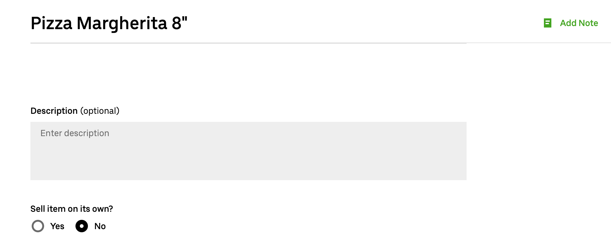
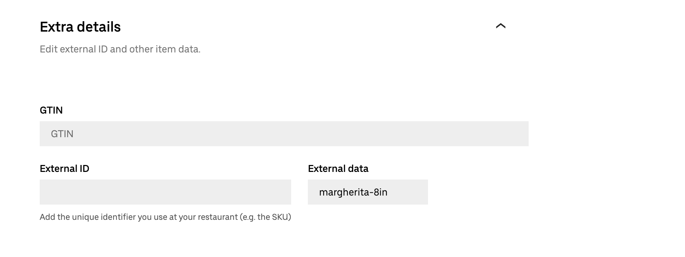
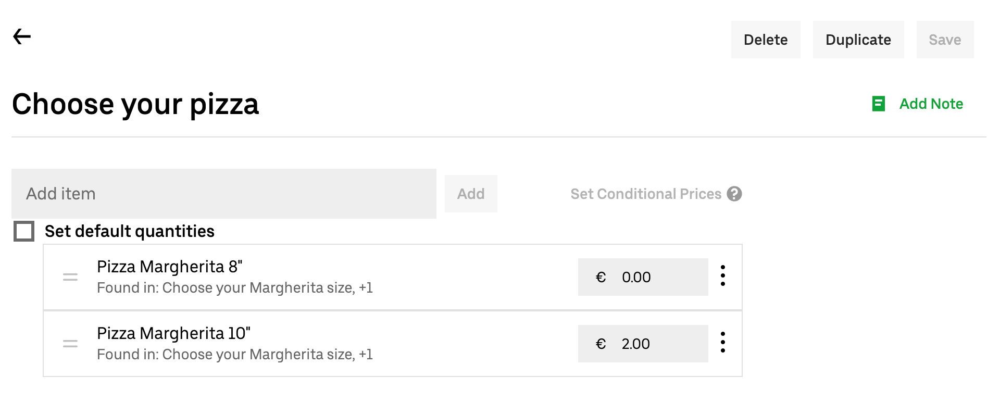
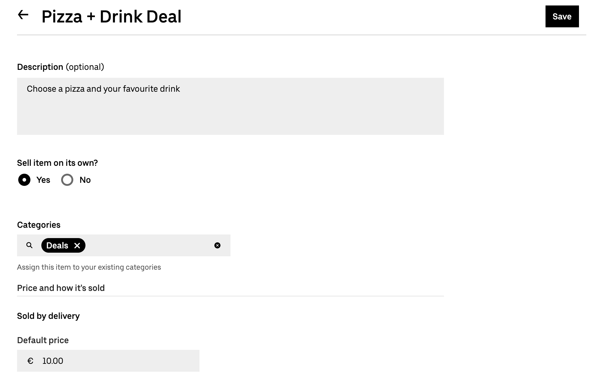
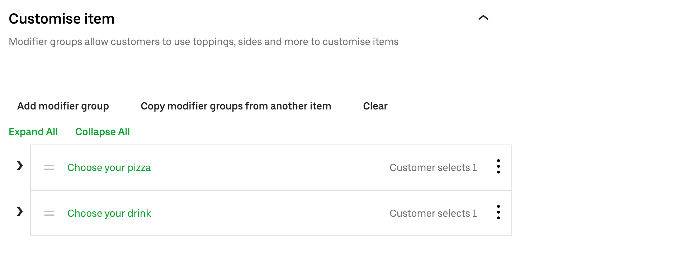
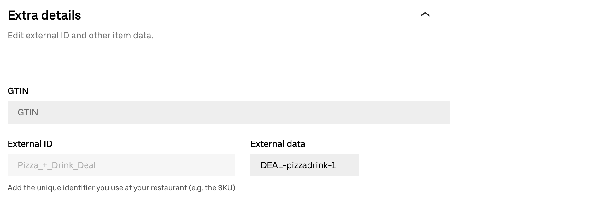

Uber Eats menus do not natively support deals, such as a pizza + drink combination at a discounted price.
However, Uber Eats items with a specific structure are interpreted as deals by Uber Eats Bridge.
This page describes the conventional structure you need to use to create deals.

If your EPOS supports deals, and you want to receive them in your Uber Eats orders, you have the following two options:

- If you [push your HubRise catalog](/apps/uber-eats/pulling-menu) into Uber Eats with Uber Eats Bridge, deals are automatically created with the correct format on Uber Eats.
- If you manually create your menu with [Menu Maker](https://merchants.ubereats.com/us/en/technology/simplify-operations/menu-management/), the catalog management tool in Uber Eats back office, create your deals following the steps on this page.

## Deal Structure

In Menu Maker, there are two main building blocks: items and modifier groups.

To create a deal, you need to create the following structure using items and modifier groups:

- Deal (Item)
  - Deal line 1 (Modifier group)
    - Product 1 (Item)
    - Product 2 (Item)
    - Product 3 (Item)
  - Deal line 2 (Modifier group)
    - Product 1 (Item)
    - Product 2 (Item)
    - Product 3 (Item)

For example, if you have a deal with pizzas and drinks, use the following structure:

- Pizza + Drink Deal (Item)
  - Choose your pizza (Modifier group)
    - Pizza Margherita (Item)
    - Pizza Napoli (Item)
    - Pizza Diavola (Item)
  - Choose your drink (Modifier group)
    - Coca-Cola (Item)
    - Pepsi (Item)
    - Beer (Item)

To ensure that Uber Eats Bridge sends the correct information to HubRise when customers order a deal, follow this convention:

- The ref code of the item that represents the deal, in this case `Pizza + Drink Deal`, must start with `DEAL-`, followed by the ref code of the deal in your EPOS.
- Items in the deal lines must have the same ref code they have in your EPOS.

## Step-By-Step Guide to Create a Deal

The following sections explains the steps required to create deals.

### 1. Create the Products

To create the individual products that are part of every deal line follow these steps:

1. Log in to your [Uber Eats back office](https://restaurant.uber.com/).
1. Select **Menu** > **Items**, then click **New item**.
1. Fill in the details for your product.
   - Enter the name of the product, for example `Pizza Margherita 8"`.
   - Under **Sell item on its own**, select **No**.
     
   - Under **Default price**, if choosing this product requires a surcharge, enter the surcharge amount. Otherwise, enter `0`.
   - Expand **Extra details**, then under **External data**, enter the ref code of the product.
     
   - Optional: Fill in the other relevant fields in the page.
1. To confirm the product, click **Save**.
1. Repeat the process for all the other products that are part of the deal lines. Click **Duplicate** to use the current product as a starting point for the next ones.

### 2. Create the Modifier Groups

After creating all the products, to group them together within a modifier group follow these steps:

1. Select **Menu** > **Modifier groups**, then click **New group**.
1. Fill in the details of your modifier group.
   - Enter the name of the modifier group, for example `Choose your pizza`.
   - In the **Add item** field, select all the products that are part of the product, then click **Add**.
     
   - Drag the products in the order you want them to appear on the list.
   - In the **Rules** section, enter the following values:
     - **Minimum number of options a customer must select**: `1`
     - **Maximum number of options a customer can select**: `1`
     - **How many times can customers select any single option**: `1`
       
1. To confirm the modifiers group, click **Save**.
1. Repeat the process for all the deal lines that are part of the deal. Click **Duplicate** to use the current modifier group as a starting point for the next ones.

### 3. Create the Deal

Finally, to create the product that represents the deal and attach the modifier groups to it follow these steps:

1. Select **Menu** > **Items**, then click **New item**.
1. Fill in the details for the deal.
   - Enter the name of the product, for example `Pizza + Drink Deal`.
   - Under **Sell item on its own**, select **Yes**.
   - Under **Categories**, select the category that contains the deal.
   - Under **Default price**, enter the total price of the deal.
     
   - Expand **Customise item**, then click **Add modifier group**. From the modifier groups list, select the modifier group that contains the products. Add all the deal lines that are part of the deal, then click **Add**.
     
   - Expand **Extra details**, then under **External data**, enter `DEAL-`, followed by the ref code of the deal.
     
   - Optional: Fill in the other relevant fields in the page.
1. To confirm the deal, click **Save**.
