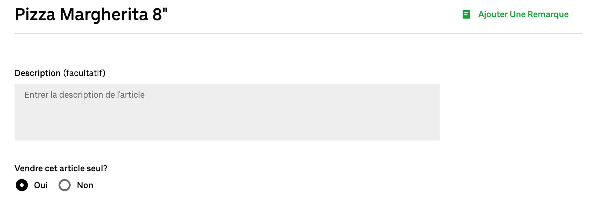
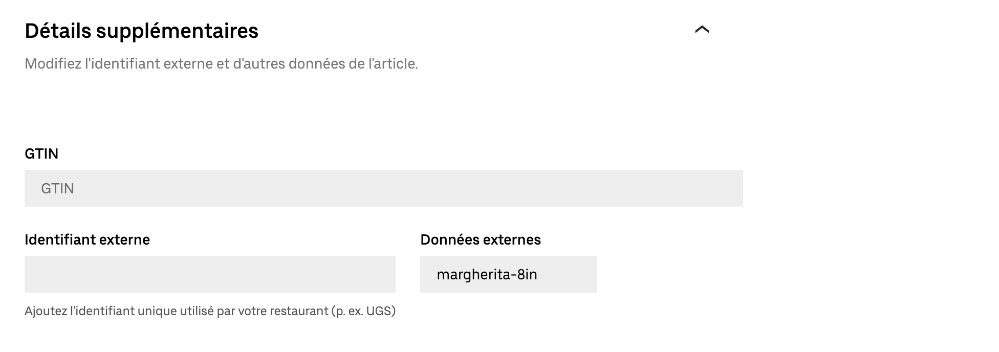
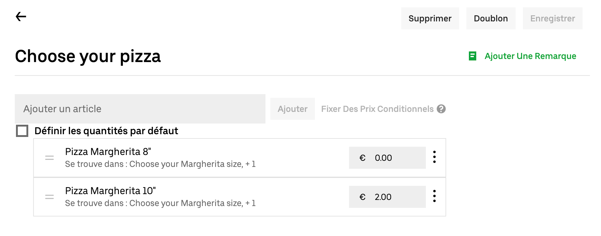
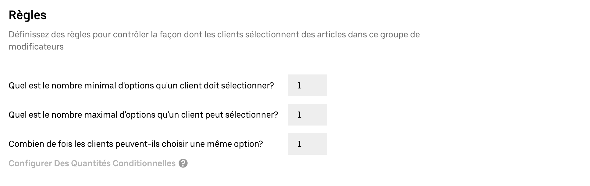
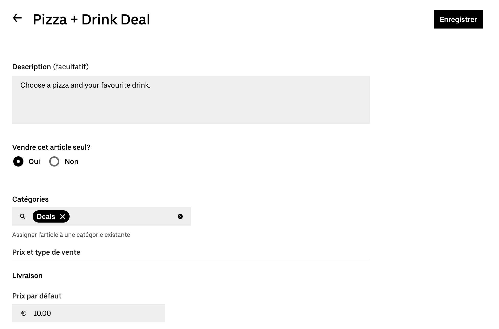
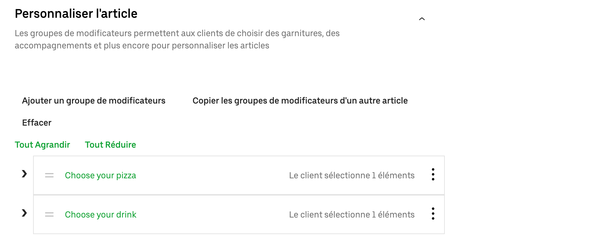
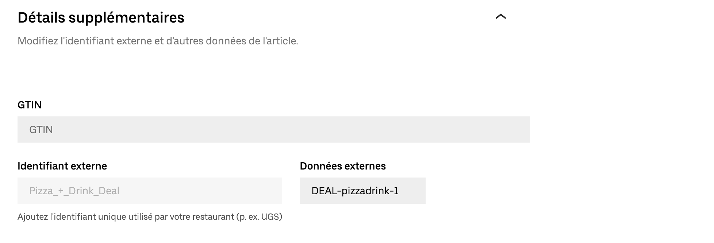

Les menus Uber Eats ne prennent pas nativement en charge les promotions, par exemple une combinaison pizza + boisson à un tarif promotionnel.
Cependant, les articles Uber Eats avec une structure spécifique sont interprétés comme des promotions par Uber Eats Bridge.
Cette page décrit la structure que vous devez utiliser pour créer des promotions.

Si votre logiciel de caisse prend en charge les promotions et que vous voulez les recevoir dans vos commandes Uber Eats, il y a deux cas de figure :

- Si vous [envoyez votre catalogue HubRise](/apps/uber-eats/push-catalog) dans Uber Eats avec Uber Eats Bridge, les promotions sont automatiquement créées au bon format dans Uber Eats.
- Si vous créez manuellement votre menu avec [Menu Maker](https://merchants.ubereats.com/us/fr/technology/simplify-operations/menu-management), l'outil de gestion des catalogues dans le back-office Uber Eats, créez vos promotions en suivant les étapes sur cette page.

## Structure de la promotion

Dans Menu Maker, il y a deux blocs principaux : les articles et les groupes de modificateurs.

Pour créer une promotion, vous devez créer la structure suivante en utilisant des articles et des groupes de modificateurs :

- Promotion (Article)
  - Ligne 1 de la promotion (Groupe de modificateurs)
    - Produit 1 (Article)
    - Produit 2 (Article)
    - Produit 3 (Article)
  - Ligne 2 de la promotion (Groupe de modificateurs)
    - Produit 1 (Article)
    - Produit 2 (Article)
    - Produit 3 (Article)

Par exemple, pour une promotion avec des pizzas et des boissons, utilisez la structure suivante :

- Promotion pizza + boisson (Article)
  - Choisissez votre pizza (Groupe de modificateurs)
    - Pizza Margherita (Article)
    - Pizza Napoli (Article)
    - Pizza Diavola (Article)
  - Choisissez votre boisson (Groupe de modificateurs)
    - Coca-Cola (Article)
    - Pepsi (Article)
    - Bière (Article)

Pour vous assurer qu'Uber Eats Bridge envoie les informations correctes à HubRise lorsque les clients commandent une promotion, suivez ces règles :

- Le code ref de l'article qui représente la promotion, dans ce cas `Promotion pizza + boisson`, doit commencer par `DEAL-`, suivi du code ref de la promotion dans votre logiciel de caisse.
- Les articles dans les lignes de la promotion doivent avoir le même code ref que dans votre logiciel de caisse.

## Procédure détaillée de création d'une promotion

Les sections suivantes présentent les étapes nécessaires pour créer une promotion.

### 1. Créez les produits

Pour créer les produits individuels inclus dans les lignes de la promotion, suivez ces étapes :

1. Connectez-vous à votre [back-office Uber Eats](https://restaurant.uber.com).
2. Sélectionnez **Menu** > **Articles**, puis cliquez sur **Nouvel article**.
3. Saisissez les informations sur le produit.
   - Saisissez le nom du produit, par exemple `Pizza Margherita 8"`.
   - Sous **Vendre cet article seul ?**, sélectionnez **Non**.
     
   - Sous **Prix par défaut**, si le choix de ce produit nécessite un supplément, entrez le montant du supplément. Sinon, saisissez `0`.
   - Developpez **Détails supplémentaires**, puis sous **Données externes** saisissez le code ref du produit.
     
   - Facultatif : Renseignez les autres champs pertinents de la page.
4. Pour confirmer la création du produit, cliquez sur **Enregistrer**.
5. Répétez le processus pour tous les autres produits inclus dans les lignes de la promotion. Cliquez sur **Doublon** pour utiliser le produit actuel comme point de départ pour les suivants.

### 2) Créez les groupes de modificateurs

Après avoir créé tous les produits, suivez ces étapes pour les regrouper au sein d'un groupe de modificateurs :

1. Sélectionnez **Menu** > **Groupes de modificateurs**, puis cliquez sur **Nouveau groupe**.
2. Saisissez les informations sur le groupe de modificateurs.
   - Saisissez le nom du groupe de modificateurs, par exemple `Choisissez votre pizza`.
   - Dans le champ **Ajouter un article**, sélectionnez tous les produits qui font partie de la promotion, puis cliquez sur **Ajouter**.
     
   - Faites glisser les produits dans l'ordre souhaité d'apparition dans la liste.
   - Dans la section **Règles**, saisissez les valeurs suivantes :
     - **Quel est le nombre minimal d'options qu'un client doit sélectionner ?** : `1`
     - **Quel est le nombre maximal d'options qu'un client peut sélectionner ?** : `1`
     - **Combien de fois les clients peuvent-ils choisir une même option ?** : `1`
       
3. Pour confirmer la création du groupe de modificateurs, cliquez sur **Enregistrer**.
4. Répétez le processus pour toutes les lignes de la promotion. Cliquez sur **Doublon** pour utiliser le groupe de modificateurs actuel comme point de départ pour les suivants.

### 3) Créez la promotion

Enfin, pour créer le produit qui représentera la promotion et y associer les groupes de modificateurs, suivez ces étapes :

1. Sélectionnez **Menu** > **Articles**, puis cliquez sur **Nouvel article**.
2. Saisissez les informations sur la promotion.
   - Saisissez le nom du produit, par exemple `Promotion pizza + boisson`.
   - Sous **Vendre cet article seul ?**, sélectionnez **Oui**.
   - Sous **Catégories**, sélectionnez la catégorie qui englobe la promotion.
   - Sous **Prix par défaut**, saisissez le prix total de la promotion.
     
   - Développez **Personnaliser l'article**, puis cliquez sur **Ajouter un groupe de modificateurs**. Dans la liste des groupes de modificateurs, sélectionnez celui qui contient les produits. Ajoutez toutes les lignes qui font partie de la promotion, puis cliquez sur **Ajouter**.
     
   - Developpez **Détails supplémentaires**, puis sous **Données externes** saisissez `DEAL-` suivi du code ref du produit.
     
   - Facultatif : Renseignez les autres champs pertinents de la page.
3. Pour confirmer la création de la promotion, cliquez sur **Enregistrer**.
