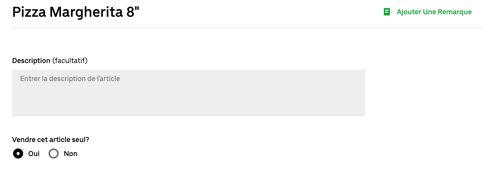
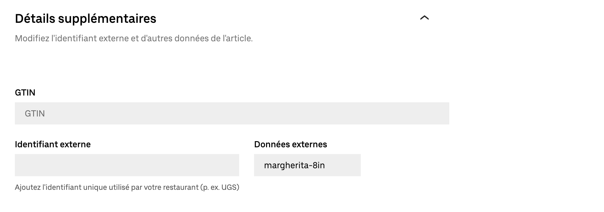
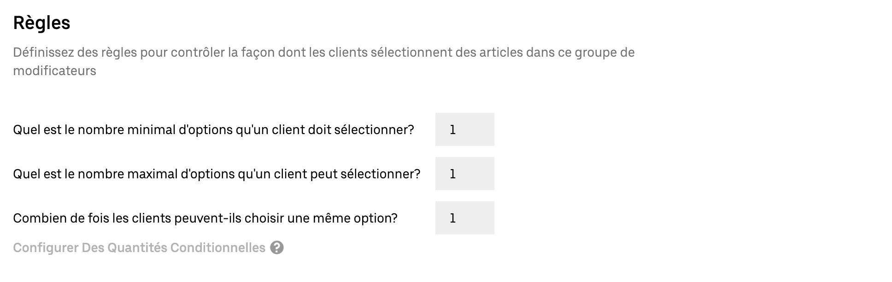

Les menus Uber Eats ne supportent pas nativement les produits avec plusieurs variantes, comme une pizza disponible en plusieurs tailles.
Cependant, les articles Uber Eats avec une structure spécifique sont interprétés comme des produits avec variantes par Uber Eats Bridge.
Cette page décrit la structure que vous devez utiliser pour créer des produits avec variantes.

Dans HubRise, une variante de produit est appelée [SKU](/docs/data#view-catalog) et peut représenter par exemple chacune des tailles du produit parent.
Si votre logiciel de caisse prend en charge les produits avec des SKU et que vous voulez les recevoir dans vos commandes Uber Eats, il y a deux cas de figure :

- Si vous [envoyez votre catalogue HubRise](/apps/uber-eats/push-catalog) dans Uber Eats avec Uber Eats Bridge, les produits avec SKU sont automatiquement créés au bon format dans Uber Eats.
- Si vous créez manuellement votre menu avec [Menu Maker](https://merchants.ubereats.com/us/fr/technology/simplify-operations/menu-management), l'outil de gestion des catalogues dans le back-office Uber Eats, créez vos produits en suivant les étapes sur cette page.

## Structure du produit

Dans Menu Maker, il y a deux blocs principaux : les articles et les groupes de modificateurs.

Pour créer un produit avec plusieurs SKU, vous devez créer la structure suivante en utilisant des articles et des groupes de modificateurs :

- Produit parent (Article)
  - Choix de la SKU (Groupe de modificateurs)
    - SKU 1 (Article)
    - SKU 2 (Article)
    - SKU 3 (Article)

Par exemple, pour une variante de taille de pizza, utilisez la structure suivante :

- Pizza Margherita (Article)
  - Choisissez votre taille de Margherita (Groupe de modificateurs)
    - Pizza Margherita 8" (Article)
    - Pizza Margherita 10" (Article)
    - Pizza Margherita 12" (Article)

Pour vous assurer qu'Uber Eats Bridge envoie les informations correctes à HubRise lorsque les clients commandent un produit avec SKU, suivez ces règles :

- Le code ref du produit parent, dans ce cas `Pizza Margherita`, doit être `MULTISKU`.
- Les SKU doivent avoir le même code ref que dans votre logiciel de caisse.

## Procédure détaillée de création d'un produit avec des SKU

Les sections suivantes présentent les étapes nécessaires pour créer un produit avec plusieurs SKU dans Uber Eats Menu Maker.

### 1. Créez les SKU

Pour créer les SKU individuelles incluses dans le produit, suivez ces étapes :

1. Connectez-vous à votre [back-office Uber Eats](https://restaurant.uber.com).
2. Sélectionnez **Menu** > **Articles**, puis cliquez sur **Nouvel article**.
3. Saisissez les informations sur la SKU.
   - Saisissez le nom de la SKU, par exemple `Pizza Margherita 8"`.
   - Sous **Vendre cet article seul ?**, sélectionnez **Non**.
     
   - Sous **Prix par défaut**, saisissez la différence avec le prix du produit principal, ou `0`.
   - Developpez **Détails supplémentaires**, puis sous **Données externes** saisissez le code ref de la SKU.
     
   - Facultatif : Renseignez les autres champs pertinents de la page.
4. Pour confirmer la création de la SKU, cliquez sur **Enregistrer**.
5. Répétez le processus pour toutes les autres SKU incluses dans les lignes de la promotion. Cliquez sur **Doublon** pour utiliser la SKU actuelle comme point de départ pour les suivantes.

### 2) Créez le groupe de modificateurs

Après avoir créé toutes les SKU, suivez ces étapes pour les regrouper au sein d'un groupe de modificateurs :

1. Sélectionnez **Menu** > **Groupes de modificateurs**, puis cliquez sur **Nouveau groupe**.
2. Saisissez les informations sur le groupe de modificateurs.
   - Saisissez le nom du groupe de modificateurs, par exemple `Choisissez votre taille de pizza`.
   - Dans le champ **Ajouter un article**, sélectionnez toutes les SKU qui font partie du produit, puis cliquez sur **Ajouter**.
     
   - Faites glisser les SKU dans l'ordre souhaité d'apparition dans la liste.
   - Dans la section **Règles**, saisissez les valeurs suivantes :
     - **Quel est le nombre minimal d'options qu'un client doit sélectionner ?** : `1`
     - **Quel est le nombre maximal d'options qu'un client peut sélectionner ?** : `1`
     - **Combien de fois les clients peuvent-ils choisir une même option ?** : `1`
       
3. Pour confirmer la création du groupe de modificateurs, cliquez sur **Enregistrer**.

### 3) Créez le produit principal

Enfin, pour créer le produit et y associer le groupe de modificateurs,
suivez ces étapes :

1. Sélectionnez **Menu** > **Articles**, puis cliquez sur **Nouvel article**.
2. Saisissez les informations sur le produit principal.
   - Saisissez le nom du produit, par exemple `Pizza Margherita`.
   - Sous **Vendre cet article seul ?**, sélectionnez **Oui**.
   - Sous **Catégories**, sélectionnez la catégorie qui englobe le produit.
   - Sous **Prix par défaut**, saisissez le prix de la SKU la moins chère.
     
   - Développez **Personnaliser l'article**, puis cliquez sur **Ajouter un groupe de modificateurs**. Dans la liste des groupes de modificateurs, sélectionnez celui qui contient les SKU, puis cliquez sur **Ajouter**.
     
   - Developpez **Détails supplémentaires**, puis sous **Données externes** saisissez `MULTISKU`.
     
   - Facultatif : Renseignez les autres champs pertinents de la page.
3. Pour confirmer la création du produit, cliquez sur **Enregistrer**.
