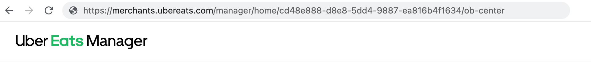

L'UUID Uber Eats est l'identifiant unique de votre restaurant Uber Eats. On l'appelle aussi ID Uber Eats.

Pour trouver votre UUID Uber Eats, suivez ces étapes dans votre navigateur :

1. Connectez-vous à votre [back-office Uber Eats](https://merchants.ubereats.com).
2. Dans le menu déroulant, sélectionnez le bon point de vente.
3. Examinez l'URL de la page. Votre UUID Uber Eats sera le numéro après `/home/`. Par exemple, si l'URL est `https://merchants.ubereats.com/manager/home/cd48e888-d8e8-5dd4-9887-ea816b4f1634`, l'UUID Uber Eats est `cd48e888-d8e8-5dd4-9887-ea816b4f1634`.

Si vous ne trouvez pas votre UUID Uber Eats, contactez votre gestionnaire de compte Uber Eats.
