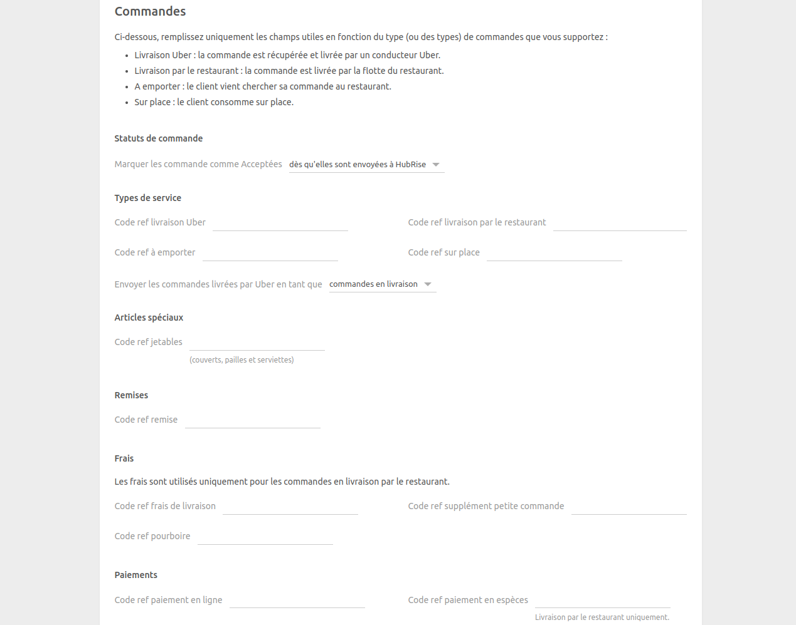
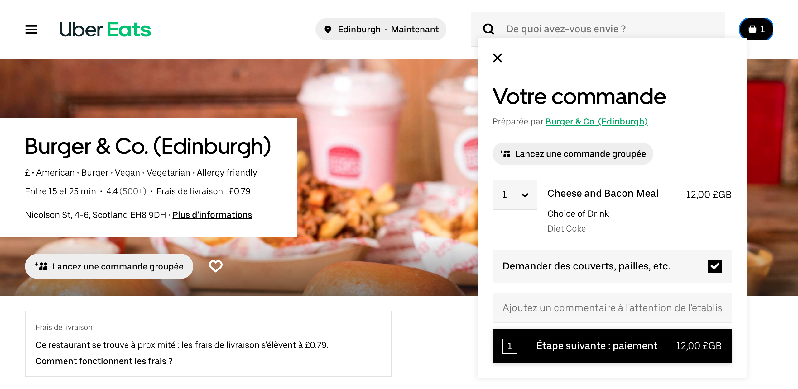
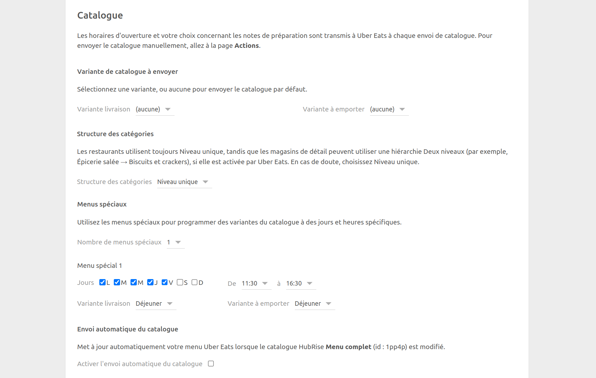
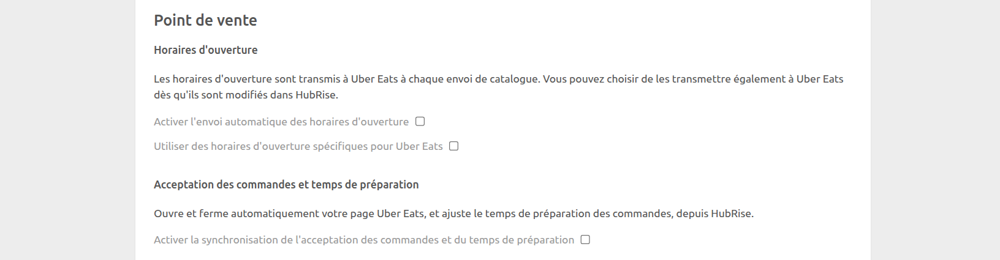
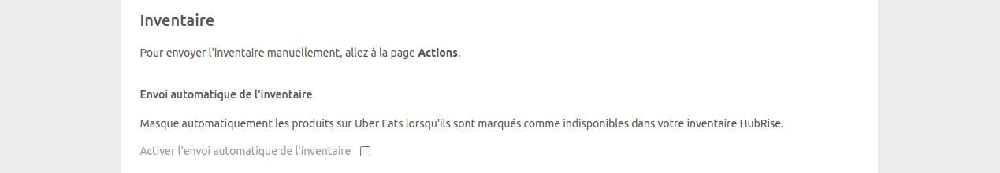

La page Configuration permet de personnaliser le comportement d'Uber Eats Bridge.

## Langue

Choisissez la langue à utiliser pour les éléments génériques tels que `Delivery charge` (Frais de livraison). Ces noms peuvent apparaître dans votre logiciel de caisse et sur les reçus des clients.

## Commandes

### Statuts de commande

Dans le menu déroulant, sélectionnez le statut HubRise qui doit permettre à la commande d'être acceptée dans Uber Eats. Pour connaître les exigences de votre logiciel de caisse, reportez-vous à sa documentation sur le site internet de HubRise.

### Types de service

Les types de service tels que la livraison par Uber Eats, la livraison par le restaurant, la vente à emporter ou la consommation sur place peuvent nécessiter la saisie du code ref correspondant. Pour connaître les exigences de votre logiciel de caisse, reportez-vous à sa documentation sur le site internet de HubRise.

Dans cette section, vous pouvez également choisir de marquer les commandes livrées par Uber Eats comme étant en livraison ou à emporter. Les commandes livrées par le restaurant sont toujours marquées comme des commandes en livraison. Cette fonctionnalité permet de répondre à des besoins spécifiques de votre entreprise ou à différencier ces commandes dans les rapports d'activité.

### Articles spéciaux

Uber Eats propose en option d'inclure une case à cocher dans le processus de commande pour permettre aux clients de **Demander des couverts, pailles, etc.**, comme montré dans l'image ci-dessous.

Pour activer cette fonctionnalité, créez un produit "Objets jetables" dans votre logiciel de caisse, saisissez son code ref dans le champ **Code de référence des objets jetables**, et demandez à Uber Eats d'activer cette option.

### Remises

Le **Code ref remise** est le code ref associé aux remises Uber Eats dans votre logiciel de caisse. Pour savoir comment gérer les remises dans celui-ci, reportez-vous à sa documentation sur le site internet de HubRise.

### Frais

Dans cette section, ajoutez les codes ref relatifs aux frais suivants :

- Frais de livraison
- Supplément petite commande
- Pourboire

Les codes ref de cette section ne s'appliquent qu'aux commandes livrées par les livreurs de votre restaurant.

### Paiements

Les clients Uber Eats peuvent régler leur commande en ligne, ou en espèces en cas de livraison par le restaurant.

Cette section de la page de configuration permet de spécifier les codes ref pour les deux types de paiement. Pour connaître les codes à utiliser, consultez la documentation de votre logiciel de caisse sur le site internet de HubRise.

## Clients

Activez l'option **Dupliquer le code d'accès téléphone dans les notes de livraison** si votre logiciel de caisse ne supporte pas nativement la récupération des codes d'accès au téléphone.

Tous les systèmes de caisse intégrés à HubRise peuvent lire les notes de livraison. Si votre logiciel de caisse présente un support natif et que cette option est activée, le code apparaîtra en double. Reportez-vous à la documentation de votre logiciel de caisse sur le site internet de HubRise pour savoir quelle valeur utiliser.

## Catalogue {#catalog}

### Variante de catalogue à envoyer

Les variantes de catalogue vous donnent la flexibilité de désactiver des articles ou d'ajuster les prix spécifiquement pour Uber Eats.

Si votre catalogue comprend des variantes, vous pouvez sélectionner celles que vous souhaitez utiliser. Vous pouvez choisir des variantes différentes pour les menus livraison et à emporter, ou utiliser la même pour les deux menus. Lorsque la valeur **(aucune)** est sélectionnée, tous les articles ainsi que leurs prix standards sont envoyés à Uber Eats.

### Structure des catégories {#category-structure}

Uber Eats permet deux types de structures de catégories :

- **Niveau unique** : toutes les catégories sont au même niveau.
- **Deux niveaux** : les catégories sont imbriquées (par exemple, Épicerie Salée → Biscuits & Crackers).

Les restaurants utilisent toujours un niveau unique, tandis que les commerces de détail peuvent choisir une hiérarchie à deux niveaux si elle est activée par le support Uber Eats. En cas de doute, laissez **Niveau unique** sélectionné.

### Menus spéciaux

Les menus spéciaux vous permettent de planifier des variantes de catalogue à des jours et des heures spécifiques. Cette fonctionnalité est utile pour proposer des menus distincts pour le petit déjeuner et le déjeuner, par exemple.

Pour configurer des menus spéciaux :

1. Assurez-vous que votre catalogue contient les variantes nécessaires.
2. Sélectionnez le nombre de menus spéciaux que vous souhaitez configurer (jusqu'à 5) dans le menu déroulant.
3. Pour chaque menu spécial :

- Sélectionnez les jours de la semaine où le menu doit être actif.
- Sélectionner l'heure de début (**De**) et l'heure de fin (**A**) du menu.
- Choisissez les variantes de catalogue à utiliser pour la livraison et le retrait durant cette période.

Lorsque des menus spéciaux sont configurés, Uber Eats basculera automatiquement vers la variante appropriée du catalogue en fonction du délai de commande prévu, que ce soit pour la livraison ou le retrait.

S'il n'y a pas de menu spécial actif à un moment donné, Uber Eats utilisera les variantes de catalogue par défaut configurées dans les paramètres **Variante de catalogue à envoyer** pour la livraison et la vente à emporter.

### Envoi automatique du catalogue

Sélectionnez la case **Activer l'envoi automatique du catalogue** pour synchroniser votre catalogue HubRise avec Uber Eats chaque fois qu'il est mis à jour.

## Point de vente {#location}

### Horaires d'ouverture

Sélectionnez **Activer l'envoi automatique des horaires d'ouverture** pour synchroniser vos horaires d'ouverture HubRise avec Uber Eats. Pour activer cette option, vous devez d'abord définir vos horaires d'ouverture dans HubRise, puis activer l'envoi automatique du catalogue.

Si vous utilisez des horaires d'ouverture spécifiques pour Uber Eats, vous pouvez les définir comme tels en sélectionnant **Utiliser des horaires d'ouverture spécifiques pour Uber Eats**, puis en saisissant vos horaires d'ouverture. Cette option remplacera les horaires définis dans HubRise.

### Acceptation des commandes et temps de préparation

Sélectionnez **Activer la synchronisation de l'acceptation des commandes et du temps de préparation** pour synchroniser la disponibilité de votre enseigne Uber Eats avec HubRise.

Lorsque cette option est activée, les changements du statut de votre enseigne et du temps de préparation dans HubRise se mettent automatiquement à jour sur Uber Eats. Cela inclut la mise en pause des commandes, le passage en mode forte affluence, et l'ajustement du temps de préparation depuis votre logiciel de caisse ou d'autres applications connectées.

## Inventaire

Grâce à la synchronisation de l'inventaire, les produits et options dont la quantité en stock est nulle peuvent être masqués sur votre restaurant Uber Eats.

Sélectionnez la case **Activer l'envoi automatique de l'inventaire** pour synchroniser votre inventaire HubRise avec Uber Eats chaque fois qu'il est mis à jour.

## Enregistrer la configuration

Pour enregistrer la configuration, cliquez sur **Enregistrer** en haut de la page.

## Réinitialiser la configuration

Si vous avez besoin de réinitialiser la configuration, cliquez sur **Réinitialiser la configuration** en bas de la page.

---

**REMARQUE IMPORTANTE :** La réinitialisation de la configuration déconnecte instantanément le bridge d'Uber Eats. Vous aurez besoin de votre UUID de restaurant Uber Eats pour rétablir la connexion.

---

La réinitialisation de la configuration ne supprime pas les logs des opérations affichés sur la page principale.
