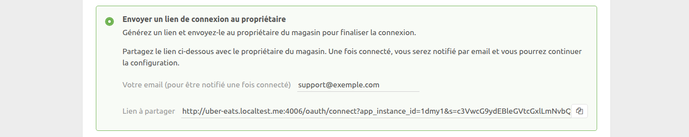
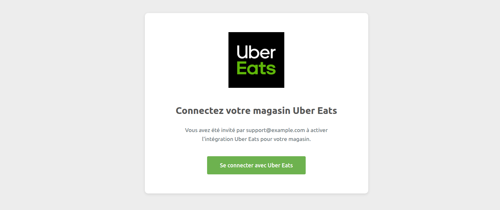
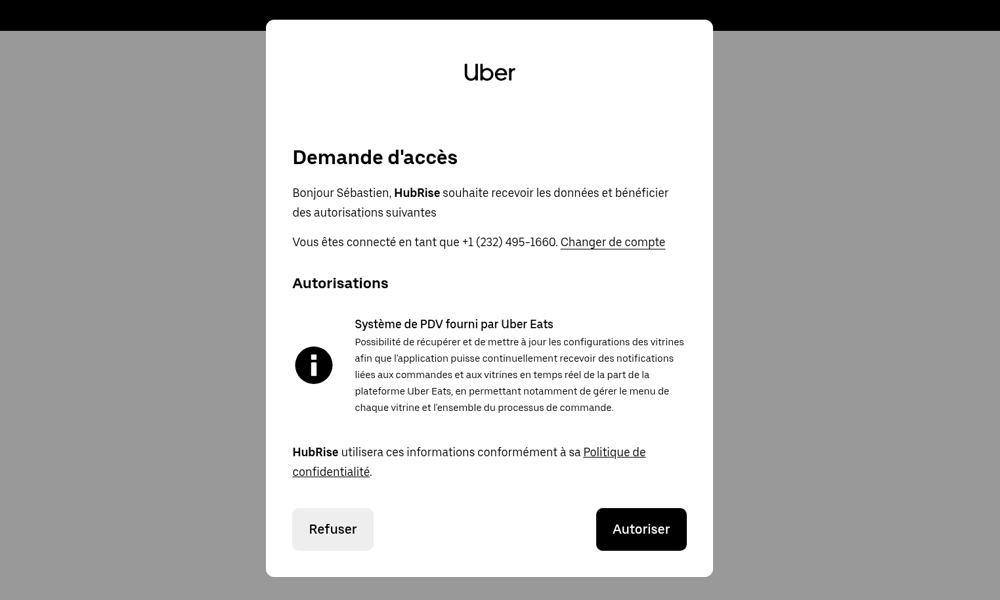
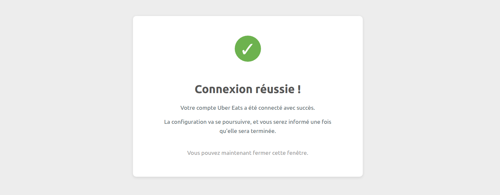
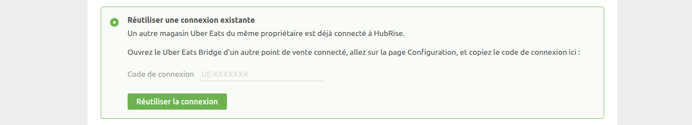
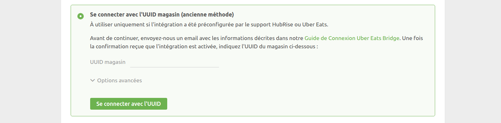

La connexion d'Uber Eats à HubRise s'effectue en quelques étapes simples. Vous pouvez connecter deux types de boutiques Uber Eats :

- Votre magasin hébergé sur la plateforme principale d'Uber Eats, accessible sur www.ubereats.com
- Votre boutique en ligne personnalisée sur Uber Eats, identifiable par une URL commençant par www.order.store

Si vous avez une boutique en ligne personnalisée sur Uber Eats, assurez-vous d'avoir lu notre [FAQ](/apps/uber-eats/faqs/connect-webstore) avant de poursuivre.

---

**REMARQUE IMPORTANTE :** Si vous ne possédez pas encore de compte HubRise, rendez-vous sur la [page d'inscription à HubRise](https://manager.hubrise.com/signup). L'inscription ne prend qu'une minute !

---

## 1. Connectez Uber Eats Bridge

Commencez par connecter Uber Eats Bridge à HubRise en suivant ces étapes :

- Connectez-vous à votre [compte HubRise](https://manager.hubrise.com).
- Dans le menu déroulant, sélectionnez le point de vente à connecter.
- Sélectionnez **CONNEXIONS**, puis **Voir les apps disponibles**.
- Sélectionnez **Uber Eats Bridge** dans la liste des apps.
- Cliquez sur **Connecter**.
- Cliquez sur **Autoriser** pour donner à Uber Eats Bridge l'accès à votre point de vente. Si votre compte comporte plusieurs points de vente, développez la section **Choisissez le point de vente**, sélectionnez le point de vente voulu, puis cliquez sur **Autoriser**.

Le bridge affiche maintenant la page **Connecter un magasin Uber Eats**. Quatre méthodes de connexion sont disponibles, détaillées ci-dessous.

Une fois l'une de ces méthodes finalisée, le bridge active l'intégration et ouvre la page **Configuration**.

### 1.1 Connexion avec votre compte Uber Eats

Utilisez cette méthode si vous êtes le propriétaire du magasin, si vous êtes avec lui, ou si vous avez accès à Uber Eats Manager.

Ouvrez d'abord le bridge comme décrit ci-dessus, puis :

- Sélectionnez **Se connecter avec votre compte Uber Eats**.
- Cliquez sur **Se connecter avec Uber Eats**, vous êtes redirigé vers Uber Eats Manager.
- Connectez-vous à Uber Eats si vous n'êtes pas déjà connecté.
- Approuvez les autorisations demandées.
- Vous êtes redirigé vers HubRise.
- Sélectionnez l'établissement à connecter et cliquez sur **Connecter le magasin**.

### 1.2 Envoyer un lien de connexion au propriétaire

Cette méthode est conçue pour les équipes de support : le propriétaire n'a qu'à cliquer sur un lien, se connecter à son compte Uber Eats, et c'est tout. La marque HubRise reste en grande partie masquée pendant le processus.

Ouvrez d'abord le bridge comme décrit ci-dessus, puis :

- Sélectionnez **Envoyer un lien de connexion au propriétaire** et entrez votre adresse email. Vous serez notifié lorsque le lien sera utilisé.
- Cliquez sur l’icône pour copier le lien et envoyez-le au propriétaire.
- Attendez l’email de confirmation indiquant que le lien a été utilisé.
- Finalisez la configuration.

Le propriétaire verra ces pages lorsqu’il cliquera sur le lien :

### 1.3 Réutiliser une connexion existante

Utilisez cette méthode si un autre magasin du même propriétaire a déjà été connecté via l'une des deux premières méthodes.

- Ouvrez le bridge pour le magasin déjà connecté.
- Ouvrez la page **Configuration**.
- Copiez le code de connexion (format `UE-XXXXXXX`) affiché en bas de page.
- Fermez la page.

Ensuite :

- Ouvrez le bridge pour le nouveau magasin.
- Choisissez **Réutiliser une connexion existante**.
- Collez le code.
- Cliquez sur **Réutiliser la connexion**.

Notez que le code de connexion s’affiche uniquement pour les magasins connectés avec l’une des deux premières méthodes, et si l’autorisation a moins d’un an. Si le code n’apparaît pas, utilisez une autre méthode de connexion.

### 1.4 Connexion avec l’UUID magasin (ancienne méthode)

N'utilisez cette méthode que si le support HubRise ou Uber Eats vous y invite explicitement. Avant de poursuivre, contactez support@hubrise.com en indiquant :

- L’UUID de votre magasin. Par exemple : `dc638853-bff1-411c-adba-8aa4d7abddd2`. Pour plus d’informations sur la manière de trouver votre UUID, voir notre [FAQ](/apps/uber-eats/faqs/find-uber-eats-uuid).
- L’URL publique de votre magasin sur Uber Eats. Par exemple : https://www.ubereats.com/store/camile-thai-epsom/V6j2cjCWX9e0WXNyGTdYsg.
- Le nom et l’identifiant de votre point de vente HubRise. Par exemple : `Fast Pizza London z6q31-0`.
- Le mode d’acceptation des commandes : **Manual accept** ou **Offered state**. Pour plus de détails, voir notre [FAQ](/apps/uber-eats/faqs/send-orders-to-epos-without-tablet).

Une fois que HubRise aura confirmé que le support Uber Eats a activé l’intégration, ouvrez le bridge comme décrit ci-dessus, puis :

- Choisissez **Se connecter avec l'UUID magasin (ancienne méthode)**.
- Saisissez l’UUID.
- Cliquez sur **Se connecter avec l'UUID**.

## 2. Configurez vos préférences

Une fois la connexion du bridge effectuée, vous devez renseigner quelques paramètres sur la page **Configuration** afin que les commandes soient transmises correctement à votre logiciel de caisse.

Pour plus d'informations sur la page Configuration et la manière d'y accéder, voir [Page de configuration](/apps/uber-eats/user-interface#configuration). Pour plus de détails sur la configuration des paramètres d'Uber Eats Bridge, voir [Configuration](/apps/uber-eats/configuration).

## 3. Associez les codes ref des produits

La plupart des applications ont besoin des codes ref des produits pour que les commandes soient correctement traitées. Pour savoir comment associer les codes ref sur Uber Eats, voir [Associer les codes ref](/apps/uber-eats/map-ref-codes).

## 4. Testez la réception des commandes

Passez quelques commandes sur votre magasin Uber Eats, afin de vous assurer qu'elles sont bien reçues dans votre logiciel de caisse, puis annulez-les pour en obtenir le remboursement. Vous aurez ainsi l'assurance que votre magasin est prêt à être mis en ligne.

Vous pourrez également, si vous le souhaitez, abandonner votre tablette Uber Eats en passant à une intégration directe.
Pour plus de détails, voir [Puis-je recevoir les commandes directement sur mon logiciel de caisse sans utiliser les tablettes Uber Eats ?](/apps/uber-eats/faqs/send-orders-to-epos-without-tablet)

Si vous rencontrez des difficultés durant ces tests, contactez-nous à l'adresse : support@hubrise.com.
